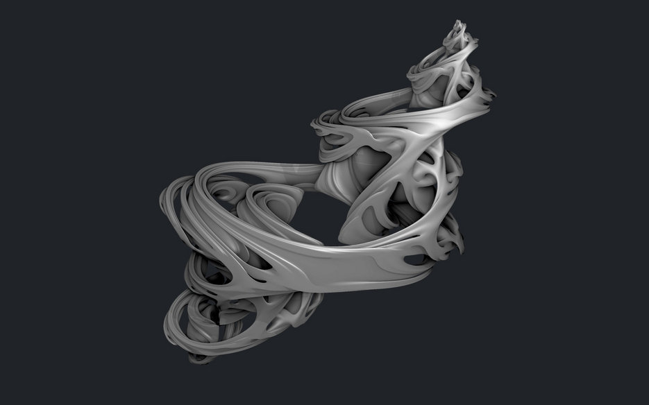
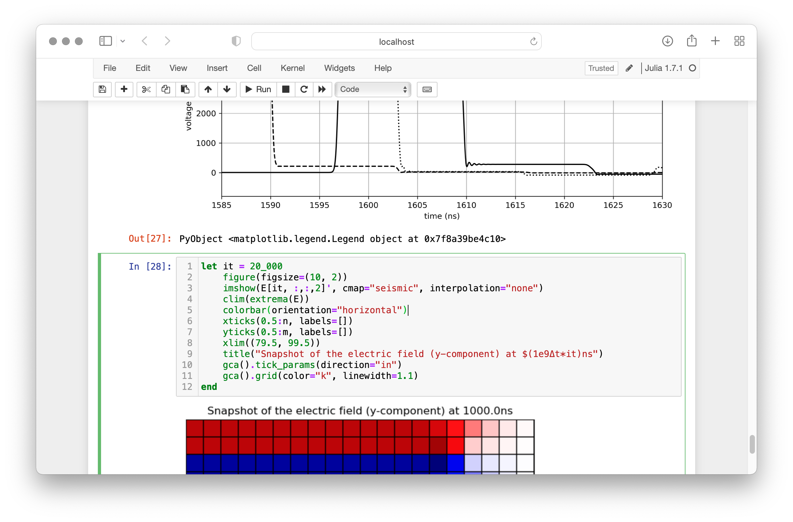
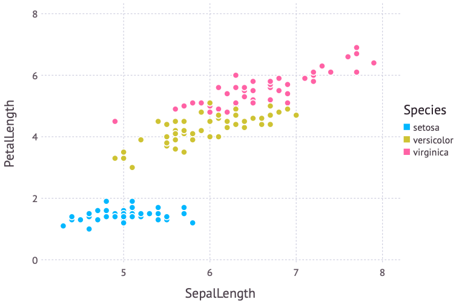
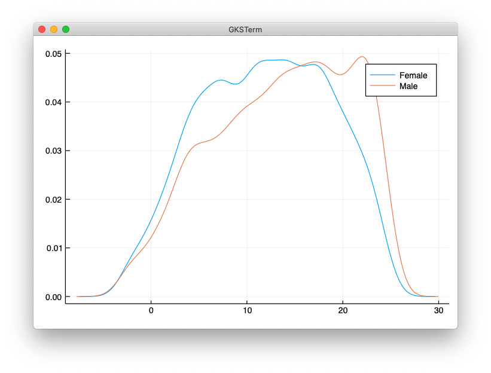

class: center, middle, inverse
<style>	.remark-code, code { padding: 5px; font-family: monospace; font-size: 15px;} </style>

# Algorytmy w inżynierii danych

## Wykład 01 - O czym będzie wykład?

## Bartosz Chaber

e-mail: bartosz.chaber@pw.edu.pl
2023L

.img-nerw-header[]

---
class: goal
## Cel przedmiotu
<style>
 .goal img {border-radius: 15px;}
</style>

.img-top-right[
  
]

1\. Poznanie ostrych krawędzi algorytmów


.footnote[Autor zdjęcia: Annie Spratt, Maddie Weiss/Unsplash]

--
.img-top-right[
  
]

---
class: goal
## Cel przedmiotu
<style>
 .goal img {border-radius: 15px;}
</style>

.img-top-right[
  
]

2\. Zajrzenie pod maskę

.footnote[Autor zdjęcia: Tyler Lastovich/Unsplash]

---
class: goal
## Cel przedmiotu
<style>
 .goal img {border-radius: 15px;}
</style>

.img-top-right[
  
]

3\. Make Algorithms Great Again!

--
.img-top-right[
  
]


---
## Ustalenia organizacyjne

Ocena końcowa z przedmiotu składa się:
* w 30% z oceny za egzamin: pytania otwarte i zadania obliczeniowe,
* w 70% z oceny za projekt: szansa na przyjrzenie się z bliska wybranej grupie algorytmów.

Zaliczenie wykładu od co najmniej 51% punktów, tj. 15,5p./30p.

Zaliczenie projektu od co najmniej 51% punktów, tj. 36p./70p.

Zajęcia projektowe zaczynają się w 6 tygodniu zajęć (lub 11 tygodniu zajęć).
Składają się z pięciu spotkań.

---

class: julia-set
<style>
 .julia-set { background-color: #202328; color: #fff;}
 .julia-set img { width: 100%; }
</style>


.center[Julia]
--
.center[*Ugh*..., po co *kolejny* język programowania?]

???

Po pierwsze: jakie są opcje?
Moglibyśmy zostać przy Pythonie. Jest to język popularny, jednak z racji swojej budowy potrzeba wyspecjalizowanego kodu wymaga zastosowania dowiązań do C/Fortran.
Jest to tzw. problem dwóch języków (*ang. two language problem*).

Druga rzecz: nowy paradygmat programowania.
Przypomnijcie sobie moment, w którym poznaliście pierwszy raz obiektowy język programowania,
zmienia to sposób myślenia do problemów, z którymi spotykamy się jako programiści.

W ten sam sposób, Julia jest świeżym podejściem do programowania. Pokazuje, że można komponować oprogramowanie bez interfejsów, przeciążania metod.

Ze zmianą paradygmatu programowania spotkaliście się na pewno nie raz. Wykorzystanie asynchronicznych wywołań metod też pokazuje jak (w inny sposób) sklejamy ze sobą komponenty.

Poprzez Julię chciałbym pokazać jedną ideę: wielometody. Pozwalają one na tworzenie różnych implementacji tych samych funkcji dla różnych typów argumentów. Te wyspecjalizowane funkcje mogą być dużo lepiej zoptymalizowane (przez co dużo szybsze).

---

## Julia

.img-top-right-smaller[

]

Charakterystyka Julii:

- powstała w 2009 r.,
- dojrzały język (wersja 1.0 w 2018),
- posiada kompilator działający "w locie" (*ang. Just-in-Time* — oparty o LLVM),
- zdobyła nagrodę pt. James H. Wilkinson Prize for Numerical Software w 2019 r.,
- posiada otwarte źródło (https://github.com/JuliaLang/julia).

```julia
julia> 🍐, 🍎 = rand(), rand()
julia> 🍐 > 🍎 ? "pears!" : "apples!"
...
```

???

Stefan Karpiński przed długi czas pracował jako inżynier danych (m.in. dla Etsy).

James H. Wilkinson Prize for Numerical Software to, przyznawana co cztery lata, nagroda uznająca znaczący wpływ na rozwój oprogramowania naukowego.

Cel projektu można podsumować: "Walk like Python. Run like C."

---

## Ciekawe w Julii

.img-top-right-smaller[]

- nie trzeba definiować typów zmiennych (ale można i&nbsp;warto!),
- łatwa współpraca z C/Fortran oraz Python, 
- zintegrowane zarządzanie pakietami,
- wielometody (*ang. multimethods* lub *ang. multiple dispatch*),
- indeksowanie od 1 (jak w MATLAB),
- makra (higieniczne).

```julia
η = 0.1 # learning rate
ReLU(x :: Real) = max(0, x)

function feedforward(x, wo, bh, wo, bo)
  x̄ = wh * x .+ bh
  x̂ = ReLU.(x̄)

  ȳ = wo * x̂ .+ bo
  ŷ = ȳ

  return ŷ, ȳ, x̂, x̄
end
```

---

## Instalacja i uruchomienie
<style>
	.text.remark-code { 
		display: block;
		overflow-x: auto;
		padding: .5em;
		color: #333;
		background: #f8f8f8;
	}
</style>

```text
               _
   _       _ _(_)_     |  Documentation: https://docs.julialang.org
  (_)     | (_) (_)    |
   _ _   _| |_  __ _   |  Type "?" for help, "]?" for Pkg help.
  | | | | | | |/ _` |  |
  | | |_| | | | (_| |  |  Version 1.8.5 (2023-01-08)
 _/ |\__'_|_|_|\__'_|  |  Official https://julialang.org/ release
|__/                   |

julia>
```

Znak zachęty `julia>` pozwala na wprowadzanie poleceń. Możliwa jest zmiana trybu wciskając `]`, `?` lub `;`. Przechodzi się wtedy odpowiednio: do zarządzania pakietami, do trybu pomocy lub do trybu powłoki systemowej.

.img-center[]

---

## Podstawowe typy danych 1/2

Oprócz podstawowych typów jest `Symbol`, który oznacza identyfikator:
```julia
typeof(42)      # Int64
typeof(3.14)    # Float64
typeof(nothing) # Nothing
typeof('ą')     # Char
typeof("ą")     # String
typeof(:foo)    # Symbol
```

Należy zwrócić uwagę na rozróżnienie między wektorem `Array{T,1}` a macierzą `Array{T,2}`:
```julia
A = [1 2;
     3 4] # 2×2 Array{Int64,2}
x = [0 0] # 1×2 Array{Int64,2}
v = [1,0] # 2-element Array{Int64,1}
Z = ['c' 4.0; :x 3] # 2×2 Array{Any,2}
🍪 = '@'
t = (1, 🍪, :x, x) # Tuple{Int64,Char,Symbol,Array{Int64,2}}
#   (1, '@', :x, [0 0])
d = Dict{String, String}("hello" => "witaj", "bye" => "żegnaj")
# Dict{String,String} with 2 entries:
#  "bye"   => "żegnaj"
#  "hello" => "witaj"
for (k, v) in d
  println("klucz: $k wartość: ", v)
end
```

---

## Podstawowe typy danych 2/2

Zmiana podmacierzy wymaga przypisania `.=`:
```julia
A[1,:] # 2-element Array{Int64,1}: 1 2
A[:,:].= 0 
A[1,1] = 1
A[2,2] =-1
A[4]   # => -1
```

Wybranie fragmentu macierzy/wektora zwraca *kopię* (.footnote[† nie musi tak być, o tym na jednym z kolejnych wykładów]†):
```julia
A = [1  0;
     0 -1]
v = A[1,:]
v.= 42

A[1,:] == v # => false
```

Praca z wektorami jest przyjemna:
```julia
v = Int[] # 0-element Array{Int64,1}:
push!(v, 2)
push!(v, 5)
push!(v, 1)
sort!(v) # 3-element Array{Integer,1}: 1 2 5
```

---

## Struktury danych 1/2

Struktury są domyślnie **niezmiennicze**, przez co łatwiej jest zarządzać nimi w pamięci:
```julia
struct Book
  year :: Int64
  title # typy pól są opcjonalne
  author
  publisher :: String
end
b = Book(2000, "Data Science", "Someone Important", "CRC Press")
b.title = "something"
# ERROR: setfield!: immutable struct of type Book cannot be changed
```

Możliwe jest zdefiniowanie struktury, której pola mogą zmieniać wartości:
```julia
mutable struct Accidents
  location   :: String
  fatalities :: Int64
  injuries
end
warsaw =   Accidents("Warsaw", 0, 0)
warsaw.injuries += 7
# warsaw = Accidents("Warsaw", 0, 7)
```

---
## Struktury danych 2/2

Operator `<:` pozwala na budowanie hierarchii typów (supertyp może być tylko abstrakcyjny, nie można utworzyć wartości typu abstrakcyjnego):
```julia
abstract type Thesis end
struct BachelorsThesis <: Thesis end
struct MastersThesis   <: Thesis end
# type aliases
BSc = BachelorsThesis
MSc = MasterThesis
```

---

## Definiowanie funkcji i ich wywoływanie

Trzy główne postaci definicji funkcji: skrócona, anonimowa i zwykła.
```julia
loss(y, ŷ) = 0.5*(y - ŷ).^2
timestwo = (x) -> 2x

function ReLU(x)
  if x > 0.0
    return x
  end
  0.0 # równoważne z: return 0.0
end
```

--

Wywołanie funkcji:
```julia
loss([1,0,0], [0.99, 0.2, 0.01]) # 3-element Array{Float64,1}: 5.0e-5 0.02 5.0e-5 
ReLU(-0.1)                       # 0.0
ReLU.([-0.1, +0.1])              # 2-element Array{Float64,1}: 0.0 0.1
map(timestwo, [1, 2, 3, 4])      # 4-element Array{Int64,1}: 2 4 6 8
3 + 4                            # 7
+(3, 4)                          # 7
```

--

Składanie funkcji:
```julia
log10(abs(0.5))     # -0.3010299956639812
0.5 |> abs |> log10 # -0.3010299956639812
```

???

Zauważ: compound return

Wspomnij o funkcjach kończących się `!`

Wspomnij o składaniu funkcji za pomocą operatora `|>`.

Wspomnij o automatycznym broadcast.

---

## Zarządzanie pakietami

Instalacja pakietu `DataFrames`:
```text
pkg> add DataFrames
```

Zaimportowania pojedynczych funkcji z modułu `Random` oraz wszystkich publicznych z `LinearAlgebra`:
```julia
import Random: seed!, rand
seed!(1234)
rand(5)

using LinearAlgebra
det([1 2; 3 4])
eigvals([1 0; 1e-3 1])
```

---

## Wielometody

Ten paradygmat jest silnie wykorzystywany, aby zdefiniować wyspecjalizowane implementacje metod:
```julia
julia> methods(Base.push!)
# 21 methods for generic function "push!":
[1] push!(a::Array{Any,1}, item) in Base at array.jl:860
[2] push!(B::BitArray{1}, item) in Base at bitarray.jl:712
[3] push!(s::BitSet, n::Integer) in Base at bitset.jl:273
[4] push!(s::BitSet, ns::Integer...) in Base at bitset.jl:275
...  
[17] push!(s::Set, x) in Base at set.jl:48
[18] push!(c::Channel, v) in Base at channels.jl:291
[19] push!(pool::Distributed.AbstractWorkerPool, w::Int64)
  in Distributed at [...]/workerpool.jl:158
[20] push!(A, a, b) in Base at abstractarray.jl:2095
[21] push!(A, a, b, c...) in Base at abstractarray.jl:2096
```

```julia
v = Int[]
s = Set{Int}()

@which push!(v, 42) # push!(a::Array{T,1}, item) where T in Base at array.jl:853
@which push!(s, 42) # push!(s::Set, x) in Base at set.jl:48
```

---

## Integracja z C

Wyobraźmy sobie, że istnieje biblioteka w C, z której chcemy skorzystać:
```c
$ cat mean.c 
double mean(double a, double b) {
  return (a + b) / 2;
}
$ gcc -c -Wall -fPIC mean.c             
$ gcc -shared  -fPIC mean.o -o libmean.dylib
```

Wywołanie wymaga od nas znajomości typów argumentów i typu zwracanego.
```julia
julia> const lib = "libmean"
julia> x = @ccall lib.mean(2.0 :: Float64, 5.0 :: Float64) :: Float64
3.5
```

Analogiczny kod w Python 3:
```python
$ python3
Python 3.7.4 (default, Aug 13 2019, 15:17:50)
>>> from ctypes import *
>>> lib = CDLL("libmean.dylib")
>>> lib.mean.argtypes = (c_double, c_double)
>>> lib.mean.restype = c_double
>>> lib.mean(2.0, 5.0)
3.5
```

---

## Integracja z Python

Python ma wiele ciekawych bibliotek, czemu z nich nie skorzystać?
Konwersja między typami Julii a Pythona jest automatyczna:
```julia
pkg> add PyCall
julia> using PyCall
julia> np = pyimport("numpy")
julia> np.arange(0, 5, 0.5)
10-element Array{Float64,1}:
 0.0
 0.5
 1.0
 1.5
 2.0
 2.5
 3.0
 3.5
 4.0
 4.5
```

---

## Makra 1/3

Makra pozwalają na modyfikację **kodu** programu **po** jego sparsowaniu, ale przed uruchomieniem.
Aby zaznaczyć, żeby Julia nie wykonywała sparsowanego kawałka kodu  należy użyć `:(...)` lub `quote ... end`:
```julia
julia> (3 + 4)  # =>7
julia> :(3 + 4) # => :(3 + 4)
julia> eval(:(3 + 4))        # => 7
julia> eval(quote 3 + 4 end) # => 7
julia> dump(:(3 + 4))
Expr
  head: Symbol call
  args: Array{Any}((3,))
    1: Symbol +
    2: Int64 3
    3: Int64 4
```

---

## Makra 2/3

Istnieje kilka użytecznych makr, m.in.: `@.` oraz `@time`.

```julia
julia> x = A .+ b.*c
julia> x = (+).(A, (*).(b, c))
julia> @macroexpand x = @. A + b*c
:(x = (+).(A, (*).(b, c)))
```

--

```julia
julia> @macroexpand @time rand(5)
quote
    #= util.jl:154 =#
    local #10#stats = (Base.gc_num)()
    #= util.jl:155 =#
    local #12#elapsedtime = (Base.time_ns)()
    #= util.jl:156 =#
    local #11#val = rand(5)
    #= util.jl:157 =#
    #12#elapsedtime = (Base.time_ns)() - #12#elapsedtime
    #= util.jl:158 =#
    local #13#diff = (Base.GC_Diff)((Base.gc_num)(), #10#stats)
    #= util.jl:159 =#
    (Base.time_print)(#12#elapsedtime,
                     (#13#diff).allocd,
                     (#13#diff).total_time,
                     (Base.gc_alloc_count)(#13#diff))
    #= util.jl:161 =#
    (Base.println)()
    #= util.jl:162 =#
    #11#val
end
```

---

## Makra 3/3

Moim ulubionym makrem jest jednak `@code_llvm`, pozwalające podglądać skompilowany kod LLVM.

```julia
julia> function add(a, b)
         return a + b
       end
add (generic function with 1 method)
```

--

```julia
julia> @code_llvm add(1, 2)
;  @ REPL[1]:1 within `add`
define i64 @julia_add_123(i64 signext %0, i64 signext %1) #0 {
top:
;  @ REPL[1]:2 within `add`
; ┌ @ int.jl:87 within `+`
   %2 = add i64 %1, %0
; └
  ret i64 %2
}
```

--

```julia
julia> @code_llvm add(0.1, 0.2)
;  @ REPL[1]:1 within `add`
define double @julia_add_155(double %0, double %1) #0 {
top:
;  @ REPL[1]:2 within `add`
; ┌ @ float.jl:399 within `+`
   %2 = fadd double %0, %1
; └
  ret double %2
}
```
---

## DataFrames.jl

Odpowiednik `DataFrame` z Python Pandas lub z języka programowania R.
Pozwala na trzymanie ustrukturyzowanych danych i ich przetwarzanie.
Zdefiniowany nowy typ: `Missing` (analogiczny do `Nothing`)
```julia
df = DataFrame(A = [1,2,missing,4], B = ["M", "F", "F", "M"])

4×2 DataFrame
│ Row │ A       │ B      │
│     │ Int64⍰  │ String │
├─────┼─────────┼────────┤
│ 1   │ 1       │ M      │
│ 2   │ 2       │ F      │
│ 3   │ missing │ F      │
│ 4   │ 4       │ M      │

df[:,:B] # zwraca kopię kolumny B
df[!,:B] # zwraca oryginalne dane
```

Ponieważ funkcje poza DataFrames nie są świadome `Missing` należy obsłużyć je wcześniej (np. pominąć):
```julia
sum(dropmissing(df)[!,:A])
```

---

## Plots.jl 1/2

Do wyboru jest kilka pakietów do rysowania wykresów, m.in. GR, Gadfly, PyPlot
Jest też pakiet Plots, który stara się integrować wspomniane wcześniej.

Gadfly potrafi wyświetlać bezpośrednio DataFrame:

```julia
using Gadfly
using RDatasets
iris = dataset("datasets", "iris") # zbiór Fishera
plot(iris, x=:SepalLength, y=:PetalLength, color=:Species, Geom.point)
```
.img-top-right[]

---

## Plots.jl 2/2

Jest też pakiet `StatsPlots`, który zawiera pakiety przystosowane do wizualizacji DataFrames:

```julia
using StatsPlots
using RDatasets
school = RDatasets.dataset("mlmRev","Hsb82")
@df school density(:MAch, group = :Sx)
```
.img-top-right[]

---

## Podsumowanie

.img-top-right-smaller[]

* Julia jest dynamicznym i ekspresyjnym językiem (jak Python)...

--

* ...z możliwością definiowania *efektywnego* kodu maszynowego (jak C);

--

* Julia umożliwia łatwą integrację z innymi językami programowania,
* posiada wiele pakietów rozwijanych przez społeczność;

--

* jest to nowoczesny język nastawiony na programowanie algorytmów numerycznych.

---
class: center, middle, inverse
# Dziękuję za uwagę

---

## Literatura

Bardzo dobre materiały znajdują się pod adresem: https://julialang.org/learning/

Szczególnie polecam:

* Chris Rackauckas †, "A Deep Introduction to Julia for Data Science and Scientific Computing", url: http://ucidatascienceinitiative.github.io/IntroToJulia/, dostęp: 27.02.2020.
* Ben Lauwens, Allen Downey, 2018, "Think Julia", url: https://benlauwens.github.io/ThinkJulia.jl/latest/book.html, dostęp: 27.02.2020

.footnote[† Chris to autor jednego z najfajniejszych modułów w Julii – https://github.com/JuliaDiffEq/DifferentialEquations.jl]
