class: center, middle, inverse
<style>	.remark-code, code { padding: 5px; font-family: monospace; font-size: 15px;} </style>
<style> img { max-height: 520px; } </style>
<style>	.attention { color: #ffb570; } </style>
<style>	.has-jax { background: none; font-size: 13pt } </style>

# Algorytmy w inżynierii danych

## Wykład 02 - Różniczkowanie: symboliczne, numeryczne i&nbsp;automatyczne

## Bartosz Chaber

e-mail: bartosz.chaber@ee.pw.edu.pl
2023L

.img-nerw-header[]

---
## Obowiązkowy XKCD (2117)

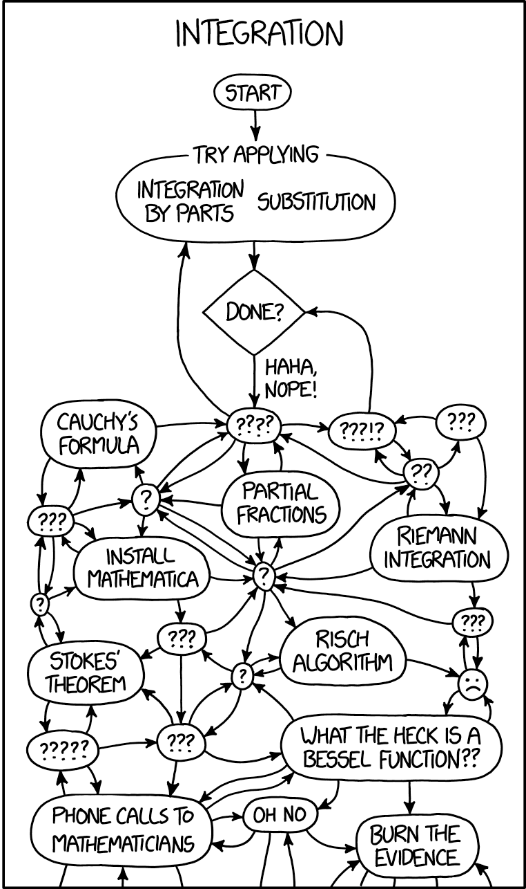
---
## Obowiązkowy XKCD (2117)

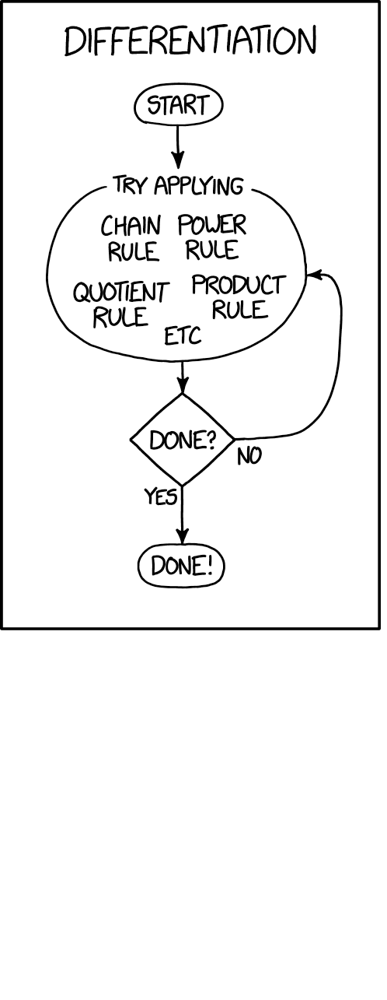
---
## Funkcje dla informatyków i matematyków

Możemy je rozpatrywać w sensie informatycznym jak i matematycznym.
Niektóre funkcje w&nbsp;języku programowania mogą być równoważne funkcjom matematycznym.

.img-center[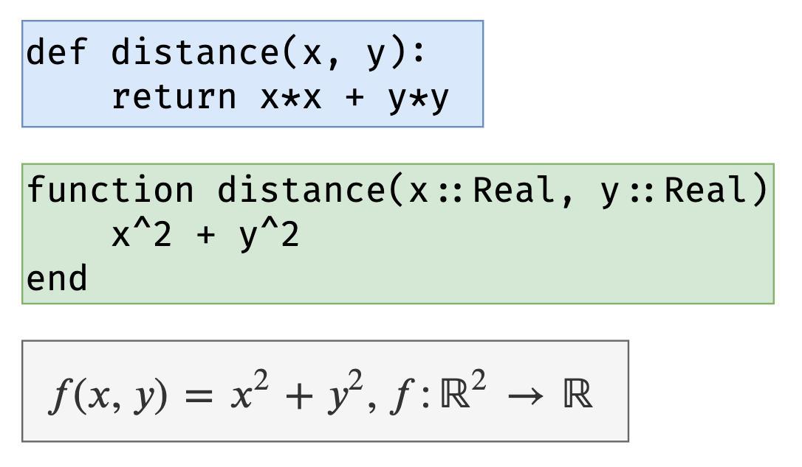]

???

Funkcja, dla programistów ma co najmniej dwa znaczenia:
pierwsze z nich to: kawałek programu, który ma swoją nazwę, listę argumentów oraz (opcjonalnie)
pewną wartość lub wartości. Drugie znaczenie to: matematyczna operacja *mapująca* punkty z pewnej *n*-wymiarowej przestrzeni w inną, *m*-wymiarową.

Funkcje informatyczne mogą odwzorowywać te matematyczne (jak na przykładzie), albo mogą nie mieć sensu matematycznego (np. funkcja `print`). Dzisiaj zajmiemy się tymi, które zachowują się jak funkcje matematyczne, tj. mapują *n*-wymiarowe dane na *m*-wymiarowe.

---
## Różniczkowanie: wymiary funkcji

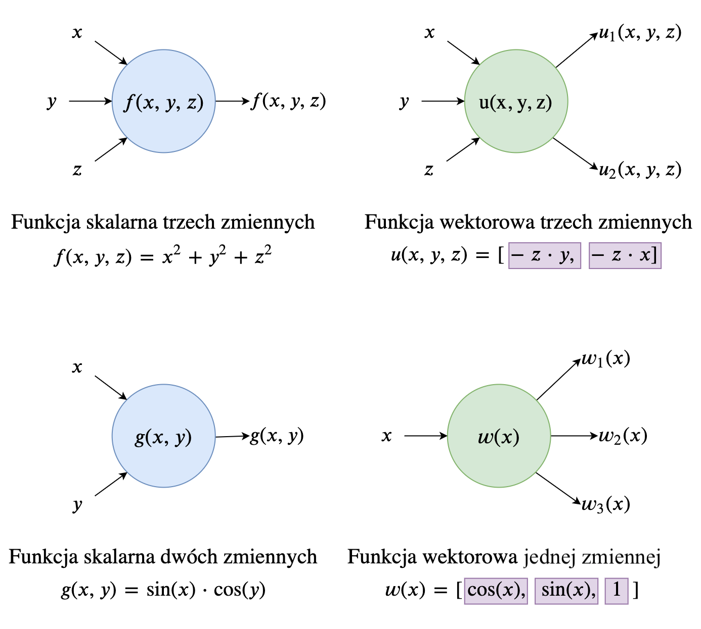

---
## Różniczkowanie: macierz Jacobiego

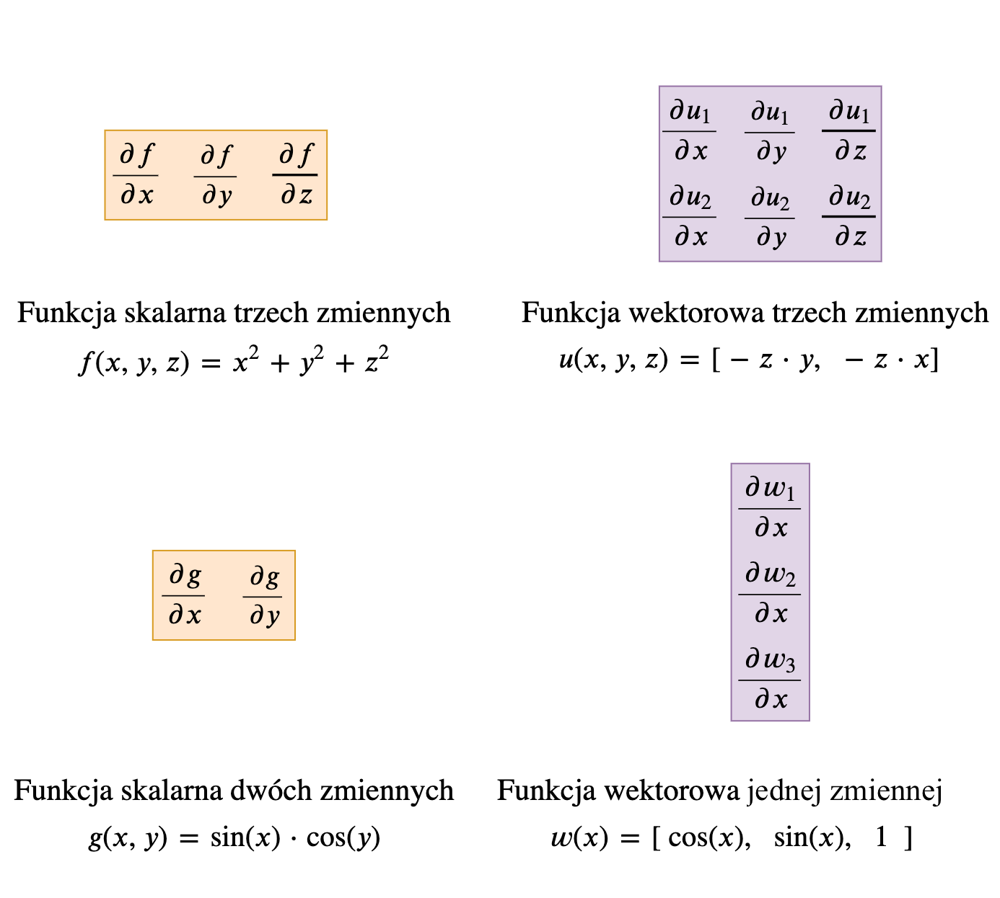

---
## Różniczkowanie: jak program może różniczkować?

Teraz, załóżmy, że mamy funkcję mapującą `f: \(\mathbb{R}^2 \rightarrow \mathbb{R}\)`:

```julia
function f(x::Real, y::Real)
	x^2 + y^2
end
```

Gradient i macierz Jacobiego funkcji skalarnej są tożsame:

$$ \text{grad}(\ f) = \nabla(\ f) = \mathbf{J} \_f = 
\begin{bmatrix}
  \frac{\partial f}{\partial x} & 
  \frac{\partial f}{\partial y}
\end{bmatrix}
$$

Macierz Hessego:

$$ \mathbf{H} \_f =
\begin{bmatrix}
  \frac{\partial^2 f}{\partial x^2} & 
  \frac{\partial^2 f}{\partial xy} \newline
  \frac{\partial^2 f}{\partial yx} & 
  \frac{\partial^2 f}{\partial y^2}
\end{bmatrix}
$$

Jak **policzyć** jej macierz Jacobiego (lub macierz Hessego) *programistycznie*?
---
class: center, middle, milestone
# Metody dokładne
---
## Różniczkowanie symboliczne
	
Pierwszym podejściem jest wykorzystanie programu komputerowego do symbolicznego przetwarzania wzorów matematycznych. W efekcie powstaje "wyrażenie", np. na pochodną funkcji.

```julia
using SymEngine

function f(x::Number, y::Number)
    x^2 + y^2
end

x, y = symbols("x y")

∂f∂x = diff(f(x, y), x);
∂f∂y = diff(f(x, y), y);
```

--

```julia
julia> ∇f = Jf = [∂f∂x ∂f∂y]
1×2 Array{Basic,2}:
 2*x  2*y

julia> subs.(∇f, x => 3, y => -2)
1×2 Array{Basic,2}:
 6  -4
```
---
## Różniczkowanie symboliczne
	
Niestety, nie wszystko da się w ten sposób przetworzyć (bo symbol nie ma wartości):

```julia
using SymEngine

function g(x, y)
    r = 1.0
    for i=1:y
        r *= x
    end
    return r
end

x, y = symbols("x y")

∂g∂x = diff(g(x, y), x)
```

--

```julia
MethodError: no method matching (::Colon)(::Int64, ::Basic)
Closest candidates are:
  Any(::T, ::Any, !Matched::T) where T<:Real at range.jl:41
  Any(::A, ::Any, !Matched::C) where {A<:Real, C<:Real} at range.jl:10
  Any(::T, ::Any, !Matched::T) where T at range.jl:40
  ...

Stacktrace:
 [1] g(::Basic, ::Basic) at ./In[1]:5
 [2] top-level scope at In[1]:13
```
---
## Różniczkowanie symboliczne
	
A nawet, jeżeli się uda, to często wyrażenie jest **bardzo** skomplikowane:

```julia
using SymEngine

function Babylonian(x; N = 10)
    t = (1+x)/2
    for i = 2:N; t=(t + x/t)/2  end
    t
end

x = symbols("x")
diff( Babylonian(x; N=3), x ) |> expand |> display
```

--
Pochodna pierwiastka `\(\sqrt{x}\)` wykorzystująca trzy iteracje algorytmu Babilońskiego:
```julia
1/8 + (-1/2)*x/(1 + 2*x + x^2) + (-1/2)*x/(1/4 + (1/2)*x + 2*x/(1 + x) +
4*x^2/(1 + x)^2 + 2*x^2/(1 + x) + (1/4)*x^2) - 2*x/((1 + x)*(1/4 + (1/2)*x +
2*x/(1 + x) + 4*x^2/(1 + x)^2 + 2*x^2/(1 + x) + (1/4)*x^2)) + 2*x^2/((1 + 2*x +
x^2)*(1/4 + (1/2)*x + 2*x/(1 + x) + 4*x^2/(1 + x)^2 + 2*x^2/(1 + x) + (1/4)*x^2)) +
(1/2)*(1 + x)^(-1) + (1/2 + (1/2)*x + 2*x/(1 + x))^(-1)
```
Podstawiając wartość `\(x\)` powinniśmy otrzymać przybliżenie pochodnej pierwiastka:`\(\frac{1}{2\sqrt{x}}\)`.

???
Czasami można sobie pozwolić na symboliczne różniczkowanie, jednak bardzo częstu nie jesteśmy zainteresowani wyrażeniem matematycznym na (przykładowo) gradient, a bardziej interesuje nas wartość tego gradientu.

---
## Różniczkowanie "ręczne": reguła łańcuchowa
Najczęściej jesteśmy zainteresowani *wartością* pochodnej/gradientu, a nie *wyrażeniem*. Dlatego
różniczkowanie symboliczne jest nieefektywne (bo daje nam za dużo).

Innym rozwiązaniem jest zastosowanie reguły łańcuchowej (*ang.* chain rule) liczenia pochodnych.
--
$$ f(x) = \sin(x^2), $$
możemy zapisać jako złożenie (*ang.* composition) dwóch funkcji:
$$ f(x) = \sin(g(x)),\quad g(x) = x^2. $$
Taki układ funkcji zapisujemy zwykle matematycznie `\(f \circ g\)`, natomiast w Julii:
```julia
f(y) = sin(y)
g(x) = x^2
(f ∘ g)(5.0)  == sin(5.0^2) # true
5.0 |> g |> f == sin(5.0^2) # true
```
---
## Różniczkowanie "ręczne": reguła łańcuchowa
$$ f(x) = \sin(x^2).$$

W takim przypadku, zgodnie z regułą łańcuchową:
$$ \partial{f}/\partial{x} = \partial{f}/\partial{g} \cdot \partial{g}/\partial{x}, $$
czyli: 
$$ \partial{f}/\partial{x} = cos(g(x)) \cdot 2x = cos(x^2) \cdot 2x $$

Natomiast programistycznie:
```julia
f(g) = sin(g)
g(x) = x^2
dfdg(g) = cos(g)
dgdx(x) = 2x

dfdx(x) = dfdg(g(x)) * dgdx(x)
dfdx(5.0) == cos(5.0^2)*(2*5.0) # true
```
---
## Różniczkowanie "ręczne": reguła łańcuchowa
Zaletą w stosunku do różniczkowania symbolicznego jest to, że otrzymujemy "wartość",
natomiast łańcuchowe stosowanie pochodnych cząstkowych zostawiamy naszemu programowi.

Gdzie spotykamy złożone funkcje? Sieć neuronowa może być postrzegana jako złożenie wielu,
funkcji:

.img-center-full[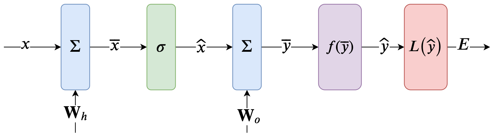]

Możemy policzyć pochodne każdej z warstw, a potem w sposób łańcuchowy wyznaczyć, np. pochodną błędu `\(E\)` względem `\(W_h\)`.

---
class: center, middle, inverse

## Różniczkowanie symboliczne i wykorzystujące regułę łańcuchową .attention[nie&nbsp;przybliżają pochodnych].
## Obydwie metody pozwalają na obliczenie wartości gradientów z&nbsp;.attention[dokładnością maszynową].
---
class: center, middle, milestone
# Metody przybliżone
---
## Różniczkowanie numeryczne: różnica w przód
Jeżeli nasze umiejętności z analizy matematycznej zardzewiały możemy przybliżać numerycznie pochodne korzystając z definicji pochodnej, tj.:
$$f'(x\_0) = \lim_{\Delta x \rightarrow 0} \frac{f(x_0 + \Delta x) - f(x_0)}{\Delta x}$$

```julia
function g(x, y)
    r = 1.0
    for i=1:y
        r *= x
    end
    return r
end

forward_diff(f, x₀; Δx=1e-3) = ( f(x₀ + Δx) - f(x₀) )/Δx
```
--
W rzeczywistości `g(x, y)` oblicza wartość `\(x^y\)`, więc jego pochodna dana jest wzorem `\(y\cdot x^{y-1}\)`.

```julia
julia> x₀, y₀ = 5.0, 3
julia> f(x) = g(x, y₀)
julia> dgdx = forward_diff(f, x₀; Δx=1e-9)
75.00000265281415
julia> dg(x, y) = y*x^(y-1)
julia> dg(x₀,y₀)
75.0
```
---
## Różniczkowanie numeryczne: różnica w przód
Gdy krok jest bardzo mały, to wynik różnicy `f(x₀ + Δx) - f(x₀)` jest bardzo niedokładny:

.img-center-full[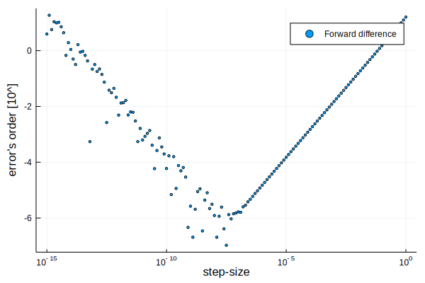]
???
Utrata cyfr znaczących.

---
## Różniczkowanie numeryczne: różnice centralne
Błąd różnicy w przód jest rzędu `\(O(h)\)` (co oznacza, że dwukrotne zmniejszenie kroku, dwukrotnie zmniejsza błąd przybliżenia). Wynika to z rozwinięcia funkcji w szereg Taylora.
Wartość funkcji `\(f(b)\)` dana jest wzorem względem wartości funkcji (i jej pochodnych) w punkcie `\(a\)`, czyli:
$$ f(b) = f(a) + f'(a)(b-a) + \frac{1}{2!}f''(a)(b-a)^2 + \frac{1}{3!}f'''(a)(b-a)^3 + \ldots $$
Na podstawie rozwinięcia `\(f(x+h)\)` i `\(f(x-h)\)` względem `\(f(x)\)` mamy:
$$ f(x+h) = f(x) + hf'(x) + h^2\frac{1}{2!}f''(x) + h^3\frac{1}{3!}f'''(x) + \ldots $$
$$ f(x-h) = f(x) - hf'(x) + h^2\frac{1}{2!}f''(x) - h^3\frac{1}{3!}f'''(x) + \ldots $$
Widać, że:
$$ f(x+h) - f(x-h) = 2hf'(x) + \frac{2}{3!}f'''(x)h^3 + \ldots $$
Przybliżając pierwszą pochodną widzimy, że błąd jest rzędu `\(O(h^2)\)`:
$$ \frac{f(x+h) - f(x-h)}{2h} = f'(x) + h^2\frac{1}{6}f'''(x) + \ldots $$

---
## Różniczkowanie numeryczne: różnice centralne
.img-center-full[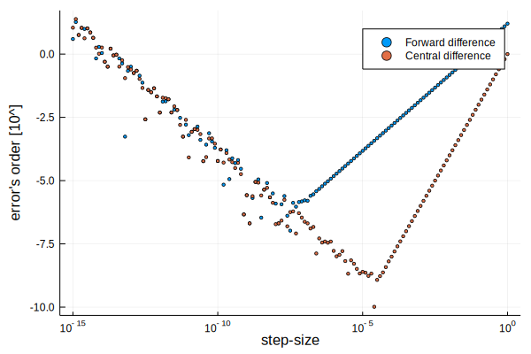]
---
## Różniczkowanie numeryczne: zespolona wartość kroku
Ciekawą metodą jest wykorzystanie *zespolonej* długości kroku, wtedy jeżeli
`\(a=x\)` i `\(b=x+ih\)`, to:
$$ f(b) = f(a) + f'(a)(b-a) + \frac{1}{2!}f''(a)(b-a)^2 + \frac{1}{3!}f'''(a)(b-a)^3 + \ldots $$
$$ f(x+ih) = f(x) + ihf'(x) - h^2\frac{1}{2!}f''(x) - ih^3\frac{1}{3!}f'''(x) + \ldots $$
Widać, że część urojona `\(f(x+ih)\)` upraszcza się do:
$$ \operatorname{Im}(f(x+ih)) = hf'(x) - h^3\frac{1}{3!}f'''(x) + \ldots \approx hf'(x) $$
Podobnie co w przypadku różnicy centralnej, przybliżając pierwszą pochodną widzimy, że błąd jest rzędu `\(O(h^2)\)`:
$$\frac{\operatorname{Im}(f(x+ih))}{h} = f'(x) - h^2\frac{1}{6}f'''(x) + \ldots $$
---
## Różniczkowanie numeryczne: zespolona wartość kroku
...ale nie mamy już niedokładnego odejmowania:
.img-center-full[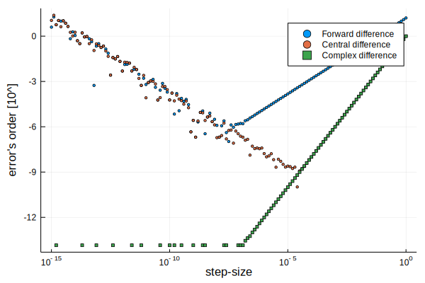]
---
class: center, middle, inverse

## Metoda różnic skończonych pozwala na liczenie .attention[przybliżenia] pochodnych.
## Różnice centralne i z zespolonym krokiem charakteryzuję się zbieżnością .attention[kwadratową], (różnica w przód - .attention[liniową]).
## Różnice centralne i w przód wymagają .attention[dwóch] wywołań funkcji, przy bardzo małych wartościach kroku są .attention[niedokładne].

???
Należy zwrócić uwagę na to, że policzenie pochodnej w jednym punkcie musimy dwukrotnie wywołać różniczkowaną funkcję (oprócz kroku zespolonego!).

Policzenie gradientu funkcji *n*-argumentowej wymaga więc wywołania funkcji *2n* razy.

Zastosowanie zespolonego kroku sprawi, że faktyczne obliczenia zespolone mogą dać zły wynik.
---
class: center, middle, milestone
# Różniczkowanie automatyczne
## Metoda dokładna
---
## Różniczkowanie automatyczne
A gdyby tak zamiast `\(i^2=-1\)` wybrać jednostkę taką, że `\(\epsilon^2=0\)`?

Wtedy:
$$ f(b) = f(a) + f'(a)(b-a) + \frac{1}{2}f'(a)(b-a)^2 + \frac{1}{3!}f'''(a)(b-a)^3 + \ldots $$
Jeżeli `\(a=x\)` i `\(b=x+\epsilon\)`, to mamy:
$$ f(x+\epsilon) = f(x) + f'(x)\epsilon + \frac{1}{2}f'(x)\epsilon^2 + \frac{1}{3!}f'''(x)\epsilon^3 + \ldots $$
Zakładając, że `\(\epsilon^2=0\)`, wszystkie człony oprócz dwóch pierwszych się **zerują**:
$$ f(x+\epsilon) = f(x) + f'(x)\epsilon $$

---
## Różniczkowanie automatyczne: liczby dualne
Wykorzystanie liczb zespolonych do liczenia pochodnych funkcji o wartościach *rzeczywistych* może być postrzegane jako *trik*. Zamiast polegać na zachowaniu jednostki urojonej możemy zdefiniować *nowy* rodzaj liczb: liczby dualne (*ang.* dual number). Gdzie taka liczba jest dana w&nbsp;postaci `\(v + dv\cdot\epsilon\)`:

```julia
struct Dual <:Number
     v::Number
    dv::Number
end
```

**Nie** jest to najbardziej efektywna implementacja .footnote[† `isabstracttype(Number) == true`]†, ale to dobry prototyp.

---
## Różniczkowanie automatyczne: podstawowe operacje na liczbach dualnych

Aby takie liczby działały, musimy zdefiniować dla nich podstawowe operacje:

```julia
 import Base: +, -, *, /
 -(x::Dual)          = Dual(-x.v,       -x.dv)
 +(x::Dual, y::Dual) = Dual( x.v + y.v,  x.dv + y.dv)
 -(x::Dual, y::Dual) = Dual( x.v - y.v,  x.dv - y.dv)
 *(x::Dual, y::Dual) = Dual( x.v * y.v,  x.dv * y.v + x.v * y.dv)
 /(x::Dual, y::Dual) = Dual( x.v / y.v, (x.dv * y.v - x.v * y.dv)/y.v^2)
```

Powyżej, mnożenie odpowiada: $$ (v_x + dv_x\cdot\epsilon) \cdot (v_y + dv_y\cdot\epsilon) =
v_xv_y +
dv_xv_y\cdot\epsilon +
v_xdv_y\cdot\epsilon +
dv_xdv_y\cdot\epsilon^2$$
$$ =
v_xv_y +
(dv_xv_y + v_xdv_y)\cdot\epsilon$$

---
## Różniczkowanie automatyczne: podstawowe funkcje na liczbach dualnych
Zdefiniujemy też wyniki podstawowych funkcji:
```julia
import Base: abs, sin, cos, tan, exp, sqrt, isless
abs(x::Dual)  = Dual(abs(x.v),sign(x.v)*x.dv)
sin(x::Dual)  = Dual(sin(x.v), cos(x.v)*x.dv)
cos(x::Dual)  = Dual(cos(x.v),-sin(x.v)*x.dv)
tan(x::Dual)  = Dual(tan(x.v), one(x.v)*x.dv + tan(x.v)^2*x.dv)
exp(x::Dual)  = Dual(exp(x.v), exp(x.v)*x.dv)
sqrt(x::Dual) = Dual(sqrt(x.v),.5/sqrt(x.v) * x.dv)
isless(x::Dual, y::Dual) = x.v < y.v;
```
--
oraz reguły konwersji i promocji typów:
```julia
# Promocja typów i konwersja
import Base: convert, promote_rule
convert(::Type{Dual}, x::T) where T<:Real = Dual(x, zero(x))
promote_rule(::Type{Dual}, ::Type{T}) where T<:Real = Dual
```
Dzięki temu możemy zrobić: `Dual[2, Dual(1,1)]`, co jest równoważne `[Dual(2, 0), Dual(1, 1)]`.

---
## Różniczkowanie automatyczne: efekt!
Policzymy pochodną funkcji `\(f(x) = max(0, x)\)`
```julia
partials(x::Dual) = x.dv;
f(x) = x > zero(x) ? x : zero(x)
ϵ = Dual(0., 1.) # zarodek, ang. seed

x = -1.0:0.05:+1.0
y = @. f(x + ϵ)
```

.img-center-smaller[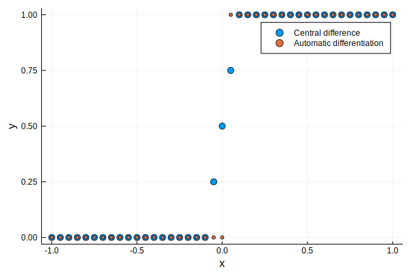]

---
## Podsumowanie

Z sześciu zaprezentowanych metod:
* trzy są dokładne do precyzji maszynowej (r. symboliczne, "ręczne" i automatyczne),
* dwie wymagają dwukrotnego wywołania funkcji (różnica w przód i różnica centralna).

.img-center-full[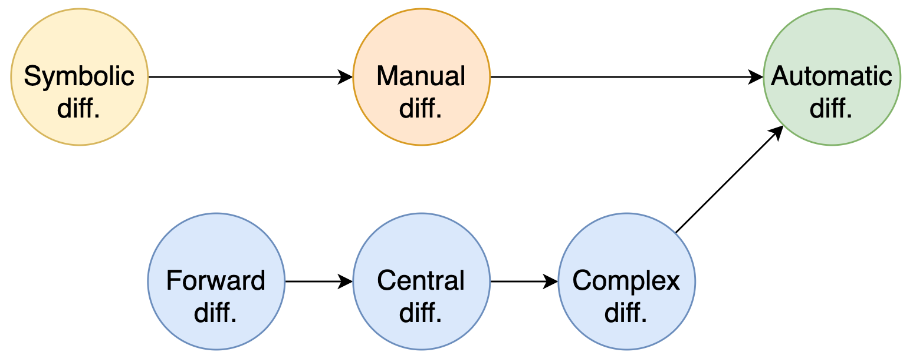]

Kolejne zajęcia poświęcone będą implementacji automatycznego różniczkowania.

---

## Literatura

* Atılım Güneş Baydin, Barak A. Pearlmutter, Alexey Andreyevich Radul, Jeffrey Mark Siskind, 2018, "Automatic Differentiation in Machine Learning: a Survey", https://arxiv.org/pdf/1502.05767.pdf, dostęp:&nbsp;20.03.2020
* Mykel J. Kochenderfer, Tim A. Wheeler, 2019, Algorithms for Optimization, The MIT Press
* Alan Edelman, 2018, "Automatic Differentiation in 10 minutes with Julia", url:&nbsp;https://github.com/JuliaAcademy/JuliaAcademyMaterials/blob/master/Courses/-Foundations%20of%20machine%20learning/20.Automatic-Differentiation-in-10-Minutes.jl, dostęp:&nbsp;20.03.2020
* Joaquim Martins, Peter Sturdza, Juan Alonso, 2003, "The complex-step derivative approximation", ACM Transactions on Mathematical Software, Association for Computing Machinery, 29, pp.245 - 262. 10.1145/838250.838251
* Sören Laue, 2019, "On the Equivalence of Forward Mode Automatic Differentiation and Symbolic Differentiation", url:&nbsp;https://arxiv.org/pdf/1904.02990.pdf, dostęp:&nbsp;23.03.2020

???
* Mike Innes, 2019, "Differentiation for Hackers: Implementing Forward Mode", url:&nbsp;https://github.com/MikeInnes/diff-zoo/blob/notebooks/forward.ipynb, dostęp:&nbsp;25.03.2020
* Jarrett Revels, Miles Lubin, Theodore Papamarkou, 2016, "Forward-Mode Automatic Differentiation in Julia", url:&nbsp;https://arxiv.org/abs/1607.07892, dostęp:&nbsp;23.03.2020
* Jarrett Revels, 2017, "How ForwardDiff Works", url:&nbsp;https://github.com/JuliaDiff/ForwardDiff.jl/blob/master/docs/src/dev/how_it_works.md, dostęp:&nbsp;24.03.2020
* Jeffrey Mark Siskind, Barak A. Pearlmutter, 2005, "Perturbation Confusion and Referential Transparency: Correct Functional Implementation of Forward-Mode AD", url:&nbps;http://www.bcl.hamilton.ie/~barak/papers/ifl2005.pdf, dostęp:&nbsp;25.03.2020

---
class: center, middle, inverse
## Dziękuję za uwagę
