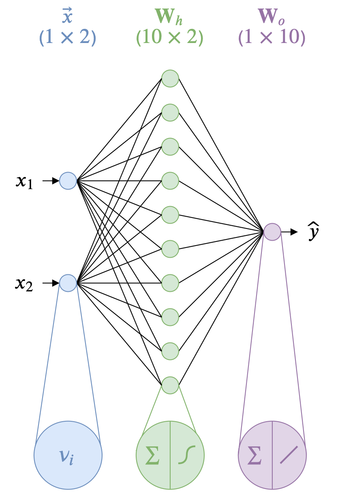
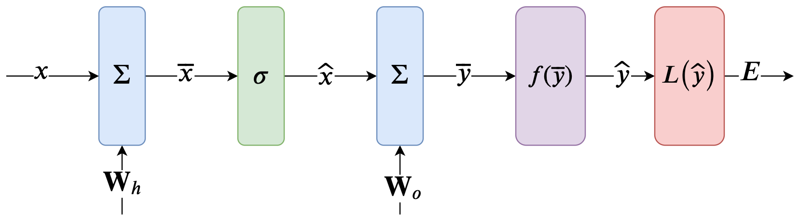
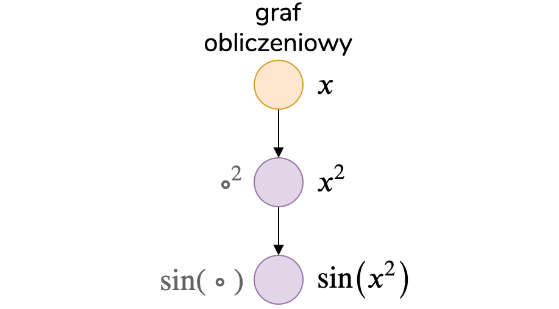
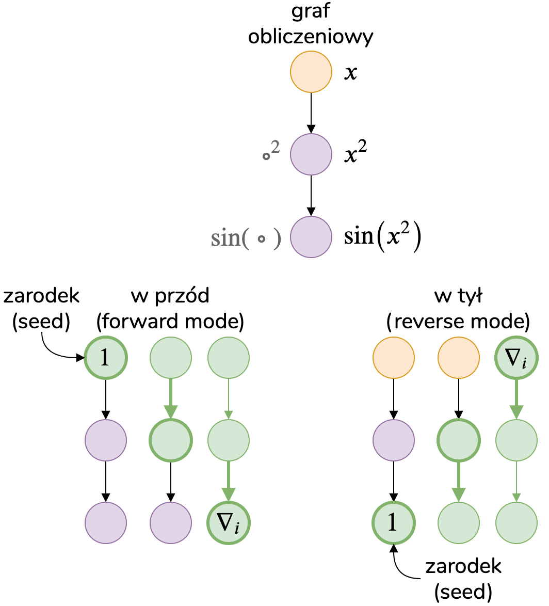
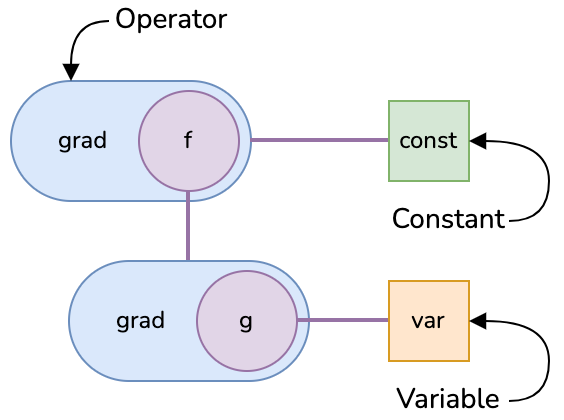
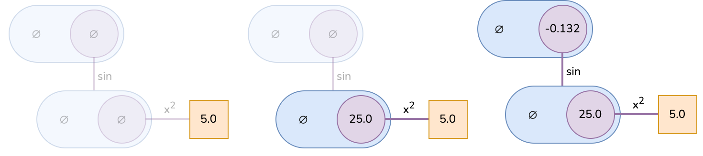
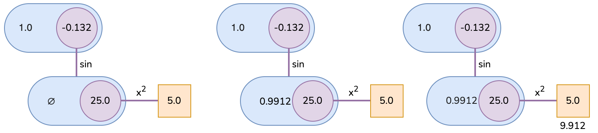
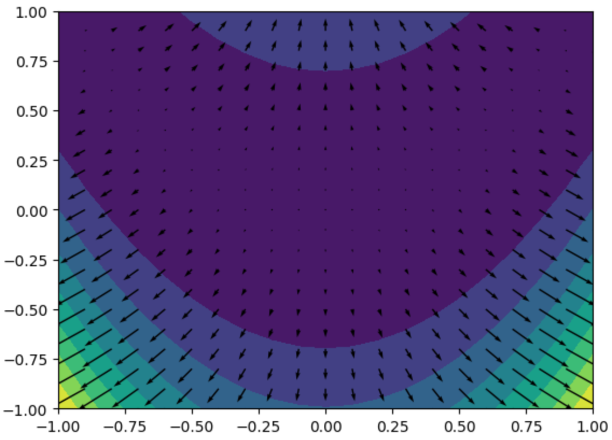

class: center, middle, inverse
<style>	.remark-code, code { padding: 5px; font-family: monospace; font-size: 15px;} </style>
<style> img { max-height: 520px; } </style>
<style>	.attention { color: #ffb570; } </style>
<style>	.has-jax { background: none; font-size: 13pt } </style>

# Algorytmy w inżynierii danych

## Wykład 03-04 - Automatyczne Różniczkowanie

## Bartosz Chaber

e-mail: bartosz.chaber@pw.edu.pl
2023L

.img-nerw-header[]

---
## Algorytm propagacji wstecznej błędu

Jak nauczyć prostą sieć neuronową z jedną warstwą ukrytą?
Sieć ma za zadanie znaleźć aproksymację funkcji  `\(y=f(\mathbf{x})\)`.

.img-top-right-smaller[]

```julia
dense(w, n, m, v, f)    = f.(reshape(w, n, m) * v)
mean_squared_loss(y, ŷ) = sum(0.5(y - ŷ).^2)

σ(x)      = one(x) / (one(x) + exp(-x))
linear(x) = x

Wh  = randn(10,2)
Wo  = randn(1,10)
x = [1.98;4.434]
y = [0.064]

function net(x, wh, wo, y)
    x̂ = dense(wh, 10, 2, x, σ)
    ŷ = dense(wo, 1, 10, x̂, linear)
    E = mean_squared_loss(y, ŷ)
end
```

--

Grant Sanderson, _Ale czym są sieci neuronowe? | Deep learning, część 1_: https://www.youtube.com/watch?v=aircAruvnKk

---
## Algorytm propagacji wstecznej błędu

Wejściem sieci są argumenty funkcji aproksymowanej, natomiast wyjściem jest wynik aproksymacji `\(\hat{y} = \hat{f}(\mathbf{x})\)`.

Podczas uczenia z nauczycielem mamy dostęp jeszcze do referencyjnej wartości `\(y\)`, dlatego możemy policzyć funkcję straty `\(E = \sum_i (y_i - \hat{y}_i)^2\)`.
Wartość funkcji straty `\(E\)` zależy pośrednio od wag sieci (bo na ich podstawie wyliczane jest `\(\hat{y}\)`).

Jeżeli policzymy macierz Jacobiego funkcji `\(E(\mathbf{W}_h, \mathbf{W}_o)\)` 
znajdziemy pochodne względem `\(\mathbf{W}_h\)` oraz `\(\mathbf{W}_o\)`. Pochodne te oznaczają *kierunek* zmian wartości, które **zwiększają** błąd.

.img-center[]

---
## Algorytm propagacji wstecznej błędu

Przykładowo, załóżmy, że mamy *magiczną* funkcję `dnet`, która zwraca pochodne funkcji straty względem wag sieci:

.img-top-right-smaller[]

```julia
julia> typeof(Wh), typeof(Wh[:])
(Array{Float64,2}, Array{Float64,1})

julia> x = [1.98;4.434]
julia> y = [0.064]
julia> E = net(x, Wh[:], Wo[:], y) # => 5.680084
julia> dWh, dWo = dnet(x, Wh[:], Wo[:], y)
julia> dWh
10×2 Array{Float64,2}:
  2.51645    5.63532    
  0.00114    0.00257 
  0.00019    0.00043
  0.08681    0.19441   
 -0.07297   -0.16342   
 -0.25881   -0.57958   
  0.19185    0.42963   
 -0.14419   -0.32290   
  0.26168    0.58600   
  0.04442    0.09949 
```
--
Aby zmniejszyć błąd pójdziemy w kierunku *przeciwnym* do gradientu:
```julia
julia> Wh -= 0.1dWh
julia> Wo -= 0.1dWo
julia> E = net(x, Wh[:], Wo[:], y) # => 0.915599
```

---
## Ręczne różniczkowanie
Znając strukturę sieci i mając wystarczająco dużo czasu możemy ręcznie napisać funkcję zwracającą gradienty funkcji straty względem wag:

.pull-left[
```julia
import LinearAlgebra: diagm
diagonal(v) = diagm(v)
eye(n) = diagm(ones(n))

function ∇W(x, x̂, ŷ, y, Wo)
  # mean_squared_loss
  Eŷ  = ŷ - y
  # liniowa funkcja aktywacji
  ŷȳ  = ȳ  |> length |> eye
  # sumowanie (W*x) wzg. wag
  ȳWo = x̂  |> transpose
  # sumowanie (W*x) wzg. wektora wej
  ȳx̂  = Wo |> transpose
  # sigmoidalna f. aktywacji
  x̂x̄  = x̂  .* (1.0 .- x̂) |> diagonal
  # sumowanie (W*x) wzg. wag
  x̄Wh = x  |> transpose
  # reguła łańcuchowa
  Eȳ  = ŷȳ * Eŷ
  Ex̂  = ȳx̂ * Eȳ
  Ex̄  = x̂x̄ * Ex̂
  EWo = Eȳ * ȳWo
  EWh = Ex̄ * x̄Wh
  return EWo, EWh
end
```
]


--
.pull-right[
```julia
julia> diagonal([1., 2., 3., 4.])
4×4 Array{Float64,2}:
 1.0  0.0  0.0  0.0
 0.0  2.0  0.0  0.0
 0.0  0.0  3.0  0.0
 0.0  0.0  0.0  4.0

julia> eye(3)
3×3 Array{Float64,2}:
 1.0  0.0  0.0
 0.0  1.0  0.0
 0.0  0.0  1.0
```

Pochodne na proste funkcje aktywacji są dobrze opisane:

arunmallya.github.io/writeups/nn/backprop.html

.img-center[]

]
---
## Ręczne różniczkowanie
Dzięki temu możemy podczas ewaluacji sieci obliczać też pochodne względem wag.
```julia
dWo = similar(Wo)
dWh = similar(Wh)

function net(x, wh, wo, y)
    x̂ = dense(wh, 10, 2, x, σ)
    ŷ = dense(wo, 1, 10, x̂, linear)
    
    EWo, EWh = ∇W(x, x̂, ŷ, y, Wo)
    dWo .= EWo
    dWh .= EWh
    
    E = mean_squared_loss(y, ŷ)
end
```
--
Teraz wywołując wielokrotnie w pętli ewaluację sieci oraz uaktualnienie wag nasza sieć powinna się uczyć (dla jednego przypadku `x` i `y` jest to trywialne, więc przypadki uczące trzeba losować z pewnego zbioru):

```julia
epochs = 10
for i=1:epochs
  E   = net(x, Wh[:], Wo[:], y)
  Wh -= 0.1dWh
  Wo -= 0.1dWo
end
```

---
class: center, middle, inverse

## Wykorzystując informację o pochodnych funkcji straty względem wag poszczególnych połączeń między neuronami możemy zmodifykować te wagi tak, żeby .attention[minimalizować] tę stratę

---
## Automatyczne różniczkowanie
Przy dużej liczbie warstw ręczne wyprowadzanie zależności na różne funkcje aktywacji jest trudne do zrobienia. Potrzebny jest algorytm do automatycznego różniczkowania.

.pull-left[
```julia
struct Dual <:Number
     v::Number
    dv::Number
end
```
]

--
.pull-right[
```julia
struct Dual{T <:Number} <:Number
     v::T
    dv::T
end
```
]

Lepiej jest mieć typ parametryzowany. 
--
Dodamy do tego przeciążone podstawowe operacje na liczbach dualnych:
```julia
import Base: +, -, *, /
 -(x::Dual)          = Dual(-x.v,       -x.dv)
 +(x::Dual, y::Dual) = Dual( x.v + y.v,  x.dv + y.dv)
 -(x::Dual, y::Dual) = Dual( x.v - y.v,  x.dv - y.dv)
 *(x::Dual, y::Dual) = Dual( x.v * y.v,  x.dv * y.v + x.v * y.dv)
 /(x::Dual, y::Dual) = Dual( x.v / y.v, (x.dv * y.v - x.v * y.dv)/y.v^2)

import Base: abs, sin, cos, tan, exp, sqrt, isless
abs(x::Dual)  = Dual(abs(x.v),sign(x.v)*x.dv)
sin(x::Dual)  = Dual(sin(x.v), cos(x.v)*x.dv)
cos(x::Dual)  = Dual(cos(x.v),-sin(x.v)*x.dv)
tan(x::Dual)  = Dual(tan(x.v), one(x.v)*x.dv + tan(x.v)^2*x.dv)
exp(x::Dual)  = Dual(exp(x.v), exp(x.v)*x.dv)
sqrt(x::Dual) = Dual(sqrt(x.v),.5/sqrt(x.v) * x.dv)
isless(x::Dual, y::Dual) = x.v < y.v;
```
---
## Automatyczne różniczkowanie
Dodamy do tego ładne wypisywania naszego typu:
```julia
import Base: show
show(io::IO, x::Dual) = print(io, "(", x.v, ") + [", x.dv, "ϵ]");
value(x::Dual)    = x.v;
partials(x::Dual) = x.dv;
```
I zdefiniujemy reguły konwersji i promocji typów:
```julia
import Base: convert, promote_rule
convert(::Type{Dual{T}}, x::Dual) where T =
  Dual(convert(T, x.v), convert(T, x.dv))

julia> Dual{Float64}[Dual(1,2), Dual(3,0)]
Dual{Float64}[(1.0) + [2.0ϵ], (3.0) + [0.0ϵ]]

convert(::Type{Dual{T}}, x::Number) where T =
  Dual(convert(T, x), zero(T))

julia> Dual{Float64}[1, 2, 3]
Dual{Float64}[(1.0) + [0.0ϵ], (2.0) + [0.0ϵ], (3.0) + [0.0ϵ]]

promote_rule(::Type{Dual{T}}, ::Type{R}) where {T,R} =
  Dual{promote_type(T,R)}

julia> Dual(1,2) * 3
(3) + [6ϵ]
```

---
## Obliczanie pochodnej funkcji jednej zmiennej
Jak policzyć pochodną funkcji `f(x) = sin(x*x)`?
```julia
julia> ϵ = Dual(0., 1.)
(0.0) + [1.0ϵ]
julia> x = 5.0 + ϵ
(5.0) + [1.0ϵ]
julia> y = f(x)
(-0.13235175009777303) + [9.912028118634735ϵ]
julia> sin(25.0), 10cos(25.0)
(-0.13235175009777303,    9.912028118634735)
```
--
Z poprzedniego wykładu pamiętamy, że:
$$ \frac{\partial f}{\partial x} =
 \frac{\partial f}{\partial g} \cdot 
 \frac{\partial g}{\partial x} \cdot 
 \frac{\partial x}{\partial x}
$$
Prześledźmy jak propaguje się pochodna po `x` (`\(\frac{\partial x}{\partial x} = 1\epsilon\)`):

.pull-left[
```julia
# *(x::Dual, y::Dual) =
 Dual(  x.v * y.v,
       x.dv * y.v + x.v * y.dv)
# sin(x::Dual)  =
 Dual(sin(x.v), cos(x.v)*x.dv)
#
```
]
.pull-right[
```julia
# (5.0) + [1.0ϵ] * (5.0) + [1.0ϵ]
 Dual( 5.0 * 5.0,
       1.0 * 5.0 + 5.0 * 1.0)
# => (25.0) + [10.0ϵ]
 Dual( sin(25.0),  cos(25.0) * 10.0 )
# => (-0.132...) + [9.91202...ϵ]
```
]
---
## Obliczanie pochodnych funkcji kilku zmiennych
Spróbujmy to samo wykonać dla funkcji dwóch zmiennych.
Poniżej definicja funkcji oraz jej pochodnych po obydwu zmiennych:
```julia
f(x,y)     = x*x*y
dfdx(x, y) = 2x*y
dfdy(x, y) = x*x
```
--
Dodamy zarodek do zmiennej `x` (`\(\frac{\partial x}{\partial x} = 1\epsilon\)`):
```julia
ϵ = Dual(0., 1.);
x = 1.0 + ϵ
y = 3.0
@show f(x,y), dfdx(1.0, 3.0);
# => (3.0) + [6.0ϵ], 6.0
```
--
Pochodną po `y` liczymy dodając zarodek do `y` (`\(\frac{\partial y}{\partial y} = 1\epsilon\)`):
```julia
x = 1.0
y = 3.0 + ϵ
@show f(x,y), dfdy(1.0,3.0))
# => (3.0) + [1.0ϵ], 1.0
```
--
Możemy zdefiniować operator różniczkowania funkcji jednej zmiennej:
```julia
D = derivative(f, x) = partials(f(Dual(x, one(x))))
```

---
## Macierz Jacobiego

Żeby z kolei policzyć macierz Jacobiego funkcji możemy napisać następującą funkcję:
```julia
J = function jacobian(f, args::Vector{T}) where {T <:Number}
    jacobian_columns = Matrix{T}[]
    for i=1:length(args)
        x = Dual{T}[]
        for j=1:length(args)
            seed = (i == j)
            push!(x, seed ?
                Dual(args[j], one(args[j])) :
                Dual(args[j],zero(args[j])) )
        end
        column = partials.([f(x)...])
        push!(jacobian_columns, column[:,:])
    end
    hcat(jacobian_columns...)
end
```

Widać, że `column = partials.([f(x)...])` wywołuje się tyle razy, ile jest elementów w wektorze `x`.
Poniżej, dwa triki (na zamianę liczby/wektora w wektor i zamianę wektora w macierz):
.pull-left[
```julia
n = 5.2
v = [3.1,3.3]
@show [n...];
@show [v...];
@show typeof(v);
@show typeof(v[:,:]);
```
]
.pull-right[
```julia
#
#
[n...] = [5.2]
[v...] = [3.1, 3.3]
typeof(v) = Array{Float64,1}
typeof(v[:, :]) = Array{Float64,2}
```
]

---
## Uczenie sieci neuronowej...
...z automatycznym różniczkowaniem

```julia
dense(w, n, m, v, f)    = f.(reshape(w, n, m) * v)
mean_squared_loss(y, ŷ) = sum(0.5(y - ŷ).^2)
linear(x) = x
σ(x)      = one(x) / (one(x) + exp(-x))

Wh  = randn(10,2)
Wo  = randn(1,10)
x, y = [1.98;4.434], [0.064]
dWh = similar(Wh)
dWo = similar(Wo)

function net(x, wh, wo, y)
    x̂ = dense(wh, 10, 2, x, σ)
    ŷ = dense(wo, 1, 10, x̂, linear)
    E = mean_squared_loss(y, ŷ)
end
dnet_Wh(x, wh, wo, y) = J(w -> net(x, w, wo, y), wh);
dnet_Wo(x, wh, wo, y) = J(w -> net(x, wh, w, y), wo);

epochs=10
for i=1:epochs
  E      =  net(x, Wh[:], Wo[:], y)
  dWh[:] = dnet_Wh(x, Wh[:], Wo[:], y)
  dWo[:] = dnet_Wo(x, Wh[:], Wo[:], y)
  Wh    -= 0.1dWh
  Wo    -= 0.1dWo
end
```

---
## Automatyczne różniczkowanie - tryb w przód - test

Policzymy gradient funkcji Rosenbrocka (klasyczna funkcja do testowania algorytmów optymalizacyjnych). `\(f: \mathbb{R}^2 \rightarrow \mathbb{R}\)`

```julia
rosenbrock(x, y) = (1.0 - x*x) + 100.0*(y - x*x)*(y - x*x)
v  = -1:.1:+1
n  = length(v)
xv = repeat(v, 1, n)
yv = repeat(v',n, 1)
dz = rosenbrock.(xv .+ ϵ, yv)
dzdx = partials.(dz)
dz = rosenbrock.(xv, yv .+ ϵ)
dzdy = partials.(dz)
z = value.(dz)
using PyPlot
contourf(xv, yv, z)
quiver(xv, yv, dzdx, dzdy)
```

.img-top-right[]

Jak efektywnie policzyć macierz Jacobiego dla wielu zmiennych?

---
class: center, middle, inverse

## Podczas automatycznego różniczkowanie w trybie w przód .attention[zarodek] musi być dodany do kolejnych argumentów różniczkowanej funkcji
## Wymaga to .attention[tylu przejść, ile argumentów] przyjmuje funkcja
## Można to ominąć stosując wielowymiarowe liczby dualne:
.attention[$$ \epsilon \rightarrow \epsilon_1 + \epsilon_2 + \epsilon_3 \ldots $$]
## Jest to wydajny sposób na różniczkowanie funkcji
.attention[$$ f: \mathbb{R}^n \rightarrow \mathbb{R}^m, n < m$$]
---

## Automatyczne różniczkowanie - tryb w tył

Do tej pory pochodne propagowane były w przód (od zmiennych do ostatecznego wyniku funkcji). Oznacza to, że dla każdej zmiennej funkcji trzeba było wykonać osobny przebieg.

Co z sieciami neuronowymi? Funkcja, której chcemy policzyć gradient jest skalarna i zawiera dziesiątki, setki lub więcej parametrów, które chcemy optymalizować...

Łańcuch pochodnych można zacząć "zwijać" z drugiej strony (tzn. od strony wyniku).
.pull-left[
Tryb "w przód"
$$ \frac{\partial f}{\partial x} =
 \frac{\partial f}{\partial g} \cdot 
\left(\frac{\partial g}{\partial x} \cdot 
 \frac{\partial x}{\partial x} \right) $$
$$ \frac{\partial f}{\partial x} =
\left(\frac{\partial f}{\partial g} \cdot 
 \frac{\partial g}{\partial x} \right) $$
]
.pull-right[
Tryb "w tył"
$$ \frac{\partial f}{\partial x} =
\left(\frac{\partial f}{\partial f} \cdot 
 \frac{\partial f}{\partial g}\right) \cdot 
 \frac{\partial g}{\partial x} $$
$$ \frac{\partial f}{\partial x} =
\left(\frac{\partial f}{\partial g} \cdot 
 \frac{\partial g}{\partial x} \right) $$
]

---
## Budowanie grafu obliczeniowego

.img-top-right[]

Zwykle algorytm automatycznego różniczkowania w trybie "w tył" wymaga stworzenia grafu obliczeniowego, który reprezentuje zależności między zmiennymi. Liście tego grafu to zmienne, a&nbsp;węzły to operacje.

Korzystając z mechanizmu przeciążania funkcji (w&nbsp;przypadku Julii – wielometod, *ang.* mutliple dispatch) można łatwo zrealizować dynamiczne generowanie takiego grafu.

---
## Przebieg w przód, przebieg w tył

.img-top-right[]

Aby obliczyć **wartość** funkcji, należy przejść graf w&nbsp;przód.

Aby efektywnie obliczyć **gradient** funkcji, należy przejść graf w tył.

Zarodek gradientu dodawany jest do **wynikowego** węzła grafu, nie do **zmiennej**.
---

## Tryb w tył - przykładowa implementacja

Graf obliczeniowy złożony z trzech podstawowych rodzajów węzłów: `Constant`, `Variable` i&nbsp;`Operator`:

* `Constant` posiada zdefiniowaną wartość, ale nie przechowuje informacji o gradiencie;
* `Variable` przechowuje informacje o swojej wartości oraz o gradiencie wyniku po "sobie";
* `Operator` reprezentuje funkcję działającą na swoich argumentach (wyróżnimy potem operatory działające na wartościach skalarnych i na wektorach).

.img-top-right[]

```julia
abstract type GraphNode end
abstract type Operator <: GraphNode end
struct Constant{T} <: GraphNode
    output :: T
end
mutable struct Variable <: GraphNode
    output :: Any
    gradient :: Any
end
mutable struct ScalarOperator{F} <:
                           Operator
    inputs :: Any
    output :: Any
    gradient :: Any
end
mutable struct BroadcastedOperator{F} <:
                                Operator
    inputs :: Any
    output :: Any
    gradient :: Any
end
```

---
## Przykład budowania grafu obliczeniowego

Zdefiniujmy nasze zmienne:
```julia
# Variable(output) = new(output, nothing, name)
# ScalarOperator(fun, inputs...) = new{typeof(fun)}(inputs, nothing, nothing)

x = Variable(5.0)
y = ScalarOperator(sin,
      ScalarOperator(*,
            x, x
      )
    )
```
Przeciążając kolejne metody możemy na ich podstawie budować graf obliczeniowy:
```julia
import Base: +, -, *, /
 +(x::GraphNode, y::GraphNode) = ScalarOperator(+, x, y)
 -(x::GraphNode, y::GraphNode) = ScalarOperator(-, x, y)
 *(x::GraphNode, y::GraphNode) = ScalarOperator(*, x, y)
 /(x::GraphNode, y::GraphNode) = ScalarOperator(/, x, y)

import Base: sin
sin(x::GraphNode) = ScalarOperator(sin, x)
```
Ostatnie uzyskując przyjemną notację:
```julia
f(x) = sin(x*x)
x = Variable(5.0)
y = f(x)
```

---
## Budowanie grafu obliczeniowego

Aktualnie, mamy zbiór węzłów grafu, ale wyniki pośrednie nie posiadają wartości. Musimy znaleźć kolejność węzłów zapewniającą, że wyniki węzłów poprzednich są dostępne:
```julia
function visit(node::GraphNode, visited, order)
    if node ∉ visited
        push!(visited, node)
        push!(order, node)
    end
end
    
function visit(node::Operator, visited, order)
    if node ∉ visited
        push!(visited, node)
        for input in node.inputs
            visit(input, visited, order)
        end
        push!(order, node)
    end
end

function topological_sort(head::GraphNode)
    visited = Set()
    order = Vector()
    visit(head, visited, order)
    return order
end
```

---

Aby obliczyć wartość węzła przejdziemy graf "w przód", tj. od liści do korzenia i uaktualnimy wynik węzła przy użyciu funkcji `forward` resetując gradient wartością pustą.

```julia
reset!(node::Constant) = nothing
reset!(node::Variable) = node.gradient = nothing
reset!(node::Operator) = node.gradient = nothing

compute!(node::Constant) = nothing
compute!(node::Variable) = nothing
compute!(node::Operator) =
    node.output = forward(node, [input.output for input in node.inputs]...)

function forward!(order::Vector)
    for node in order
        compute!(node)
        reset!(node)
    end
    return last(order).output
end
```

.img-center[]

---
## Przechodzenie grafu w tył

W poniższym przykładzie, `x` jest uchwytem do węzła-liścia grafu, natomiast `y` jest uchwytem do węzła `Operator(sin)`, reprezentującego wynik funkcji.

```julia
x = Variable(5.0, 0.0)
y = sin(x*x)
```

Teraz, możemy rozpocząć propagację gradientu od węzła `y` poprzez `backward(y, seed=1.0)`:
```julia
update!(node::GraphNode, gradient) = if isnothing(node.gradient)
    node.gradient = gradient else node.gradient .+= gradient
end

function backward!(order::Vector; seed=1.0)
    result = last(order)
    result.gradient = seed
    @assert length(result.output) == 1
    for node in reverse(order)
        backward!(node)
    end
end

function backward!(node::Operator)
    inputs = node.inputs
    gradients = backward(node, [input.output for input in inputs]...,node.gradient)
    for (input, gradient) in zip(inputs, gradients)
        update!(input, gradient)
    end
end
```
---
## Przechodzenie grafu w tył

W poniższym przykładzie, `x` jest uchwytem do węzła-liścia grafu, natomiast `y` jest uchwytem do węzła `Operator(sin)`, reprezentującego wynik funkcji.

```julia
x = Variable(5.0, 0.0)
y = sin(x*x)
```

Teraz, możemy rozpocząć propagację gradientu od węzła `y` poprzez `backward(y, seed=1.0)`:

.img-center[]

---
## Automatyczne różniczkowanie - tryb w tył - test

Ponownie policzymy gradient funkcji Rosenbrocka.

```julia
rosenbrock(x, y) = (Constant(1.0) .- x .* x) .+
                    Constant(100.0) .* (y .- x .* x) .* (y .- x .* x)
x = Variable([0.])
y = Variable([0.])
graph = topological_sort(rosenbrock(x, y))
```
.img-top-right[]
```julia
v  = -1:.1:+1
n  = length(v)
z  = zeros(n, n)
dzdx = zeros(n, n)
dzdy = zeros(n, n)

for i=1:n, j=1:n
    x.output .= v[i]
    y.output .= v[j]
    z[i,j] = first(forward!(graph))
    backward!(graph)

    dzdx[i,j] = first(x.gradient)
    dzdy[i,j] = first(y.gradient)
end

using PyPlot
xv = repeat(v, 1, n)
yv = repeat(v',n, 1)
contourf(xv, yv, z)
quiver(xv, yv, dzdx, dzdy)
```

---
class: center, middle, inverse

## Zarodek gradientu propagowany jest w .attention[przeciwnym] kierunku, niż jest obliczane wyrażenie
## Gradient propagowany jest do .attention[wszystkich] zmiennych (liści grafu)
## Interfejs przypomina Tensorflow oraz PyTorch
## Jest to wydajny sposób na różniczkowanie funkcji
.attention[$$ f: \mathbb{R}^n \rightarrow \mathbb{R}^m, n > m$$]

---
class: center, middle, inverse

## Zaprezentowane rozwiązania wykorzystują .attention[przeciążanie] metod
## W ten sposób wspierają .attention[ograniczony] zbiór kodu w Julii
## Innym podejściem jest analiza .attention[kodu] i .attention[wygenerowanie] kodu różniczkującego

---


## Literatura

* Mike Innes, 2019, "Differentiation for Hackers: Implementing Forward Mode", url: https://github.com/MikeInnes/diff-zoo/blob/notebooks/forward.ipynb, dostęp:&nbsp;25.03.2020
* Jarrett Revels, Miles Lubin, Theodore Papamarkou, 2016, "Forward-Mode Automatic Differentiation in Julia", url: https://arxiv.org/abs/1607.07892, dostęp:&nbsp;23.03.2020
* Jarrett Revels, 2017, "How ForwardDiff Works", url: https://github.com/JuliaDiff/ForwardDiff.jl/blob/master/docs/src/dev/how_it_works.md, dostęp:&nbsp;24.03.2020
* Jeffrey Mark Siskind, Barak A. Pearlmutter, 2005, "Perturbation Confusion and Referential Transparency: Correct Functional Implementation of Forward-Mode AD", url: http://www.bcl.hamilton.ie/~barak/papers/ifl2005.pdf, dostęp:&nbsp;25.03.2020

---
class: center, middle, inverse
# Dziękuję za uwagę
