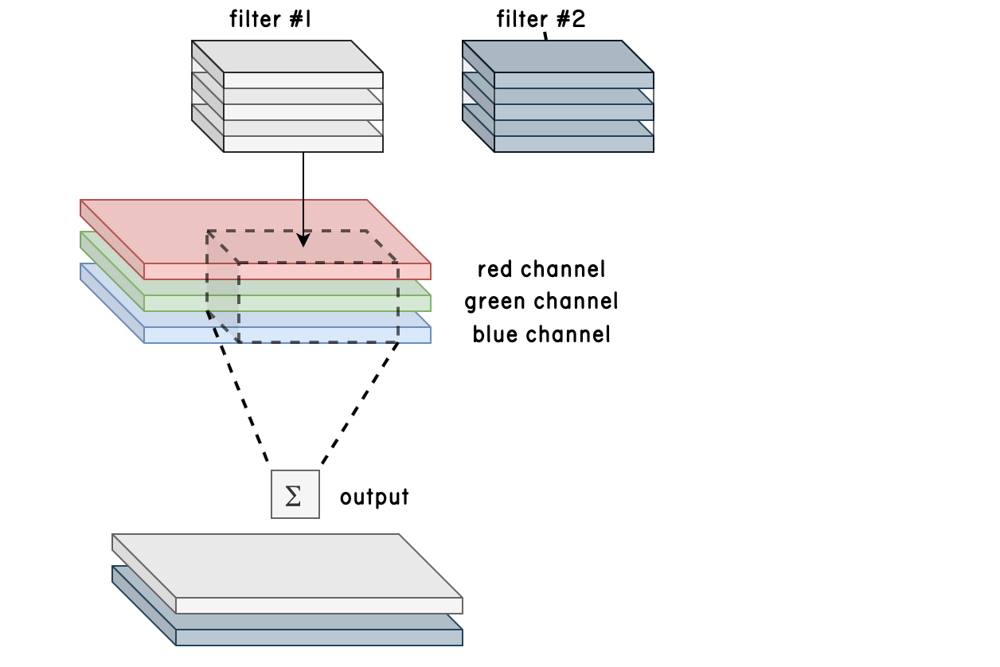
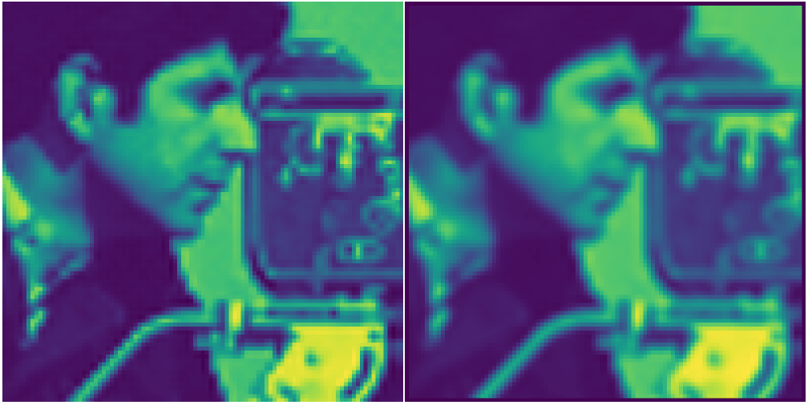
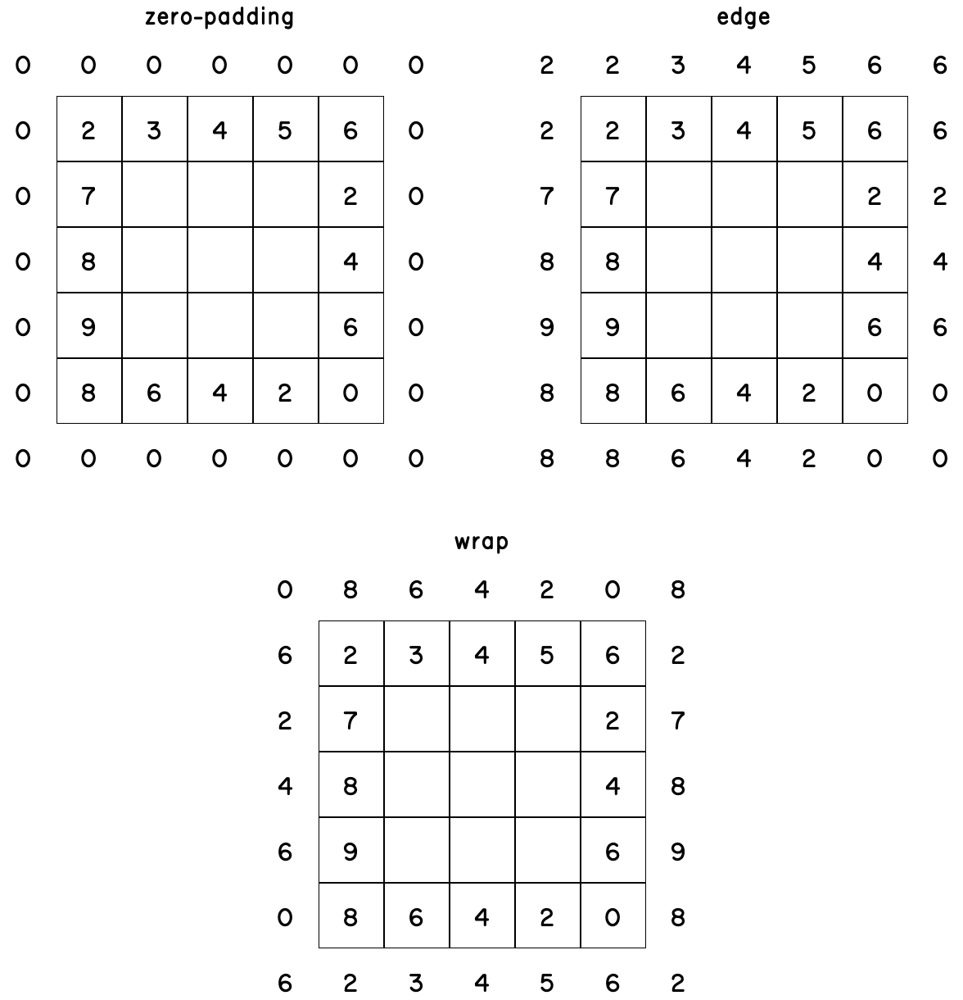
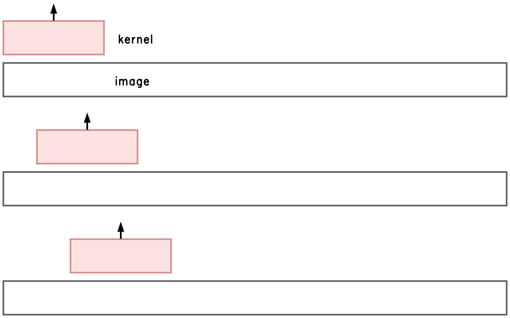
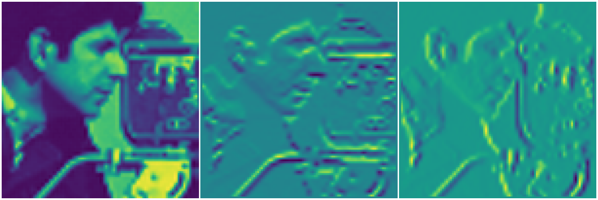
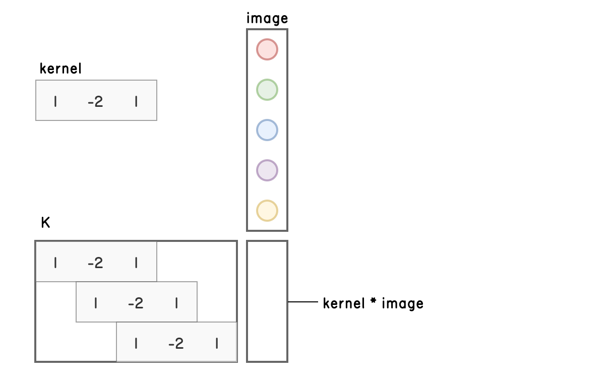
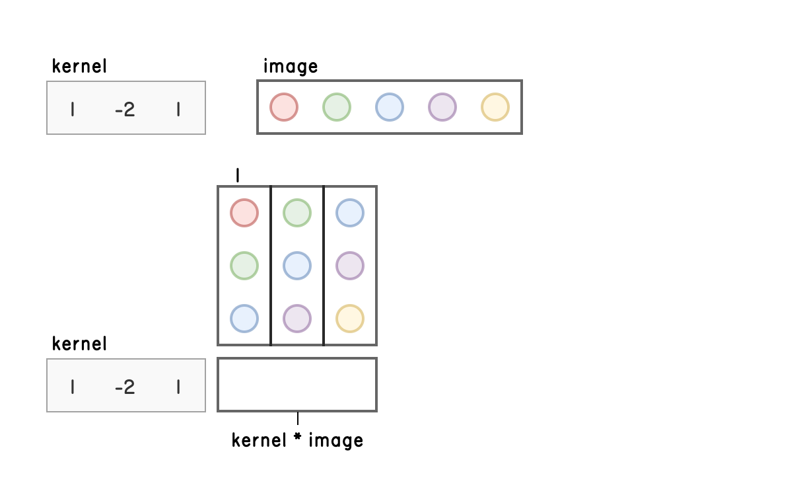
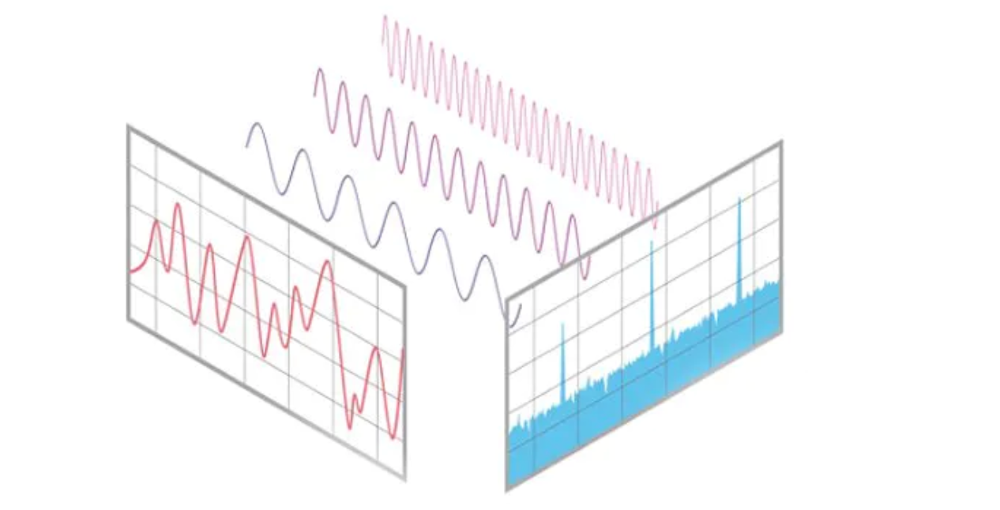

class: center, middle, inverse
<style>	.remark-code, code { padding: 5px; font-family: monospace; font-size: 15px;} </style>
<style> .img-center img { max-height: 620px; width: auto; } </style>
<style>	.attention { color: #ffb570; } </style>
<style>	.has-jax { background: none; font-size: 13pt } </style>
<style> .-fullscreen img { width: 0; height: 0; }
.full-height img { max-width: 60%; }
.full-width img { max-height: 100%; }
.fullscreen img {
  position: absolute;
  top: 0; left: 0;
}
</style>
<style>.pull-left-60 { float: left; width: 60%; }</style>
<style>.pull-right-40 { float: right; width: 39%;}</style>

# Algorytmy w inżynierii danych

## Wykład 05 - *

## Bartosz Chaber

e-mail: bartosz.chaber@pw.edu.pl
2023L

.img-nerw-header[]

---

<video autoplay="" muted="" loop="" playsinline="" class="video">
<source src="https://www.tesla.com/sites/default/files/images/careers/autopilot/network.mp4" type="video/mp4">
</video>

---

## Splot / Konwolucja

Czasem nazywane też mnożeniem splotowym:

`\(f(t) * g(t) = \int_{-\infty}^{\infty} f(t - \tau)g(\tau) d\tau \)`

Zwykle, rozpatrujemy to na spróbkowanych, dyskretnych wartościach funkcji:

`\(f_n * g_n = \sum_{m=-\infty}^{\infty} f(n - m)g(m)\)`

Na dzisiejszych zajęciach przyjrzymy się algorytmom obliczającym konwolucję obrazów.

.img-top-right[]
---
## Filtry obrazów jako wynik konwolucji

Jednym z najbardziej naturalnych zastosowań (również wykorzystywanych w uczeniu maszynowym) jest konwolucja obrazów z pewnymi _maskami_/_filtrami_. Po angielsku nazywa
się je czasem _kernel_.

.img-center-full[]

---
## Obsługa brzegu (ang. padding)

Wielokrotnie spotykamy się z sytuacją, gdy filtr "wystaje" poza nasz obraz. Mamy kilka sposobów uwzględniania tego, co jest poza naszym obrazem.

.full-height[]

---
## Tryby operacji splotu

Vincent Dumoulin, Francesco Visin - A guide to convolution arithmetic for deep learning
https://github.com/vdumoulin/conv_arithmetic


---
## Naiwna implementacja

Najprostsza implementacja wymaga pętli po kolejnych ustawieniach maski splotu nad obrazem.
```julia
function conv(I :: Array{Float64,1}, K :: Array{Float64, 1})
  n = length(I) - 1
  J = zeros(n+1)
  for i=2:n
    J[i] = sum(I[i-1:i+1] .* K)
  end

  return J
end
```
.img-center-full[]

---
## Rozmywanie i wykrywanie krawędzi
Różne maski mają różne działanie:
```julia
function conv(I :: Array{Float64, 2}, K :: Array{Float64, 2})
  n, m = size(I) .- 1
  J = zeros(n+1, m+1)
  for i=2:n, j=2:m
    J[i, j] = sum(I[i-1:i+1, j-1:j+1] .* K)
  end
  
  return J
end

conv(img, [1/9 1/9 1/9
           1/9 1/9 1/9
           1/9 1/9 1/9])
```
Rozmywanie:
.img-top-right[]

---
## Rozmywanie i wykrywanie krawędzi
Różne maski mają różne działanie:
```julia
function conv(I :: Array{Float64, 2}, K :: Array{Float64, 2})
  n, m = size(I) .- 1
  J = zeros(n+1, m+1)
  for i=2:n, j=2:m
    J[i, j] = sum(I[i-1:i+1, j-1:j+1] .* K)
  end
  
  return J
end

conv(img, [-1 -2 -1
            0 .0  0
           +1 +2 +1])
```
Wykrywanie krawędzi (filtr Sobela):
.img-center-full[]

---
## Splot jako mnożenie macierzowe
W ogólności możemy zamienić pętle po położeniach maski na mnożenie macierzy przez obraz:
.pull-left[
```julia
function mulconv(
  img :: Array{Float64, 2},
  kernel :: Array{Float64, 2})
  n, m = size(img)
  I = reshape(img, :, 1)
  K = spdiagm(
     0   => kernel[2,2]*ones(n*m),
    -1   => kernel[2,1]*ones(n*m-1),
    +1   => kernel[2,3]*ones(n*m-1),
    -m   => kernel[1,2]*ones(n*m-m),
    +m   => kernel[3,2]*ones(n*m-m),
    -m-1 => kernel[1,1]*ones(n*m-m-1),
    -m+1 => kernel[1,3]*ones(n*m-m-1),
    +m-1 => kernel[3,1]*ones(n*m-m-1),
    +m+1 => kernel[3,3]*ones(n*m-m-1))
  reshape(K * I, n, m)
end
```
]
.pull-right[
.img-center-full[]
]

---
## Splot jako mnożenie macierzowe (im2col)
Możemy też zmodyfikować macierz związaną z obrazem:

.pull-left-60[
```julia
# Author: Seif_Shebl
# URL: https://discourse.julialang.org/t/
#             what-is-julias-im2col/14066/9
@inline function im2col(A, n, m)
  M,N = size(A)
  B = Array{eltype(A)}(undef, m*n,
    (M-m+1)*(N-n+1))
  indx = reshape(1:M*N, M,N)[1:M-m+1,1:N-n+1]
  for (i,value) in enumerate(indx)
    for j = 0:n-1
    @views B[(i-1)*m*n+j*m+1:(i-1)m*n+(j+1)m] =
           A[value+j*M:value+m-1+j*M]
    end
  end
  return B'
end
# https://leonardoaraujosantos.gitbook.io/
# artificial-inteligence/machine_learning/
# deep_learning/convolution_layer/making_faster
```
]
.pull-right-40[
.img-center-full[]
]

---
## Splot w dziedzinie częstotliwości
Ostatnia, prezentowana dzisiaj metoda polega na wykorzystaniu twierdzenia o konwolucji, tj.
splot w dziedzinie czasu jest równoważny mnożeniu (_element-wise_) w dziedzinie **częstotliwości**.

`\(\mathcal{F}\)`: operator transformujący między dziedziną czasu, a dziedziną częstotliwości.

`\(\mathcal{F}^{-1}\)`: operator transformujący między częstotliwości, a czasu.

.pull-left[
`\(F = \mathcal{F}(f)\)`, 
`\(G = \mathcal{F}(g)\)`.

`\(f * g = \mathcal{F}^{-1}(F \cdot G)\)`

Oznacza to, że jeżeli potrafimy _szybko_ dokonać transformacji między dziedziną czasu a częstotliwości to _opłaca_ się nam dokonać splotu w dziedzinie częstotliwości.
]

.pull-right[ 
.img-center-full[]
.footnote[źródło: fragment logo EasyFFT Frequency Transform for Arduino]
]

---
## Splot w dziedzinie częstotliwości
Umiemy szybko wykonywać transformację Fouriera!

FFT (Fast Fourier Transform)
polega na liczeniu dyskretnej transformaty Fouriera dla fragmentów sygnału. Powszechnie wykorzystywany jest wariant, w którym dzielimy fragmenty sygnału na dwa (dwukrotnie krótsze sygnały) aż operujemy tylko na dwóch próbkach. Dlatego najwięszką efektywność uzyskujemy dla sygnałów o liczbie próbek `\(N=2^k\)`.

```julia
function fftconv(img :: Array{Float64, 2}, kernel :: Array{Float64, 2})
  ker = zero(img); ker[1:3, 1:3] .= kernel
  I = fft(img)
  K = fft(ker)
  J = ifft(I .* K)
  return abs.(J)
end
```

---
class: center, middle, inverse
# Dziękuję za uwagę
