class: center, middle, inverse
<style>	.remark-code, code { padding: 5px; font-family: monospace; font-size: 15px;} </style>
<style> img { max-height: 520px; } </style>

# Algorytmy w inżynierii danych

## Wykład 06 - O czym pamiętać pisząc efektywne algorytmy?

## Bartosz Chaber

e-mail: bartosz.chaber@pw.edu.pl
2023L

.img-nerw-header[]

---
## Co się dzieje z kodem, gdy klikamy "Run ▶"?

Przykładem jest Python wykorzystujący interpreter CPython.

.img-center[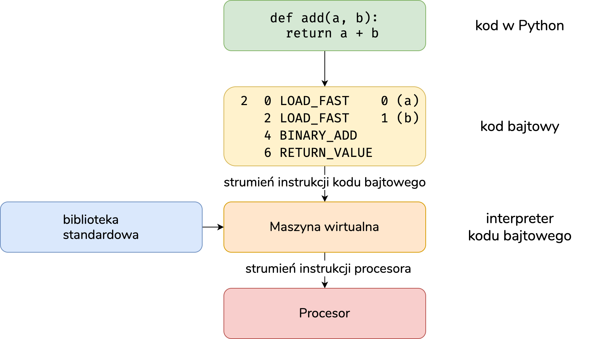]

---
## Co się dzieje z kodem, gdy klikamy "Run ▶"?

W Julii proces kompilacji wygląda *trochę* inaczej. Wykorzystuje kompilację *w locie*.

.img-center-medium[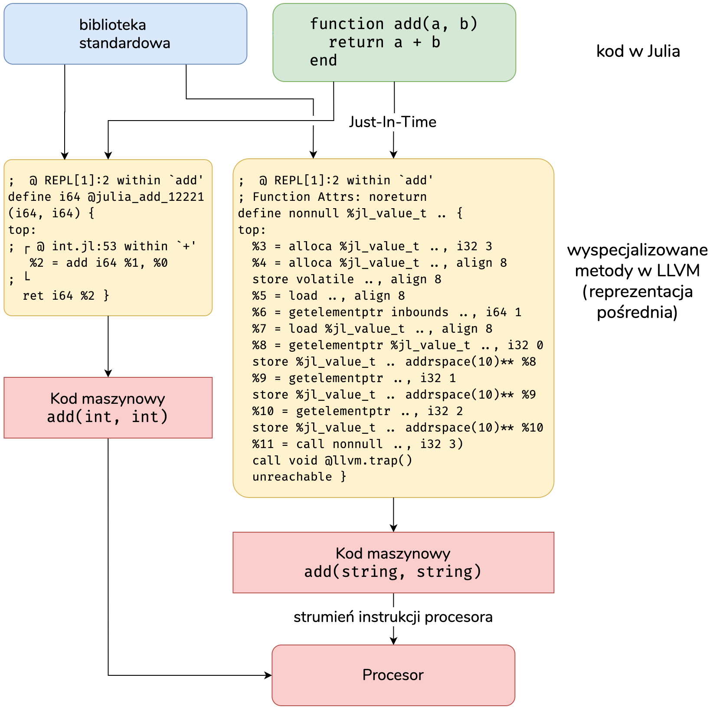]

---
## Co się dzieje z kodem, gdy klikamy "Run ▶"?

Wykorzystując projekt Numba kod w Pythonie również może być kompilowany w locie.

.img[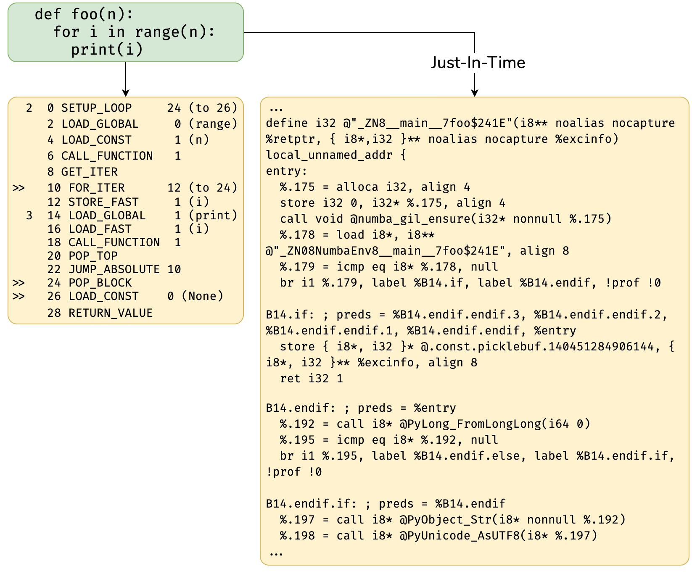]

---
## Co się dzieje z kodem, gdy klikamy "Run ▶"?

Kod w Julii równoważny temu przedstawionemu na poprzednim slajdzie.

.img-center-medium[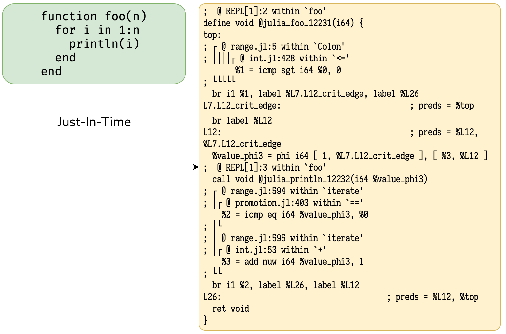]

---
## Jak porównywać realizacje algorytmów

* w Julii makro `@time`, które oprócz czasu działania bada też rozmiar alokowanej pamięci,
* przy pierwszym uruchomieniu funkcji może powstać potrzeba jej kompilacji w locie,
* pakiet `BenchmarkTools` posiada makro `@btime`, które wielokrotnie uruchamia kod.

```julia
f(x) = x > 0.0 ? x : 0.0
@time f(1.0) # obejmuje też czas kompilacji... nie jest miarodajne!
@time f(1.0) # to już coś może powiedzieć.

@time f(1)   # ponownie skompiluje, tym razem dla argumentu Int64!
@time f(1)
```

--

- możemy porównywać też kod, do którego kompilowane są funkcje,
- mamy dostęp do makr `@code_lowered`, `@code_llvm` czy `@code_native`.

```julia
julia> @code_lowered f(4)
CodeInfo(
1 ─ %1 = x > 0.0
└──      goto #3 if not %1
2 ─      return x
3 ─      return 0.0
)
```

---
class: center, middle

.center[]
.center[.unsplash-credit[
<a href="https://unsplash.com/@kelli_mcclintock" title="Download free do whatever you want high-resolution photos from Kelli McClintock">
  <span>
    <svg xmlns="http://www.w3.org/2000/svg" viewBox="0 0 32 32"><title>unsplash-logo</title>
      <path d="M10 9V0h12v9H10zm12 5h10v18H0V14h10v9h12v-9z"></path>
    </svg>
  </span>
  <span>Kelli McClintock</span>
</a>]]

---

## Wartości w pudełkach


.img-top-right[]

.pull-left[
Dynamiczne języki często pozwalają na przechowywanie w kontenerach wartości o&nbsp;różnych typach danych.

Wymaga to zbudowania *pudełek* na te wartości, aby je przechowywać.

Jaki jest wpływ tych pudełek?
]
--


.img-bottom-right[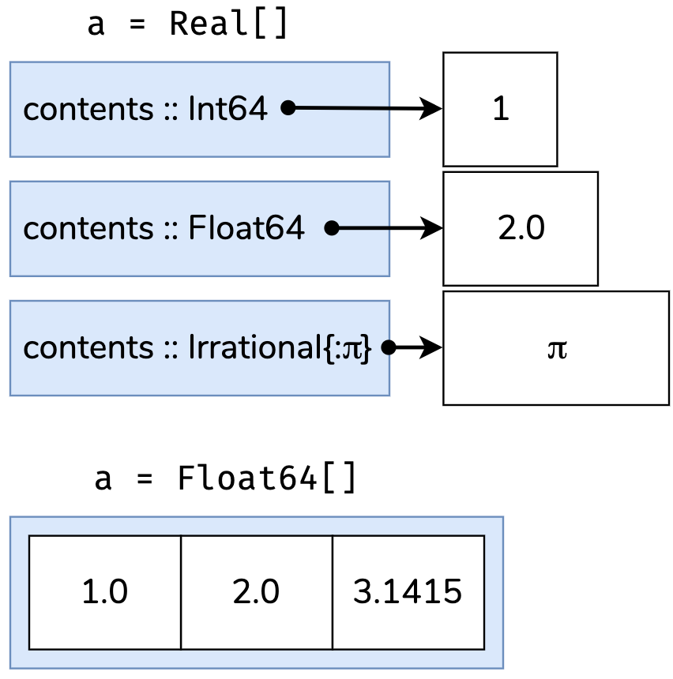]
.pull-left[
W przypadku, gdy kontener zawiera różne typy danych, w jego segmencie pamięci przechowywane są pudełka *ze wskaźnikami* na faktyczne wartości oraz informacja o&nbsp;typie tej wartości.

Oznacza to, że nie można wykorzystać pamięci podręcznej procesora...
]
---
## Wartości w pudełkach

Kontener z typem abstrakcyjnym:
```julia
a = Real[]
push!(a, 1)
push!(a, 2.0)
push!(a, π) #  3-element Array{Real,1}:    1     2.0   π
```

Kontener z typem konkretnym:
```julia
a = Float64[]
push!(a, 1)
push!(a, 2.0)
push!(a, π) #  3-element Array{Float64,1}: 1.0   2.0   3.141592653589793
```

---
## Wartości w pudełkach

.img-top-right[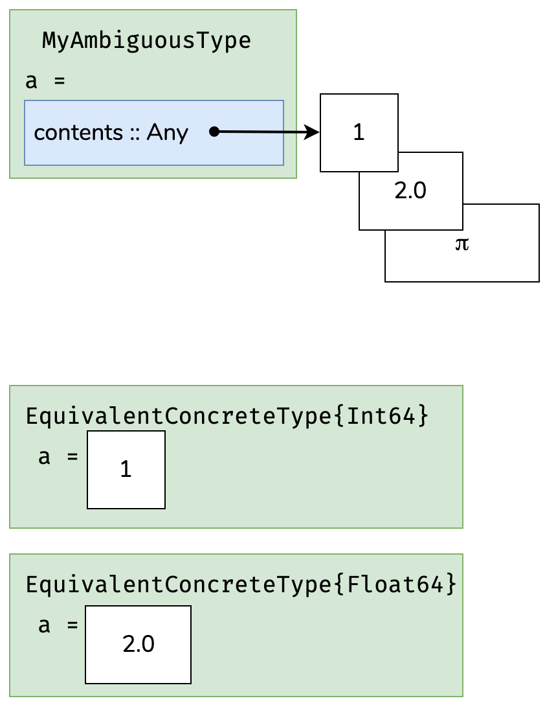]

Analogicznie do kontenerów z niekonkretnymi typami danych, wygląda sytuacja ze strukturami.
Dzięki wykorzystaniu konkretnych typów, środowisko uruchomieniowe potrafi optymalnie rozmieścić je w pamięci tak, aby jak najlepiej wykorzystać pamięć podręczną.

---
## Wartości w pudełkach

Brak typu konkretnego w strukturze nie pozwala środowisku uruchomieniowemu wnioskować o&nbsp;polu `a`, przez co generowany kod musi umieć rozpakować wartość `a` z pudełka.

```julia
struct MyAmbiguousType
 a
end

b = MyAmbiguousType("Hello")
c = MyAmbiguousType(17)

@show typeof(b); # typeof(b) = MyAmbiguousType
@show typeof(c); # typeof(c) = MyAmbiguousType
```

--

Definicja abstrakcyjnego typu (jakim jest np. `Real`) pozwala trochę ograniczyć rodzaj wartości tego pola, ale nie wpływa pozytywnie na wydajność.

```julia
mutable struct MyStillAmbiguousType
 a :: Real
end

t = MyStillAmbiguousType(3.2)
@show typeof(t); # typeof(t) = MyStillAmbiguousType
```

---
## Wartości w pudełkach

Zamiast deklarować abstrakcyjny typ pola możemy zdefiniować abstrakcyjny, parametryczny typ struktury. Wtedy **instancja** struktury będzie miała konkretny typ, niezmienny w trakcie działania programu.

```julia
mutable struct EquivalentConcreteType{T <: Real}
 a :: T
end

m = EquivalentConcreteType(3.2)
@show typeof(m) # typeof(m) = EquivalentConcreteType{Float64}

func(m::EquivalentConcreteType) = m.a + 1
@code_llvm func(m)
```

--

Pozwoli to na wygenerowanie efektywnego kodu:

```llvm 
    ;  @ In[14]:1 within `func'
    define double @julia_func_17450(%jl_value_t addrspace(10)* nonnull align 8...{
    top:
    ; ┌ @ Base.jl:20 within `getproperty'
       %1 = addrspacecast %jl_value_t addrspace(10)* %0 to %jl_value_t ...
       %2 = bitcast %jl_value_t addrspace(11)* %1 to double addrspace(11)*
       %3 = load double, double addrspace(11)* %2, align 8
    ; └
    ; ┌ @ promotion.jl:311 within `+' @ float.jl:401
       %4 = fadd double %3, 1.000000e+00
    ; └
      ret double %4
    }
```

---

## Wartości w pudełkach

W przypadku pola z abstrakcyjnym typem danych:

```julia
func(m::MyStillAmbiguousType) = m.a + 1
@code_llvm func(t)
    ;  @ In[12]:1 within `func'
    define nonnull %jl_value_t addrspace(10)* @japi1_func_17448(%jl_val... {
    top:
      %3 = alloca %jl_value_t addrspace(10)*, i32 2
      %gcframe = alloca %jl_value_t addrspace(10)*, i32 3
      %4 = bitcast %jl_value_t addrspace(10)** %gcframe to i8*
      call void @llvm.memset.p0i8.i32(i8* %4, i8 0, i32 24, i32 0, i1 false)
      %5 = alloca %jl_value_t addrspace(10)**, align 8
      store volatile %jl_value_t addrspace(10)** %1, %jl_value_t addrsp...
      %thread_ptr = call i8* asm "movq %fs:0, $0", "=r"()
      %ptls_i8 = getelementptr i8, i8* %thread_ptr, i64 -15712
      %ptls = bitcast i8* %ptls_i8 to %jl_value_t***
      %6 = getelementptr %jl_value_t addrspace(10)*, %jl_value_t addrsp...
      %7 = bitcast %jl_value_t addrspace(10)** %6 to i64*
      store i64 2, i64* %7
      %8 = getelementptr %jl_value_t**, %jl_value_t*** %ptls, i32 0
      %9 = getelementptr %jl_value_t addrspace(10)*, %jl_value_t addrsp...
      %10 = bitcast %jl_value_t addrspace(10)** %9 to %jl_value_t***
      %11 = load %jl_value_t**, %jl_value_t*** %8
      store %jl_value_t** %11, %jl_value_t*** %10
      %12 = bitcast %jl_value_t*** %8 to %jl_value_t addrspace(10)***
      store %jl_value_t addrspace(10)** %gcframe, %jl_value_t addrsp...
      %13 = load %jl_value_t addrspace(10)*, %jl_value_t addrsp...
    ; ┌ @ Base.jl:20 within `getproperty' ...
```

---
class: center, middle

.center[.unsplash[]]
.center[.unsplash-credit[
<a href="https://unsplash.com/@vladimir__film" title="Download free do whatever you want high-resolution photos from Vladimir Malyutin">
  <span>
    <svg xmlns="http://www.w3.org/2000/svg" viewBox="0 0 32 32">
      <title>unsplash-logo</title>
      <path d="M10 9V0h12v9H10zm12 5h10v18H0V14h10v9h12v-9z"></path>
    </svg>
  </span>
  <span>Vladimir Malyutin</span>
</a>]]

---
## Pamięć podręczna

To, w jaki sposób ułożone są dane w pamięci jest istotne. Ponownie, pamięć podręczna procesora pozwala na szybszy dostęp do danych znajdujących się blisko siebie.

.img-center-medium[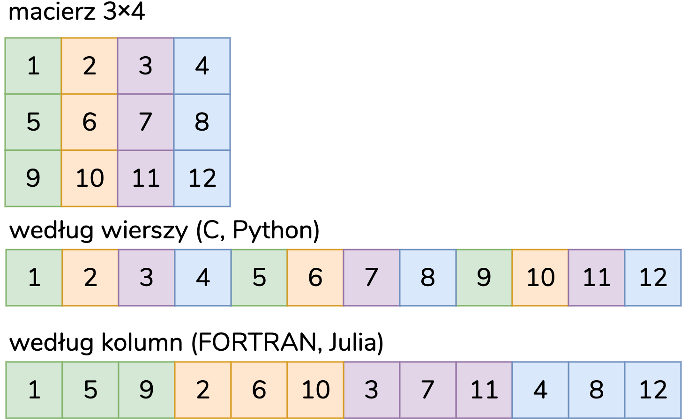]

---
## Pamięć podręczna

Załóżmy, że do pamięci podręcznej procesora pobieramy dwie kolejne komórki pamięci:

.img-center-medium[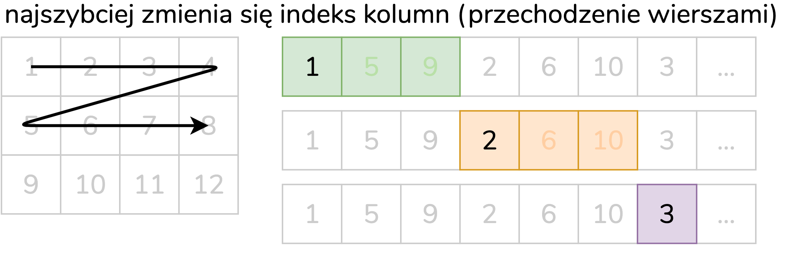]

.img-center-medium[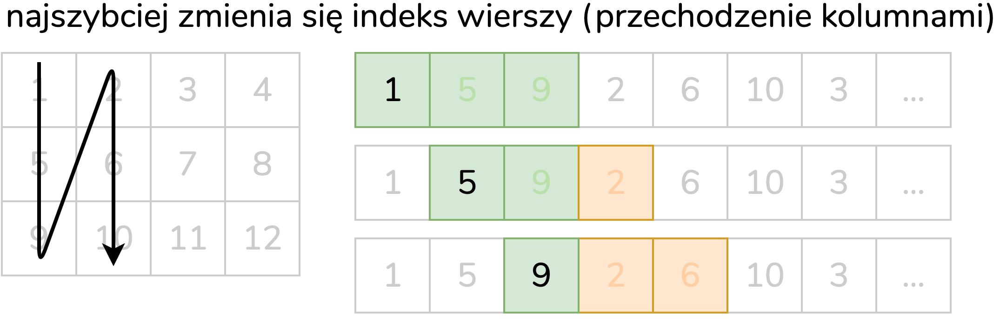]

---
## Pamięć podręczna

```julia
import BenchmarkTools: @btime
function copy_col_row!(out::Array{T,2}, x::Vector{T}) where T
    inds = axes(x, 1);
    for col = inds, row = inds
        out[row, col] = x[row]
    end
    return out
end
function copy_row_col!(out::Array{T,2}, x::Vector{T}) where T
    inds = axes(x, 1);
    for row = inds, col = inds
        out[row, col] = x[col]
    end
    return out
end
n = 10_000;
x = randn(n);
out = similar(Array{Float64}, n, n)
```
--
Indeks kolumn zmienia się najszybciej:
```julia
julia> @btime copy_row_col!(out, x);
  3.768 s (0 allocations: 0 bytes)
```
Indeks wierszy zmienia się najszybciej:
```julia
julia> @btime copy_col_row!(out, x);
85.932 ms (0 allocations: 0 bytes)
```

---

## Wstępna alokacja pamięci

W Julii alokacja pamięci i jej zwalnianie są automatyczne (istnieje odśmiecacz pamięci – *ang. garbage collector*).
Możemy pomóc w gospodarce pamięcią tworząc struktury raz i ponownie ich używając.

.pull-left[
```julia
function xinc(x)
 return [x, x+1, x+2]
end

function loopinc()
 y = 0
 for i = 1:10^7
  ret = xinc(i)
  y  += ret[2]
 end
 return y
end
```
]

--

.pull-right[
```julia
function xinc!(ret, x)
 ret[1] = x
 ret[2] = x+1
 ret[3] = x+2
 nothing
end

function loopinc_prealloc()
 ret = Vector{Int}(undef, 3)
 y = 0
 for i = 1:10^7
  xinc!(ret, i)
  y += ret[2]
 end
 return y
end
```
]

--

Porównanie pokazuje, że możemy oszczędzić *dużo* pamięci i czasu:
```julia
julia> @btime loopinc();
 1.066 s (10000000 allocations: 1.04 GiB)
julia> @btime loopinc_prealloc()
 9.986 ms (1 allocation: 112 bytes)
```

---
class: center, middle
## Kopiować czy nie kopiować?

---
## Kopiować czy nie kopiować?

Domyślnie, wycięcie kawałka wektora/macierzy w Julii zwraca kopię†.
.footnote[† chyba, że wycinanie jest po lewej stronie operatora przypisania]

```julia
x = [1 2 3 4 5]

c = x[1:4]  # wycięcie elementów z wektora v
c[2] = 9 # c = 1 9 3 4, x = 1 2 3 4 5

v = view(x, 1:4)
v[2] = 0 # v = 1 0 3 4, x = 1 0 3 4 5 
```

--

Dla wygody możemy skorzystać z makra `@views`, które automatycznie zamienia kopiowanie na tworzenie widoku.

```julia
       fcopy(x) = sum(x[2:end-1]);
@views fview(x) = sum(x[2:end-1]);
```

Rezygnacja z kopiowania może przyspieszyć program.

```julia
julia> x = rand(10^6);
julia> @btime fcopy(x);
    1.283 ms (3 allocations: 7.63 MiB)
julia> @btime fview(x);
  460.700 μs (2 allocations: 64 bytes)
```

---
## Kopiować czy nie kopiować?

Czasami kopiowanie niewielkiego fragmentu macierzy może przynieść zysk w czasie działania algorytmu (*patrz* slajd o pamięci podręcznej):

```julia
using Random
N, n = 1_000_000, 500_000;
inds = shuffle(1:N)[1:n];
println("Indeksy: ", inds[1:5], "...")

x = randn(N);
A = randn(50, N);

x̂ = zeros(n);
 = zeros(50, n);

@btime @views sum(A[:, inds] * x[inds])
@btime @views begin
           copyto!(x̂, x[inds])
           copyto!(Â, A[:, inds])
           sum(Â * x̂)
       end

# Indeksy: [312390, 17432, 853856, 62834, 420377]...
#  323.159 ms (12 allocations: 784 bytes)
#  245.241 ms (12 allocations: 784 bytes)
```

---
## Stabilne typy

Środowisko uruchomieniowe Julii potrafi dobrze wnioskować typy zmiennych nawet bez ich jawnej deklaracji.
Ale czasami funkcje napisane są tak, że automatycznie trudno jest przewidzieć typ wszystkich zmiennych.

.pull-left[
```julia
function baz()
 x = 1
 for i = 1:10
  x /= rand()
 end
 return x
end

julia> @code_warntype baz()
```
]
.pull-right[
```julia
Variables
x::Union{Float64, Int64}
@_3::Union{Nothing,Tuple{Int64,Int64}}
i::Int64

Body::Float64
1       (x = 1)
│ %2  = (1:10)::Core.Compiler.Const...
│       (@_3 = Base.iterate(%2))
│ %4  = (@_3::Core.Compiler.Const...
│ %5  = Base.not_int(%4)::Core...
└─      goto #4 if not %5
2 %7  = @_3::Tuple{Int64,Int64}...
│       (i = Core.getfield(%7, 1))
│ %9  = Core.getfield(%7, 2)::Int64
│ %10 = x::Union{Float64, Int64}
│ %11 = Main.rand()::Float64
│       (x = %10 / %11)
│       (@_3 = Base.iterate(%2, %9))
│ %14 = (@_3 === nothing)::Bool
│ %15 = Base.not_int(%14)::Bool
└─      goto #4 if not %15
3       goto #2
4       return x::Float64
```
]
---

```julia
function strange_twos(n)
 a = Vector{rand() > 0.5 ? Int64 : Float64}(undef, n)
 for i = 1:n
  a[i] = 2
 end
 return a
end
```
```julia
julia> @code_warntype strange_twos(1)
Variables
  n::Int64
  a::Array{_A,1} where _A
  @_4::Union{Nothing, Tuple{Int64,Int64}}
  i::Int64
  @_6::Union{Type{Float64}, Type{Int64}}
Body::Array{_A,1} where _A
1 ─       Core.NewvarNode(:(a))
│         Core.NewvarNode(:(@_4))
│   %3  = Main.rand()::Float64
│   %4  = (%3 > 0.5)::Bool
└──       goto #3 if not %4
2 ─       (@_6 = Main.Int64)
└──       goto #4
3 ─       (@_6 = Main.Float64)
4 ┄ %9  = @_6::Union{Type{Float64}, Type{Int64}}
│   %10 = Core.apply_type(Main.Vector, %9)::Type{Array{_A,1}} where _A
│         (a = (%10)(Main.undef, n))
...
│   %15 = Base.not_int(%14)::Bool
└──       goto #7 if not %15
5 ┄ %17 = @_4::Tuple{Int64,Int64}::Tuple{Int64,Int64}
...
7 ┄       return a
```

---
## Kropka tu, kropka tam! Czyli, bardziej efektywne pętle!

Dzięki `.` Julia jest w stanie już na poziomie *parsera* określić, że pewne operacje na wektorach może zrealizować w tym samym obiegu pętli.

Porównajmy dwie wersje funkcji liczącej wartości wielomianu:
```julia
f(x) =    3x.^2  + 4x  + 7x.^3;
g(x) = @. 3x^2   + 4x  + 7x^3;
x = rand(10^6);
```

Widać, że w przypadku pierwszej funkcji utworzonych zostało dużo więcej zmiennych tymczasowych na wyniki pośrednie:
```julia
julia> @btime f(x);
    6.942 ms (12 allocations: 45.78 MiB)
julia> @btime g(x);
  906.600 μs (2 allocations: 7.63 MiB)
julia> @btime f.(x);
  923.200 μs (5 allocations: 7.63 MiB)
```
---

## Podsumowanie

* Dzięki kompilacji w locie i stabilnym, znanym typom zmiennych możliwa jest generacja szybkiego kodu.

--

* Julia charakteryzuje się tym, że cały program może ulec optymalizacji, bez uszczerbku na jego czytelności czy prędkości.

--

* Projekty takie jak Numba czy Cython pozwalają zoptymalizować tylko **część** programu.

.img-center-medium[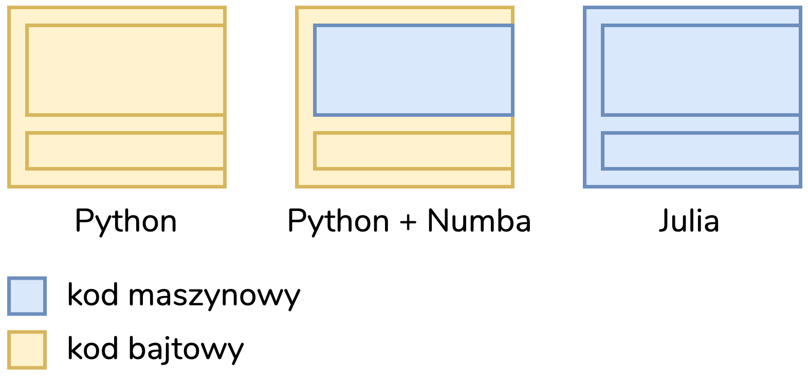]

---
class: middle
.center[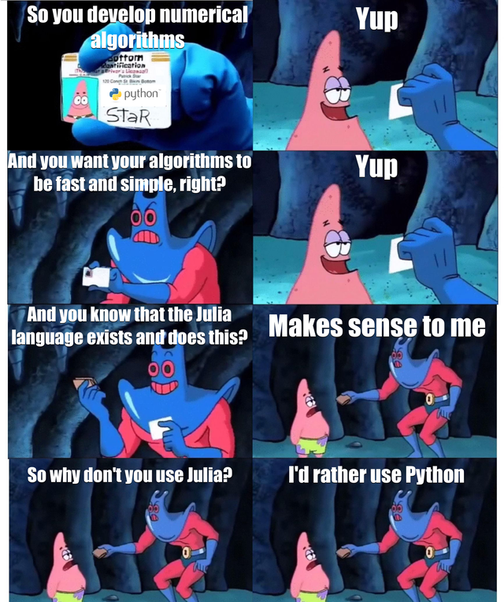]

---

## Literatura

* Chris Rackauckas, 2018, "Why Numba and Cython are not substitutes for Julia", url:&nbsp;https://www.stochasticlifestyle.com/why-numba-and-cython-are-not-substitutes-for-julia/, dostęp:&nbsp;02.03.2020
* Steven G. Johnson, 2017, "More Dots: Syntactic Loop Fusion in Julia", url:&nbsp;https://julialang.org/blog/2017/01/moredots/, dostęp:&nbsp;05.03.2020
* dokumentacja Julia "Performance Tips", url:&nbsp;https://docs.julialang.org/en/v1/manual/performance-tips/, dostęp:&nbsp;01.03.2020
* Lionel Zoubritzky, 2018, "Engineering Julia for Speed", JuliaCon2018, url:&nbsp;https://www.youtube.com/watch?v=XWIZ_dCO6X8, dostęp:&nbsp;10.04.2022
* Brain Jackson, 2020, "Adventures in Avoiding Allocations", JuliaCon2020, url:&nbsp;https://www.youtube.com/watch?v=o8qTJGcPWkE, dostęp:&nbsp;10.04.2022
---
class: center, middle, inverse
# Dziękuję za uwagę
