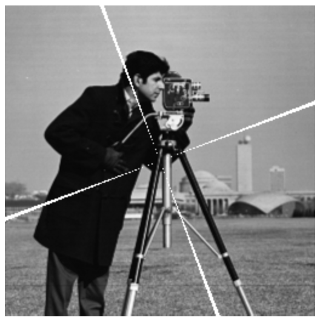

class: center, middle, inverse
<style> .remark-code, code { padding: 5px; font-family: monospace; font-size: 15px;} </style>
<style> img { max-height: 520px; } </style>
<style> .attention { color: #ffb570; } </style>
<style> .has-jax { background: none; font-size: 13pt } </style>

# Algorytmy w inżynierii danych

## Wykład 07 - Macierze i wartości własne

## Bartosz Chaber

e-mail: bartosz.chaber@pw.edu.pl
2023L

.img-nerw-header[]

---
### Macierzowe układy równań
Jest wiele ciekawych problemów, które można rozwiązać znajdując
taki wektor `\(\mathbf{x}\)`, który spełnia macierzowy układ równań:

$$\mathbf{A} \mathbf{x} = \mathbf{b},$$
gdzie znamy macierz `\(\mathbf{A}\)`, oraz pewien wektor `\(\mathbf{b}.\)`

---
### Renderowanie sceny 3D metodą energetyczną

.img-center[]
Zrzut ekranu z demo silnika Frostbite 2.0 (oparto na nim m.in. grę Battlefield 3 czy Need for Speed: The Run)

---
### Renderowanie sceny 3D metodą energetyczną

Metoda energetyczna (ang. radiosity) polega na zbudowaniu macierzowego układu równań opisujących jak natężenie światła jest przesyłane z jednego płatu (ang. patch) do innego. Rozwiązaniem jest jasność każdego z płatów.

.img-center[]

---
### Symulacje anten metodą elementów brzegowych

Oprogramowanie pozwalające projektować efektywne anteny polega na rozwiązaniu macierzowego układu równań, którego rozwiązanie pozwala na wyznaczenie rozkładu pola elektromagnetycznego w dowolnej odległości wokół anteny. Na tej podstawie można ocenić, czy antena jest dobra, czy zła.

.img-center[]
Klatka z serialu Mr Robot (S02E09 &mdash; https://www.youtube.com/watch?v=AdHE5Nss4HI)

---
### Silnik fizyczny (ang. physics engine)
Silniki fizyczne, często potrzebują rozwiązywać skomplikowane układy połączonych ze sobą punktów materialnych. Na podstawie zależności w tych układach, powstaje zbiór ograniczeń, które określają
jakie siły działają w tym układzie ciał.

.img-center[]
Model katapulty (Making My Physics Engine 10x Faster and Simulating Trusses &mdash; https://www.youtube.com/watch?v=oulfRfqTxJA)
---
class: center, middle, inverse

## Wszystko zaczyna się od .attention[macierzy]...
---
### Macierz, jako przekształcenie
.pull-left[Potraktujmy teraz obraz... .img-center[]]
--
.pull-right[...jako zbiór punktów o pewnym natężeniu koloru. .img-center[]]
---
### Macierz, jako przekształcenie
.pull-left[Możemy taki obraz obrócić o wybrany kąt... .img-center[]]
--
.pull-right[...albo ścisnąć (ang. skew).img-center[]]
---
### Macierz, jako przekształcenie
Odpowiadają temu odpowiednie macierze przekształceń:

Obrót o `\(45^\circ\)`: $$\begin{pmatrix}0.707107 & 0.707107\\\ -0.707107 & 0.707107\end{pmatrix}$$
Ściśnięcie: $$\begin{pmatrix} 1.04 & 0.2\\\ 0.2 & 1.0\end{pmatrix}$$
---
class: center, middle, inverse

## Jest coś specjalnego w tych macierzach przekształceń
no .attention[właśnie]...
---
### Wartości i wektory własne
Wektory własne są charakterystycznymi wektorami dla konkretnej, kwadratowej macierzy `\(\mathbf{A}\)`, spełniającymi tzw. równanie charakterystyczne:

$$\mathbf{A} \mathbf{v} = \lambda \mathbf{v}$$
(`\(\lambda\)` jest liczbą).

Równanie charakterystyczne można zrozumieć jako: 
> przekształcenie wektora własnego `\(\mathbf{v}\)` jest równoznaczne wydłużeniu/skróceniu go o współczynnik `\(\lambda\)`.

Wartości własnych jest tyle, co liczba kolumn macierzy `\(\mathbf{A}\)`.
Niektóre z wartości własnych mogą się powtarzać (są to wielokrotne wartości własne).
Z każdą wartością własną skojarzony jest jeden **znormalizowany** wektor własny.
---
### Wektory własne obrotu i ściśnięcia
Metody do wyznaczania wartości i wektorów własnych znajdują się w module `LinearAlgebra`:
```julia
> using LinearAlgebra
> λ, v = eigen(A)```
Wektory własne są podane *kolumnami*.

.pull-left[**obrót** .img-center[]]
.pull-right[**ściśnięcie** .img-center[]]
---
### Wektory własne operacji ściśnięcia
Zobaczmy jak kierunki własne są zachowywane.

.pull-left[**losowe kierunki** .img-center[]]
.pull-right[**kierunki własne** .img-center[]]
---
### Wektory własne operacji ściśnięcia
Zobaczmy jak kierunki własne są zachowywane.

.pull-left[**losowe kierunki** .img-center[]]
.pull-right[**kierunki własne** .img-center[]]
---
class: center, middle, inverse

## A teraz odwiedzimy macierzowe .attention[ZOO]
---
### Macierz diagonalna
Macierz diagonalna posiada (zgodnie z nazwą) niezerowe elementy jedynie na głównej przekątnej.
Szczególnym przypadkiem macierzy diagonalnej, jest macierz jednostkowa, która ma na przekątnej `\(1\)`.

.img-center[]
---
### Macierz sprzężona
Podobnie jak istnieją zespolone liczby sprzężone, tak istnieją macierze sprzężone.

```julia
> A = [1 2 3; 4 5 6; 7 8 9]
3×3 Matrix{Int64}:
 1  2  3
 4  5  6
 7  8  9

> A' # transpozycja (zamiana wierszy z kolumnami)
3×3 adjoint(::Matrix{Int64}) with eltype Int64:
 1  4  7
 2  5  8
 3  6  9

> A = [1 1im; 0 1im]
2×2 Matrix{Complex{Int64}}:
 1+0im  0+1im
 0+0im  0+1im

> conj(A) # sprzężenie zespolone
2×2 Matrix{Complex{Int64}}:
 1+0im  0-1im
 0+0im  0-1im

> A' # sprzężenie hermitowskie = sprzężenie zespolone + transpozycja
2×2 adjoint(::Matrix{Complex{Int64}}) with eltype Complex{Int64}:
 1+0im  0+0im
 0-1im  0-1im
```

---
### Macierz Hermitowska
.img-center[]

---
### Macierz symetryczna
.img-center[]

---
### Macierz dodatnio określona
.img-full-width[]

---
### Macierz osobliwa
.img-center-full[]

---
### Macierz odwrotna
.img-full-height[]

---
## Literatura
---
class: center, middle, inverse
# Dziękuję za uwagę
