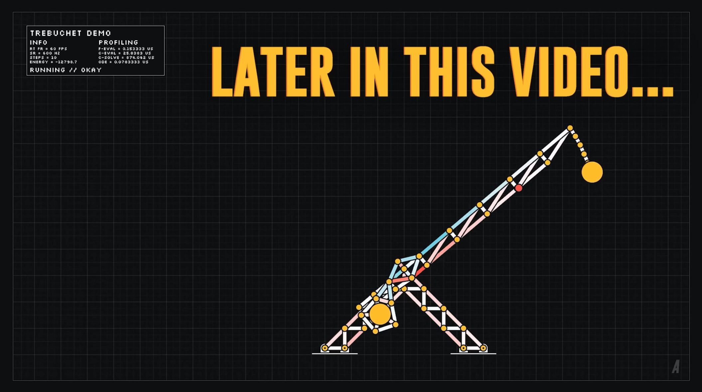

class: center, middle, inverse
<style> .remark-code, code { padding: 5px; font-family: monospace; font-size: 15px;} </style>
<style> img { max-height: 520px; } </style>
<style> .attention { color: #ffb570; } </style>
<style> .has-jax { background: none; font-size: 13pt } </style>

# Algorytmy w inżynierii danych

## Wykład 07 - Wstęp do obliczeń macierzowych

## Bartosz Chaber

e-mail: bartosz.chaber@pw.edu.pl
2023L

.img-nerw-header[]

---
### Macierzowe układy równań
Jest wiele ciekawych† problemów, które można rozwiązać znajdując
taki wektor `\(\mathbf{x}\)`, który spełnia macierzowy układ równań:

$$\mathbf{A} \mathbf{x} = \mathbf{b},$$
gdzie znamy macierz `\(\mathbf{A}\)`, oraz pewien wektor `\(\mathbf{b}.\)`

.footnote[† to zresztą każdy powinien ocenić sam ;)]
### Przykładami są...
---
### Renderowanie sceny 3D metodą energetyczną

.img-center[]
Zrzut ekranu z demo silnika Frostbite 2.0 (oparto na nim m.in. grę Battlefield 3 czy Need for Speed: The Run)

---
### Renderowanie sceny 3D metodą energetyczną

Metoda energetyczna (ang. radiosity) polega na zbudowaniu macierzowego układu równań opisujących jak natężenie światła jest przesyłane z jednego płatu (ang. patch) do innego. Rozwiązaniem jest jasność każdego z płatów.

.img-center[]

---
### Symulacje anten metodą elementów brzegowych

Oprogramowanie pozwalające projektować efektywne anteny polega na rozwiązaniu macierzowego układu równań, którego rozwiązanie pozwala na wyznaczenie rozkładu pola elektromagnetycznego w dowolnej odległości wokół anteny. Na tej podstawie można ocenić, czy antena jest dobra, czy zła.

.img-center[]
Klatka z serialu Mr Robot (S02E09 &mdash; https://www.youtube.com/watch?v=AdHE5Nss4HI)

---
### Silnik fizyczny (ang. physics engine)
Silniki fizyczne, często potrzebują rozwiązywać skomplikowane układy połączonych ze sobą punktów materialnych. Na podstawie zależności w tych układach, powstaje zbiór ograniczeń, które określają
jakie siły działają w tym układzie ciał.

.img-center[]
Model katapulty (Making My Physics Engine 10x Faster and Simulating Trusses &mdash; https://www.youtube.com/watch?v=oulfRfqTxJA)
---
class: center, middle, inverse

## Wszystko zaczyna się od .attention[macierzy]...
---
### Macierz, jako przekształcenie
.pull-left[Potraktujmy teraz obraz... .img-center[]]
--
.pull-right[...jako zbiór punktów o pewnym natężeniu koloru. .img-center[]]
---
### Macierz, jako przekształcenie
.pull-left[Możemy taki obraz obrócić o wybrany kąt... .img-center[]]
--
.pull-right[...albo ścisnąć (ang. skew).img-center[]]
---
### Macierz, jako przekształcenie
Odpowiadają temu odpowiednie macierze przekształceń:

Obrót o `\(-45^\circ\)`: $$\begin{pmatrix}0.707107 & 0.707107\\\ -0.707107 & 0.707107\end{pmatrix}$$
Ściśnięcie: $$\begin{pmatrix} 1.04 & 0.2\\\ 0.2 & 1.0\end{pmatrix}$$
---
class: center, middle, inverse

## Jest coś specjalnego w tych macierzach przekształceń
no .attention[właśnie]...
---
### Wartości i wektory własne
Wektory własne są charakterystycznymi wektorami dla konkretnej, kwadratowej macierzy `\(\mathbf{A}\)`, spełniającymi tzw. równanie charakterystyczne:

$$\mathbf{A} \mathbf{v} = \lambda \mathbf{v}.$$

Równanie charakterystyczne można zrozumieć jako: 
> przekształcenie wektora własnego `\(\mathbf{v}\)` jest równoznaczne wydłużeniu/skróceniu go o współczynnik `\(\lambda\)`.

Wartości własnych jest tyle, co liczba kolumn macierzy `\(\mathbf{A}\)`.
Niektóre z wartości własnych mogą się powtarzać (są to wielokrotne wartości własne).
Z każdą wartością własną skojarzony jest jeden **znormalizowany** wektor własny.
---
### Wektory własne obrotu i ściśnięcia
Metody do wyznaczania wartości i wektorów własnych znajdują się w module `LinearAlgebra`:
```julia
> using LinearAlgebra
> λ, v = eigen(A)```
Wektory własne są podane *kolumnami*.

.pull-left[**obrót** .img-center[]]
.pull-right[**ściśnięcie** .img-center[]]
---
### Wektory własne operacji ściśnięcia
Zobaczmy jak kierunki własne są zachowywane.

.pull-left[**losowe kierunki** .img-center[]]
.pull-right[**kierunki własne** .img-center[]]
---
### Wektory własne operacji ściśnięcia
Zobaczmy jak kierunki własne są zachowywane.

.pull-left[**losowe kierunki** .img-center[]]
.pull-right[**kierunki własne** .img-center[]]
---
### Wektory własne operacji ściśnięcia
Co się w takim razie dzieje z wektorem, przekształcanym przez macierz?

Skoro `\(\mathbf{v} = a_1 \cdot \mathbf{v_1} + a_2 \cdot \mathbf{v_2}\)`,
to `\(\mathbf{A} \cdot \mathbf{v} = a_1 \cdot \mathbf{A} \cdot \mathbf{v_1} + a_2 \cdot \mathbf{A} \cdot \mathbf{v_2}\)`.

```julia
> A = [1.04 0.2; 0.2 1.0]
2×2 Matrix{Float64}:
 1.04  0.2
 0.2   1.0

> _, v = eigen(A);
> v_1 = v[:, 1]
2-element Vector{Float64}:
  0.6710053207609463
 -0.7414525335518785

> w_1 = A * v_1
2-element Vector{Float64}:
  0.5495550268810085
 -0.6072514693996892

> w_1 ./ 0.8190024875775821
2-element Vector{Float64}:
  0.6710053207609464
 -0.7414525335518786
```
Należy zauważyć błąd w ostatniej cyfrze części ułamkowych. Jest to wynik niedokładnego zapisania wartości własnej.

---
class: center, middle, inverse

## A teraz odwiedzimy macierzowe .attention[ZOO]
---
### Macierz diagonalna
Macierz diagonalna posiada (zgodnie z nazwą) niezerowe elementy jedynie na głównej przekątnej.
Szczególnym przypadkiem macierzy diagonalnej, jest macierz jednostkowa, która ma na przekątnej `\(1\)`.

.img-center[]
---
### Macierz sprzężona
Podobnie jak istnieją zespolone liczby sprzężone, tak istnieją macierze sprzężone.

```julia
> A = [1 2 3; 4 5 6; 7 8 9]
3×3 Matrix{Int64}:
 1  2  3
 4  5  6
 7  8  9

> A' # transpozycja (zamiana wierszy z kolumnami)
3×3 adjoint(::Matrix{Int64}) with eltype Int64:
 1  4  7
 2  5  8
 3  6  9

> A = [1 1im; 0 1im]
2×2 Matrix{Complex{Int64}}:
 1+0im  0+1im
 0+0im  0+1im

> conj(A) # sprzężenie zespolone
2×2 Matrix{Complex{Int64}}:
 1+0im  0-1im
 0+0im  0-1im

> A' # sprzężenie hermitowskie = sprzężenie zespolone + transpozycja
2×2 adjoint(::Matrix{Complex{Int64}}) with eltype Complex{Int64}:
 1+0im  0+0im
 0-1im  0-1im
```
.footnote[sprzężenie hermitowskie, ang. _Hermitian adjoint_ lub _conjugate transpose_]
---
### Macierz Hermitowska
.img-center[]

---
### Macierz symetryczna
.img-center[]

---
### Macierz dodatnio określona
.img-full-width[]
---
### Macierz dodatnio określona
Forma kwadratowa `\(\mathbf{v}^T \cdot \mathbf{A} \cdot \mathbf{v}\)` reprezentuje hiperparabolę z globalnym minimum.
.img-full-width[]

---
### Macierz osobliwa
.img-center-full[]

---
### Macierz odwrotna
.img-full-height[]
---
### Macierz unitarna
Macierz, której macierz odwrotna jest równa sprzężeniu hermitowskiemu:
`\(\mathbf{U}\cdot\mathbf{U}^H=\mathbf{U}^T\cdot\mathbf{U}=\mathbf{I}\)`
```julia
> U = [0.0 1im; 1im 0.0]
2×2 Matrix{ComplexF64}:
 0.0+0.0im  0.0+1.0im
 0.0+1.0im  0.0+0.0im

> U'
2×2 adjoint(::Matrix{ComplexF64}) with eltype ComplexF64:
 0.0-0.0im  0.0-1.0im
 0.0-1.0im  0.0-0.0im

> U * U'
2×2 Matrix{ComplexF64}:
 1.0+0.0im  0.0+0.0im
 0.0+0.0im  1.0+0.0im
```
---
### Macierz ortogonalna
To macierz unitarna o wartościach rzeczywistych. Przykładem jest np. macierz obrotu:
```julia
> Q = [cos(π/4) -sin(π/4); sin(π/4) cos(π/4)] # π/4 to 45 stopni
2×2 Matrix{Float64}:
 0.707107  -0.707107
 0.707107   0.707107

> Q * Q'
2×2 Matrix{Float64}:
 1.0  0.0
 0.0  1.0
```
---
### Macierz rzadka
Dość często powstała macierz `\(\mathbf{A}\)` zawiera dużo wartości `\(0\)` (tak jest np. w metodzie energetycznej czy w części obliczeniowej silnika fizycznego). W takim wypadku, pamiętanie jedynie niezerowych wartości daje nam oszczędność pamięciową, oraz czasową (np. mnożąc macierz przez wektor możemy pominąć zerowe elementy macierzy).

```julia
> using SparseArrays
> sprand(Float64, 10, 10, 0.1) # losowa macierz rzadka 10×10, wypełniona w 10%
10×10 SparseMatrixCSC{Float64, Int64} with 9 stored entries:
  ⋅         ⋅    ⋅         ⋅         ⋅         ⋅    ⋅    ⋅    ⋅         ⋅ 
  ⋅         ⋅    ⋅         ⋅         ⋅         ⋅    ⋅    ⋅    ⋅        0.382798
  ⋅         ⋅    ⋅         ⋅        0.674015   ⋅    ⋅    ⋅   0.215447   ⋅ 
  ⋅         ⋅    ⋅        0.40991    ⋅         ⋅    ⋅    ⋅    ⋅         ⋅ 
  ⋅         ⋅    ⋅         ⋅         ⋅         ⋅    ⋅    ⋅    ⋅         ⋅ 
  ⋅         ⋅    ⋅        0.930593   ⋅         ⋅    ⋅    ⋅    ⋅         ⋅ 
 0.214956   ⋅    ⋅         ⋅        0.749859   ⋅    ⋅    ⋅    ⋅         ⋅ 
  ⋅         ⋅   0.593603   ⋅         ⋅         ⋅    ⋅    ⋅    ⋅         ⋅ 
  ⋅         ⋅    ⋅        0.620426   ⋅         ⋅    ⋅    ⋅    ⋅         ⋅ 
  ⋅         ⋅    ⋅         ⋅         ⋅         ⋅    ⋅    ⋅    ⋅         ⋅
```
---
class: center, middle, inverse
## Sposoby przechowywania macierzy rzadkich
---
### Format COOrdinate
Elementy macierzy są przechowywane trójkami: (`i`, `j`, wartość).

Zaletą tego formatu jest szybka konstrukcja macierzy.

Wadą natomiast jest wyciąganie z niej danych, tj. wybranie drugiego wiersza czy czwartej kolumny, itp. Wada ta jest też widoczna w operacjach macierzowych.
Zwykle ten format macierzy jest przepisywany do innych formatów.
```julia
> I = [1, 4, 3, 5];
> J = [4, 7, 10, 9];
> V = [1.2, 2.3, -5.4, 3];
> sparse(I, J, V)
5×10 SparseMatrixCSC{Float64, Int64} with 4 stored entries:
  ⋅    ⋅    ⋅   1.2   ⋅    ⋅    ⋅    ⋅    ⋅     ⋅ 
  ⋅    ⋅    ⋅    ⋅    ⋅    ⋅    ⋅    ⋅    ⋅     ⋅ 
  ⋅    ⋅    ⋅    ⋅    ⋅    ⋅    ⋅    ⋅    ⋅   -5.4
  ⋅    ⋅    ⋅    ⋅    ⋅    ⋅   2.3   ⋅    ⋅     ⋅ 
  ⋅    ⋅    ⋅    ⋅    ⋅    ⋅    ⋅    ⋅   3.0    ⋅ 
```
--
### Podobne formaty
Dictionary Of Keys (DOK): wykorzystuje tablicę asocjacyjną, gdzie kluczem jest para indeksów, a wartością niezerowy element macierzy

LIst of Lists (LIL): zawiera dwie listy list: jedną z posortowanymi indeksami kolumn elementów w danym wierszu, drugą &mdash; z odpowiadającymi, niezerowymi wartościami w danym wierszu.

---
### Format Compressed Sparse Rows
Macierz zdefiniowana jest przy pomocy trzech list: `V` z **niezerowymi** wartościami, `COL_IDX` i `ROW_PTR`.
`COL_IDX` jest listą o tylu elementach, co `V` i zawiera indeks kolumny każdego z tych elementów.
`ROW_PTR` jest listą o długości o jeden większej, niż liczba wierszy macierzy. Zawiera indeksy do listy `V`,
pozwalające szybko wybrać niezerowe elementy z danego wiersza: 

`A[i,:] = V[ROW_PTR[i]:ROW_PTR[i+1]-1]`

Zaletą tego formatu jest łatwość w wyborze wiersza. To szczególnie wygodne przy mnożeniu macierzy rzadkiej przez wektor.

Wadą natomiast jest kosztowne modyfikowanie struktury tej macierzy. Dlatego zwykle do konstrukcji stosuje się formaty COO, DOK czy LIL.
---
### Format Compressed Sparse Columns
Analogiczny format do CSR: różnicą jest to, że mamy `COL_PTR` i `ROW_IDX`. Zgodnie z tym, łatwo jest wybierać
wiersze macierzy rzadkiej w takim formacie.

```julia
10×10 SparseMatrixCSC{Int64, Int64} with 7 stored entries:
 ⋅  1  ⋅  ⋅  ⋅  ⋅  ⋅  ⋅  ⋅  ⋅
 ⋅  ⋅  ⋅  ⋅  ⋅  ⋅  ⋅  ⋅  ⋅  ⋅
 ⋅  ⋅  ⋅  ⋅  ⋅  ⋅  ⋅  ⋅  ⋅  6
 ⋅  2  ⋅  ⋅  ⋅  ⋅  ⋅  ⋅  ⋅  ⋅
 ⋅  3  4  ⋅  ⋅  ⋅  ⋅  ⋅  ⋅  ⋅
 ⋅  ⋅  ⋅  ⋅  ⋅  ⋅  ⋅  ⋅  ⋅  ⋅
 ⋅  ⋅  ⋅  ⋅  5  ⋅  ⋅  ⋅  ⋅  7
 ⋅  ⋅  ⋅  ⋅  ⋅  ⋅  ⋅  ⋅  ⋅  ⋅
 ⋅  ⋅  ⋅  ⋅  ⋅  ⋅  ⋅  ⋅  ⋅  ⋅
 ⋅  ⋅  ⋅  ⋅  ⋅  ⋅  ⋅  ⋅  ⋅  ⋅
nzval  = [1, 2, 3, 4, 5, 6, 7]
rowidx = [1, 4, 5, 5, 7, 3, 7]
colptr = [1, 1, 4, 5, 5, 6, 6, 6, 6, 6, 8]
```
Przykład: druga kolumna zawiera elementy od `1` do `4` (ale bez niego), tj. `nzval[1:4-1]`.

Jest to mniej optymalne dla operacji wymagających wybierania wierszy, ale np. mnożenie
`\(\mathbf{A}\cdot\mathbf{v}\)` można zamienić na
`\(\mathbf{v}^T\cdot\mathbf{A}^T\)` (wtedy będziemy wybierać kolumny z macierzy `\(\mathbf{A}^T\)`).
---
## Literatura

* Burenius, M., "Real-Time Radiosity : Real-time global illumination of a static scene with dynamic lights using hierarchical radiosity", Master's thesis, KTH, 2009.
* Nylén, O., & Pall, P. "The Red-Black Physics Engine: A Parallel Framework for Interactive Soft Body Dynamics", Master's thesis, Chalmers University of Technology/University of Gothenburg, 2017

---
class: center, middle, inverse
# Dziękuję za uwagę
