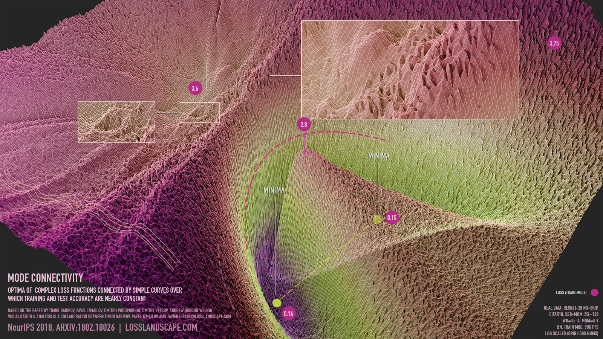

class: center, middle, inverse
<style>	.remark-code, code { padding: 5px; font-family: monospace; font-size: 15px;} </style>
<style> .img-center img { max-height: 620px; width: auto; } </style>
<style>	.attention { color: #ffb570; } </style>
<style>	.has-jax { background: none; font-size: 13pt } </style>
<style> .-fullscreen img { width: 0; height: 0; }
.full-height img { max-width: 100%; }
.full-width img { max-height: 100%; }
.fullscreen img {
  position: absolute;
  top: 0; left: 0;
}
</style>
<style>.pull-left-30 { float: left; width: 35%; }</style>
<style>.pull-right-70 { float: right; width: 63%;}</style>

# Algorytmy w inżynierii danych

## Wykład 08-09 - Optymalizacja

## Bartosz Chaber

e-mail: bartosz.chaber@ee.pw.edu.pl
2023L

.img-nerw-header[]

---

## Algorytmy optymalizacji

Zadaniem algorytmów optymalizacyjnych jest przeszukanie przestrzeni możliwych rozwiązań,
w celu znalezienia takiego, którego wartość funkcji celu jest jak najmniejsza.

Skupimy się na optymalizacji funkcji skalarnych (funkcja celu jest liczbą rzeczywistą).

* `\(\theta \in \mathbb{R}^n\)` to zbiór _n_ parametrów (np. _n_ wag w uczonej sieci neuronowej),
* `\(f(\theta): \mathbb{R}^n \rightarrow \mathbb{R}\)` to funkcja celu, którą minimalizujemy.

Aby odnaleźć punkt optymalny, algorytmy optymalizacji mogą polegać na gradencie i ew. macierzy Hessego:

* `\(\nabla f(\theta) \in \mathbb{R}^n\)` to gradient funkcji celu,
* `\(\nabla^2 f(\theta) \in \mathbb{R}^n\)` to macierz Hessego (drugich pochodnych) funkcji celu.

---
class: center, middle

.img-center[]

---
class: center, middle, inverse

## Metody pierwszego rzędu
## Opierają się na informacji o .attention[gradiencie] optymalizowanej funkcji.
## Gradient zwykle wyliczany jest automatycznie lub ręcznie (bardzo rzadko na podstawie różnic skończonych).

---
## Metoda najszybszego spadku
Najprostsza metoda optymalizacji gradientowej.
Parametryzowana za pomocą długości kroku `\(\alpha\)`. W przypadku uczenia
sieci neuronowych ten parametr nazywa się szybkością uczenia (_ang. learning rate_, czasem oznaczany jako `\(\eta\)` zamiast `\(\alpha\)`).

`\( \theta_{t+1} = \theta_t - \alpha \nabla f(\theta_t) \)`

--

Przykładowa implementacja w Julii:

```julia
abstract type DescentMethod end

struct GradientDescent <: DescentMethod
  α # learning rate
end

function step!(M::GradientDescent, f, ∇f, θ)
  α, g = M.α, ∇f(θ)
  return θ - α*g
end

opt = GradientDescent(0.1) # create a Gradient Descent optimizer
```
--
Widzieliśmy już ją na czwartym wykładzie:
```julia
julia> Wh -= 0.1dWh
julia> Wo -= 0.1dWo
julia> E = net(x, Wh[:], Wo[:], y)
```
---
## Metoda najszybszego spadku z bezwładnością
Metoda najszybszego spadku porusza się z prędkością proporcjonalną do gradientu. Na "płaskich" fragmentach przestrzeni rozwiązań (punkty siodłowe) gradient ma małe wartości i optymalizator porusza się wolno. Dodanie bezwładności pozwala optymalizatorowi pokonać te obszary, w których gradient zanika.

```julia
mutable struct Momentum <: DescentMethod
  α # learning rate
  β # momentum decay
  v # momentum
  Momentum() = new() # new uninitialized structure
end

function init!(M::Momentum, θ; α=0.01, β=0.5)
  M.α = α
  M.β = β
  M.v = zero(θ)
  return M
end

function step!(M::Momentum, f, ∇f, θ) 
  α, β = M.α, M.β
  v, g = M.v, ∇f(θ)
  v[:] = β*v .- α*g
  return θ + v
end

opt = Momentum() # create an uninitialized Momentum optimizer
init!(opt, θ; β=0.002)
```
---
## Metoda najszybszego spadku w działaniu!

<iframe width="700px" height="400px" src="https://www.youtube.com/embed/Q3pTEtSEvDI" title="YouTube video player" frameborder="0" allow="accelerometer; autoplay; clipboard-write; encrypted-media; gyroscope; picture-in-picture" allowfullscreen></iframe>

---
## Harmonogram szybkości uczenia
W zależności od tego jak blisko jesteśmy punktu optymalnego lub czy dopiero rozpoczęliśmy optymalizację możliwe są różne
strategie kontrolowania szybkości uczenia.

Poniżej przedstawione jest kilka przykładowych typów harmonogramów zmian szybkości uczenia:

* `\(\alpha_t = \alpha_0 = \text{const}\)`;
* `\(\alpha_t = \alpha_{t-1}\cdot\gamma = \alpha_0\cdot\gamma^t\)`,`\(\gamma \in (0,1)\)`;
* `\(\alpha_t = \frac{\alpha_0}{\sqrt{t+1}}\)`,`\(t \ge 0\)`;
* `\(\alpha_t = \alpha_{T} + \frac{1}{2}(\alpha_0 - \alpha_T)(1 + \cos(\pi t/T)) \)`.

Rozpoczęcie od wysokiej wartości szybkości uczenia może być niepożądane. Dlatego w ramach harmonogramu zmian szybkości uczenia często zwiększa się najpierw (np. liniowo) wartość szybkości uczenia.


---
class: center, middle, inverse

## Optymalizując wiele parametrów, część z nich może się okazać .attention[mało istotna] w poszukiwaniu punktu optymalnego.
## Opisywane dalej metody wykorzystują .attention[różne szybkości uczenia] dla .attention[różnych parametrów]
## Parametry z mało zmiennymi wartościami gradientu są wygaszane, podczas gdy te o&nbsp;częstych zmianach wartościach są .attention[wzmacniane].

---
## Metoda Nesterov Momentum 
Metoda podobna do najszybszego spadku z bezwładnością, ale gradient wyznaczany jest w następnym/prognozowanym położeniu:

```julia
mutable struct NesterovMomentum <: DescentMethod
  α # learning rate
  β # momentum decay
  v # momentum
  NesterovMomentum() = new()
end

function init!(M::NesterovMomentum, θ; α=0.01, β=0.5)
  M.α = α
  M.ε = ε
  M.v = zero(θ)
  return M
end


function step!(M::NesterovMomentum, f, ∇f, θ) 
  α, β = M.α, M.β
  v, g = M.v, ∇f(θ + β*v)
  v[:] = β*v .- α*g
  return θ + v
end
```
---
## Metoda Adagrad
Monotonicznie modyfikowana szybkość uczenia dla każdego parametru optymalizowanej funkcji.

```julia
mutable struct Adagrad <: DescentMethod
  α # learning rate
  ε # small value
  s # sum of squared gradient
  Adagrad() = new() # new uninitialized structure
end

function init!(M::Adagrad, θ; α=0.01, ε=1e-8)
  M.α = α
  M.ε = ε
  M.s = zero(θ)
  return M
end


function step!(M::Adagrad, f, ∇f, θ) 
  α, ε = M.α, M.ε
  s, g = M.s, ∇f(θ)
  s[:] = s + g .* g
  return θ - α*g ./ (sqrt.(s) .+ ε)
end
```

---
## Metoda RMSProp
**Nie**monotonicznie modyfikowana szybkość uczenia dla każdego parametru optymalizowanej funkcji.

```julia
mutable struct RMSProp <: DescentMethod
  α # learning rate
  ε # small value
  s # sum of squared gradient
  γs # gradient decay
  RMSProp() = new() # new uninitialized structure
end

function init!(M::RMSProp, θ; α=0.01, γs=0.9, ε=1e-8)
  M.α = α
  M.ε = ε
  M.s = zero(θ)
  M.γs = γs
  return M
end

function step!(M::RMSProp, f, ∇f, θ) 
  α, ε, γs = M.α, M.ε, M.γs
  s, g = M.s, ∇f(θ)
  s[:] = γs*s + (1.0 - γs) * g .* g
  return θ - α*g ./ (sqrt.(s) .+ ε)
end
```
---
## Metoda Adadelta

Zastępuje całkowicie szybkość uczenia wartością zależną od zmian każdej z wag.

```julia
mutable struct Adadelta <: DescentMethod
  ε # small value
  s # sum of squared gradient
  u # sum of squared update
  γs # gradient decay
  γθ # update decay
  Adadelta() = new() # new uninitialized structure
end

function init!(M::Adadelta, θ; γs=0.9, γθ= 0.5, ε=1e-8)
  M.ε = ε
  M.s = zero(θ)
  M.u = zero(θ)
  M.γs = γs
  M.γu = γu
  return M
end

function step!(M::Adadelta, f, ∇f, θ) 
  γs, γθ, ε = M.γs, M.γθ, M.ε
  s, u, g = M.s, M.u, ∇f(θ)
  s[:] = γs*s + (1.0 - γs) * g .* g
  Δθ = - (sqrt.(u) .+ ε) ./ (sqrt.(s) .+ ε) .* g
  u[:] = γθ*u + (1.0 - γθ) * Δθ .* Δθ
  return θ + Δθ
end
```

---
## Metoda Adam
Oprócz śledzenia kwadratów gradientów do wygaszania mniej ważnych parametrów, dodana jest bezwładność (jako `v`).

```julia
mutable struct Adam <: DescentMethod
  α # learning rate
  ε # small value
  v # sum gradient
  s # sum of squared gradient
  γs # gradient decay
  γv # momentum decay
  k # step counter
  Adam() = new() # new uninitialized structure
end

function init!(M::Adam, θ; α=0.001, γv=0.9, γs=0.999, ε=1e-8)
  M.α = α
  M.ε = ε
  M.γs = γs
  M.γv = γv
  M.s = zero(θ)
  M.v = zero(θ)
  M.k = 0
  return M
end
```

---
## Metoda Adam
Ponieważ inicjalizacja wektorów `s` i `v` za pomocą zer może powodować błąd systematyczny, niezbędna jest korekcja:

```julia
function step!(M::Adam, f, ∇f, θ) 
  γs, γv  = M.γs, M.γv
  α, ε, k = M.α, M.ε, M.k
  s, v, g = M.s, M.v, ∇f(θ)

  v[:] = γv*v + (1.0 - γv) * g
  s[:] = γs*s + (1.0 - γs) * g .* g

  M.k = k += 1

  v̂ = v ./ (1.0 - γv^k)
  ŝ = s ./ (1.0 - γs^k)
  return θ - α*v̂ ./ (sqrt.(ŝ) .+ ε)
end
```

---
class: center, middle

.fullscreen[.full-width[]]

---
## Co chcemy optymalizować podczas uczenia sieci neuronowych?
Chcemy minimalizować błąd generalizacji sieci.
Zakładamy, że możemy to osiągnąć znajdując minimum
funkcji straty (_ang. loss function_).
.footnote[Autorem powyższej wizualizacji jest Javier Ideami (http://losslandscape.com)]
.full-height[]
---
## _Batch Gradient Descent_

Naturalnym podejściem jest wybranie jako funkcji celu sumy wartości funkcji straty przy zadanych parametrach sieci `\(\theta\)` dla wszystkich _N_ próbkach danych uczących (te _N_ próbek nazywane jest często porcją - _batch_).

Poniżej schemat działania _batch gradient descent_ (oryginalni autorzy w [1]).
.full-height[]
Legenda: `\(\nabla h = \nabla f\)` to gradient funkcji straty, `\(w^i = \theta_i\)` to parametry sieci w _i_-tej iteracji. 
---
## _Batch Gradient Descent_
Przykładowo, w zbiorze danych FashionMNIST od firmy Zalando znajduje się `\(60,000\)` obrazów w zbiorze uczącym. Oznacza to, że optymalizator wykonuje jeden krok po przejrzeniu całej porcji danych. Czy wykonaniu tego kroku wcześniej (po przejrzeniu np. 10 obrazów) działa gorzej?

.full-height[]

---

## Stochastyczna metoda najszybszego spadku
Okazuje się, że podążając za gradientem losowo wybranych próbek również będziemy zmierzać do optymalnego rozwiązania.

Co więcej, gradient wyliczony na podstawiej pojedynczej próbki jest zaszumiony, co pozwala czasami wyjść z lokalnych minimów oraz pokonać punkty siodłowe.

Poniżej schemat działania _stochastic gradient descent_ (oryginalni autorzy również w [1]).
.full-height[]
Legenda: `\(\nabla h = \nabla f\)` to gradient funkcji straty, `\(w^i = \theta_i\)` to parametry sieci w _i_-tej iteracji. 

---
## _Mini-batch Gradient Descent_
Podejście pośrednie między _Stochastic Gradient Descent_ a _Batch Gradient Descent_. Wybieramy _n_ próbek z _N_ dostępnych tworząc mini-porcję danych. Na podstawie tej mini-porcji wyliczamy _uśredniony_ gradient i podążamy w jego kierunku.

Poniżej działanie optymalizatora wykorzystującego porcje i mini-porcje danych (oryginalni autorzy ponownie w [1]).
.full-height[]
---
## Jak efektywnie losować próbki?
Z oczywistych względów _losowy_ dostęp do pamięci (a jeszcze gorzej - dysku) jest kosztowny [2].
Dlatego efektywnie jest _pomieszać_ dane w pamięci, a potem _sekwencyjnie_ przechodzić po próbkach.

Możemy je pomieszać po wczytywaniu:
```julia
import Random: shuffle, shuffle!, seed!
seed!(0)
include("datasets/iris.jl")
test_size  = 10
train_size = 140
data_size  = train_size + test_size
train_set  = shuffle(1:data_size)[1:train_size]
test_set   = setdiff(1:data_size, train_set)
```

A następnie mieszać w każdej epoce uczącej:
```julia
for i=1:epochs
  shuffle!(train_set)
  optimize!(parameters)
  println(i, "\t", test(parameters, test_set))
end
```

---
## Wizualizacja funkcji straty
Funkcja straty jest wielowymiarowa. Z tego powodu trudno jest ją zwizualizować, a przez to zobaczyć z czym mierzy się optymalizator. Pewne, ciekawe rozwiązanie tego problemu proponuje [3]. Polega ono na wykorzystaniu faktu, że losowe wektory z _N_-wymiarowej przestrzeni mają tym większe prawdopodobieństwo bycia ortogonalnymi, im większa jest wartość _N_.
.full-height[]
---
## Wizualizacja funkcji straty
Dzięki tej metodzie, możliwe jest lepsze uchwycenie różnic pomiędzy architekturami sieci neuronowych. Znakomitym przykładem wykorzystania tej techniki są wizualizację Javiera Ideami: https://losslandscape.com/gallery/.

<iframe title="WALTZ-RES | Morphology &amp;amp; Dynamics of the loss landscape of gradient descent in a Resnet-25" src="https://player.vimeo.com/video/361916353?dnt=1&amp;app_id=122963" frameborder="0" allow="autoplay; fullscreen" allowfullscreen="" id="fitvid0" width="600px" height="500px"></iframe>

---
class: center, middle, inverse

# Metody pierwszego rzędu polegają jedynie na kierunku wzrostu wartości minimalizowanej funkcji celu.
# Na podstawie samego gradientu .attention[nie można] określić optymalnej wartości kroku.

---
## Metoda Newtona dla funkcji jednej zmiennej

Metoda Newtona jest standardową metodą poszukiwania równań nieliniowych `\(g(x) = 0\)`. Na podstawie rozwinięcia w szereg Taylora można znaleźć wzór na kolejne przybliżenia:
$$ x_{i+1} = x_i - \frac{g(x_i)}{g'(x_i)} .$$

Teraz, zakładając, że poszukujemy minimum funkcji `\(f(x)\)`, możemy rozwiązać problem `\(f'(x) = 0\)`, czyli wykorzystać wzór:
$$ x_{i+1} = x_i - \frac{f'(x_i)}{f''(x_i)} .$$

.img-bottom-right[]

--
.img-bottom-right[]

---

## Metoda siecznych dla funkcji jednej zmiennej

Metoda siecznych przybliża nam pochodną funkcji (styczną do wykresu) poprzez sieczną między dwoma punktami.

$$ g'(x_i) \approx \frac{g(x_i) - g(x_j)}{x_i - x_j}. $$

.img-bottom-right[]

---
## Metoda Newtona dla funkcji wielu zmiennych

Poprzednia analiza zakłada, że funkcja `\(f\)` jest funkcją jednej zmiennej `\(x\)`. W przypadku, gdy liczba argumentów funkcji jest większa, zamiast pierwszej pochodnej wykorzystujemy gradient funkcji, a zamiast drugiej pochodnej - macierz Hessego.
$$ x_{i+1} = x_i - \frac{\nabla f(x_i)}{\nabla^2 f(x_i)} = x_i - H^{-1}(x_i)\nabla f(x_i), $$
gdzie `\(H^{-1}\)` jest macierzą odwrotną do macierzy Hessego dla funkcji `\(f\)`.

---
## Metoda Newtona

Implementacja w języku Julia może wyglądać następująco (zachowując interfejs `DescentMethod`):
```julia
mutable struct NewtonsMethod
  k
  Δ
  NewtonsMethod() = new()
end

function init!(M::NewtonsMethod, θ)
  M.k = 0
  M.Δ = similar(θ)
end

function step!(M::NewtonsMethod, ∇f, H, θ;
         ε=1e-8, kmax=10_000)
  k, Δ = M.k, M.Δ
  Δ[:] = H(θ) \ ∇f(θ) # => H⁻¹⋅∇f

  if norm(Δ) < ε || k ≥ kmax
    return θ
  end

  M.k = k += 1
  return θ - Δ
end
```

---
## Metoda BFGS
Jedną z bolączek metody Newtona jest konieczność znajomości macierzy Hessego. Oczywiście, stosując automatyczne różniczkowanie możemy ją często wyznaczyć, jednak jest to kosztowne (dla `\(p\)` parametrów optymalizowanych macierz Hessego ma wymiar `\(p \times p\)`).

Odpowiedzią są metody quasi-Newtona, m.in. BFGS (nazwa pochodzi o nazwisk autorów tej metody: Broyden, Fletcher, Goldfarb, Shanno). W BFGS operuje się gradientem i _przybliżeniem_ macierzy Hessego (albo jej odwrotności).

.img-center-small[]

---
## Metoda BFGS

.pull-left[
```julia
using LinearAlgebra
mutable struct BFGS
  Q # approximation of
    # Hessian matrix inverse
  BFGS() = new()
end

function init!(M::BFGS, θ)
  p = length(θ)
  # initiated with an identity matrix
  M.Q = Matrix(1.0I, p, p)
  return M
end
```
]
.pull-right[
```julia
function step!(M::BFGS, f, ∇f, θ)
  Q  = M.Q
  g  = ∇f(θ)

  d  = -Q*g
  ϕ  = α ->  f(θ + α*d)
  ϕ′ = α -> ∇f(θ + α*d)⋅d
  α  = line_search(ϕ, ϕ′, d)
  θ′ = θ + α*d
  g′ = ∇f(θ′)
  δ  = θ′ - θ
  γ  = g′ - g

  Q[:]= Q - (δ*γ'*Q+Q*γ*δ')/(δ'*γ) +
            (1.0 + (γ'*Q*γ)/(δ'*γ)) *
                     (δ*δ')/(δ'*γ)
  return θ′
end
```
]
---
## Minimalizacja kierunkowa (metoda złotego podziału)
Algorytm BFGS wykorzystuje minimalizację kierunkową, poszukując optymalnego kroku `\(\alpha\)`:
.pull-left[
```julia
import Base.MathConstants: φ

function golden_section_search(f,a,b;
    n=50)
  ρ = φ - 1
  d = ρ * b + (1 - ρ)*a
  yd = f(d)
  for i = 1:n-1
    c = ρ*a + (1 - ρ)*b
    yc = f(c)
    if yc < yd
      b, d, yd = d, c, yc
    else
      a, b = b, c
    end
  end
  return a < b ? (a, b) : (b, a)
end
```
]
.pull-right[
```julia
function bracket_minimum(f;
    x=0; s=1e-2, k=2.0)
  a, ya = x, f(x)
  b, yb = a + s, f(a + s)
  if yb > ya
    a,  b  = b, a
    ya, yb = yb, ya
    s = -s
  end
  while true
    c, yc = b + s, f(b + s)
    if yc > yb
      return a < c ? (a, c) : (c, a)
    end
    a, ya, b, yb = b, yb, c, yc
    s *= k
  end
end

function line_search(ϕ, ϕ′, d)
  a, b = bracket_minimum(ϕ)
  x, y = golden_section_search(ϕ, a, b)
  x/2 + y/2
end
```
]
---
## Minimalizacja kierunkowa (na podstawie [4])
Algorytm BFGS wykorzystuje minimalizację kierunkową, poszukując optymalnego kroku `\(\alpha\)`:
.pull-left[
```julia
function zoom(ϕ, ϕ′, αlo, αhi;
    c₁=1e-4, c₂=0.1, jmax=1000)
  ϕ′0 = ϕ′(0.0)
  for j=1:jmax
    αj = 0.5(αlo + αhi) # bisection
    ϕαj = ϕ(αj)
    if ϕαj > ϕ(0.0) + c₁*αj*ϕ′0 ||
       ϕαj ≥ ϕ(αlo)
       αhi = αj
    else
      ϕ′αj = ϕ′(αj)
      if abs(ϕ′αj) ≤ -c₂*ϕ′0
        return αj
      end
      if ϕ′αj*(αhi - αlo) ≥ 0.0
        αhi = αlo
      end
      αlo = αj
    end
  end
  return 0.5(αlo + αhi)
end
```
]
.pull-right[
```julia
function line_search(ϕ, ϕ′, d;
    c₁=1e-4, c₂=0.1, ρ=0.1,
    αmax=100., jmax=1000)
  αi, αj = 0.0, 1.0
  ϕαi, ϕ0, ϕ′0 = ϕ(αi), ϕ(0.0), ϕ′(0.0)
  for j=1:jmax
    ϕαj = ϕ(αj)
    if ϕαj > ϕ0 + c₁*αj*ϕ′0 ||
      (ϕαj ≥ ϕαi && j > 1)
      return zoom(ϕ, ϕ′, αi, αj)
    end
    ϕ′αj = ϕ′(αj)
    if abs(ϕ′αj) ≤ -c₂*ϕ′0
      return αj
    end
    if ϕ′αj ≥ 0.0
      return zoom(ϕ, ϕ′, αj, αi)
    end
    αi, αj = αj, ρ*αj + (1.0 - ρ)*αmax
    ϕαi = ϕαj
  end
  return αj
end
```
]
---
## Minimalizacja kierunkowa (na podstawie [4])
Algorytm BFGS wykorzystuje minimalizację kierunkową, poszukując optymalnego kroku `\(\alpha\)`:
.pull-left[
```julia
function zoom(ϕ, ϕ′, αlo, αhi;
    c₁=1e-4, c₂=0.1, jmax=1000)
  ϕ′0 = ϕ′(0.0)
  for j=1:jmax
    αj = 0.5(αlo + αhi) # bisection
    ϕαj = ϕ(αj)
    if ϕαj > ϕ(0.0) + c₁*αj*ϕ′0 ||
       ϕαj ≥ ϕ(αlo)
       αhi = αj
    else
      ϕ′αj = ϕ′(αj)
      if abs(ϕ′αj) ≤ -c₂*ϕ′0
        return αj
      end
      if ϕ′αj*(αhi - αlo) ≥ 0.0
        αhi = αlo
      end
      αlo = αj
    end
  end
  return 0.5(αlo + αhi)
end
```
]

.pull-right[.img-center-xsmall[]]
---
## Metoda L-BFGS
W przypadku BFGS przechowujemy całą macierz odwrotną do macierzy Hessego.
.pull-left-30[
```julia
using LinearAlgebra
mutable struct LBFGS
  m
  δs
  γs
  qs
  LBFGS() = new()
end

function init!(M::LBFGS, m)
  M.m  = m
  M.δs = []
  M.γs = []
  M.qs = []
  return M
end
```

L-BFGS przechowuje tylko historię _m_ ostatnich gradientów (w `qs`). Następnie wylicza kierunek **bez potrzeby** wyznaczania odwrotności macierzy Hessego.
]

.pull-right-70[
```julia
function step!(M::LBFGS, f, ∇f, θ)
  δs, γs, qs = M.δs, M.γs, M.qs
  m, g = length(δs), ∇f(θ)
  d = -g
  if m > 0
    q = g
    for i in m:-1:1
      qs[i] = copy(q)
      q -= (δs[i]⋅q) / (γs[i]⋅δs[i]) * γs[i]
    end
    z = (γs[m] .* δs[m] .* q) / (γs[m]⋅γs[m])
    for i in 1:+1:m
      z += δs[i]*(δs[i]⋅qs[i]-γs[i]⋅z)/(γs[i]⋅δs[i])
    end
    d = -z;
  end
  ϕ  = α ->  f(θ + α*d);  ϕ′ = α -> ∇f(θ + α*d)⋅d
  α  = line_search(ϕ, ϕ′, d)
  θ′ = θ + α*d; g′ = ∇f(θ′)
  δ  = θ′ - θ; γ  = g′ - g
  push!(δs, δ);    push!(γs, γ);  push!(qs, zero(θ))
  while length(δs) > M.m
    popfirst!(δs); popfirst!(γs); popfirst!(qs)
  end
  return θ′
end
```
]

---
class: center, middle, inverse

## Nie ma nic za darmo. Skuteczność konkretnego optymalizatora i jego parametrów .attention[zależy od rodzaju funkcji celu].
## Stochastyczna metoda najszybszego spadku zdaje się być jedną z najbardzie .attention[odpornych] metod optymalizacji gradientowej.

---

## Literatura
<blockquote>
 Szukając celu w przestrzeni banalnej<br/>
 Myśląc, że nie ma, nie ma, nie znajde...<br/>
 <br/>
 Tysiące mil w kierunku złym<br/>
 Szukając w nim tego co ty...<br/>
</blockquote>
>> Tabu - Tysiące mil https://www.youtube.com/watch?v=P8Gl2EDqN24

* [1] Jeremy Watt, Reza Borhani, Aggelos Katsaggelos, 2016, rozdział 13.6. Stochastic and mini-batch gradient descent - Machine Learning Refined, url: https://kenndanielso.github.io/mlrefined/, dostęp:&nbsp;25.04.2020
* [2] Yoshua Bengio, 2012, Practical recommendations for gradient-based training of deep architectures, Neural networks: Tricks of the trade, Springer, url: https://arxiv.org/abs/1206.5533, dostęp:&nbsp;23.04.2020
* [3] Hao Li, Zheng Xu, Gavin Taylor, Christoph Studer, Tom Goldstein, 2017, Visualizing the Loss Landscape of Neural Nets, Advances in Neural Information Processing Systems, url: https://arxiv.org/abs/1712.09913, dostęp:&nbsp; 20.04.2020
* [4] Jorge Nocedal, Stephen Wright, 2006, Numerical Optimization, Springer
* [5] Mykel J. Kochenderfer, Tim A. Wheeler, 2019, Algorithms for Optimization, The MIT Press
---
class: center, middle, inverse
# Dziękuję za uwagę
