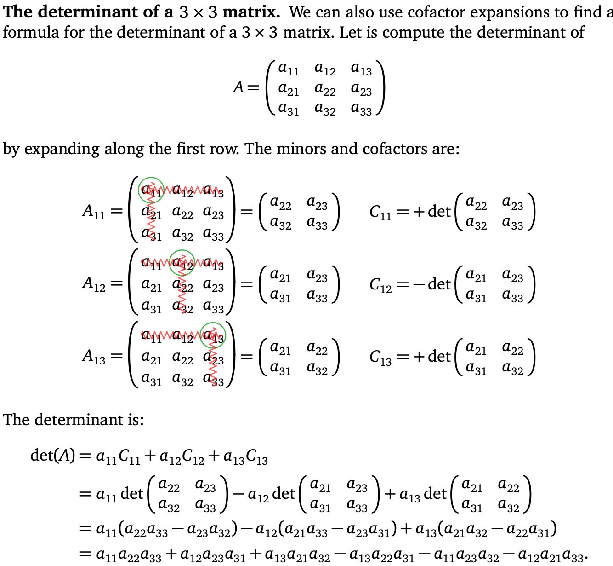
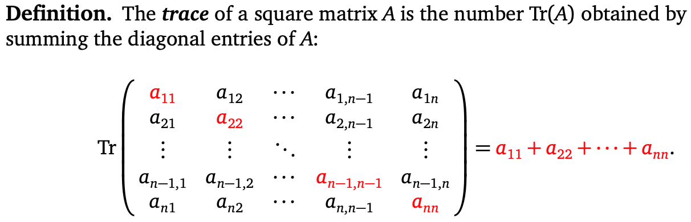
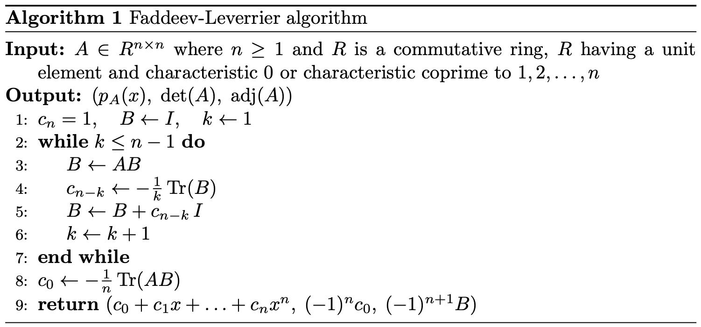
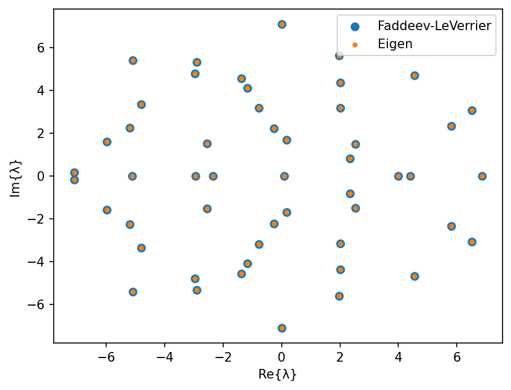
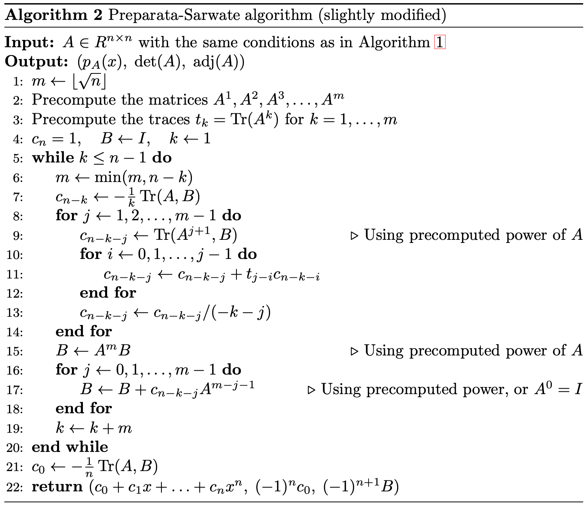
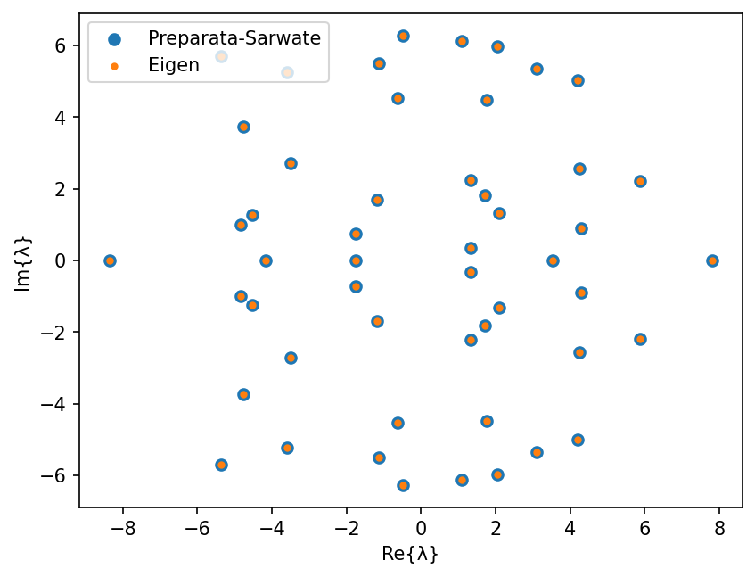
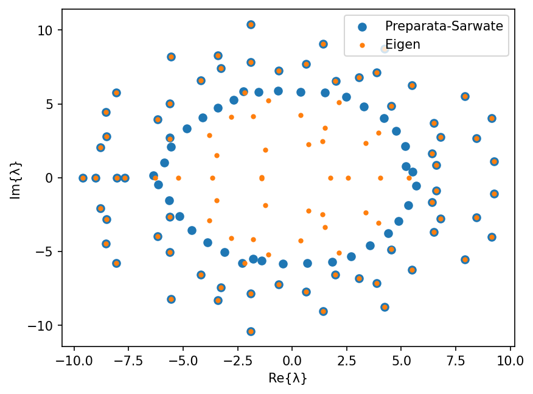
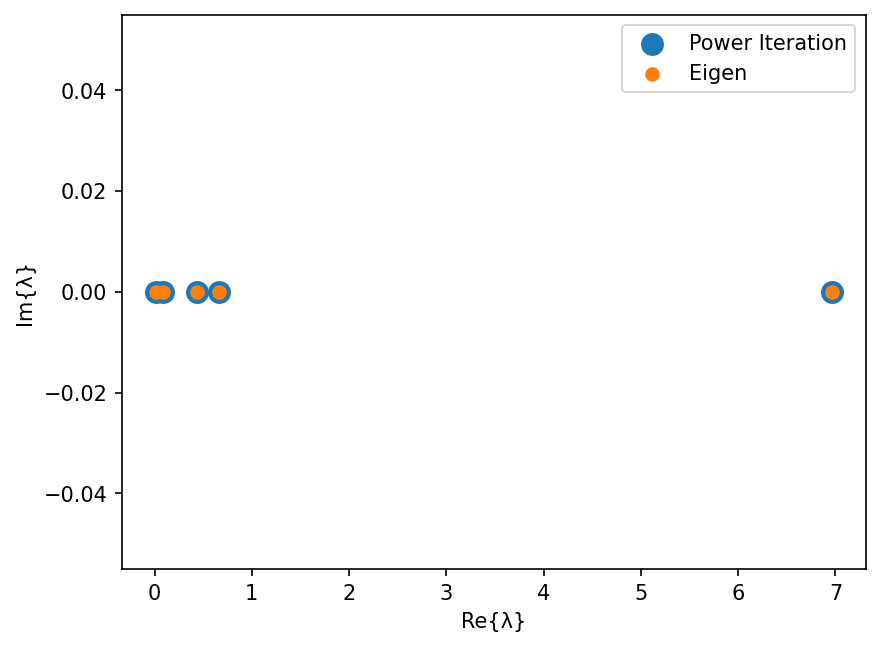
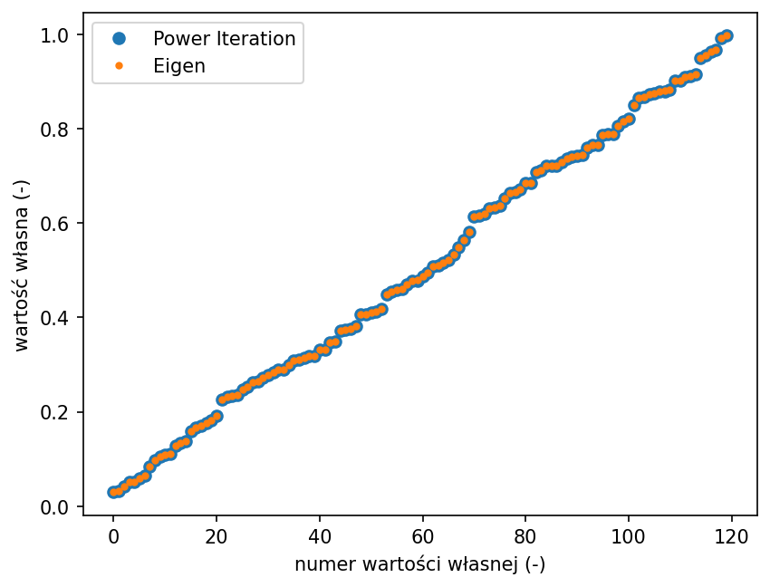

class: center, middle, inverse
<style>	.remark-slide pre { overflow: visible; } </style>
<style>	.remark-code, code { padding: 5px; font-family: monospace; font-size: 15px;} </style>
<style> .img-center img { max-height: 620px; width: auto; } </style>
<style>	.attention { color: #ffb570; } </style>
<style>	.has-jax { background: none; font-size: 13pt } </style>
<style> .-fullscreen img { width: 0; height: 0; }
.full-height img { max-width: 100%; }
.full-width img { max-height: 100%; }
.fullscreen img {
  position: absolute;
  top: 0; left: 0;
}
</style>
<style>.pull-left-30 { float: left; width: 35%; }</style>
<style>.pull-left-70 { float: left; width: 63%; }</style>
<style>.pull-right-30 { float: right; width: 35%;}</style>
<style>.pull-right-70 { float: right; width: 63%;}</style>

# Algorytmy w inżynierii danych

## Wykład 10 - Metoda potęgowa

## Bartosz Chaber

e-mail: bartosz.chaber@ee.pw.edu.pl
2023L

.img-nerw-header[]

---

## Wielomian charakterystyczny macierzy

Najbardziej bezpośrednią metodą znalezienia wartości własnych jest znalezienie miejsc zerowych wielomianu charakterystycznego. Natomiast wyzwaniem jest wyznaczenie tego wielomianu. Wynika to z faktu, że wyznaczenie tego np. z rozwinięcia Laplace'a (wykorzystującego minory) byłoby bardzo czasochłonne dla większych macierzy. Złożoność czasowa wyznaczenia rozwinięcia Laplace'a to `\(O(n!)\)`.

Wielomian charakterystyczny:
$$ f(\lambda) = \text{det}(\lambda \cdot \mathbf{I} - \mathbf{A})$$

---

Wyrażenie na wyznacznik macierzy `\(3\times3\)` przy użyciu rozwinięcie Laplace'a [1]:
.img-center[]

---

## Metoda Faddeeva-LeVerriera

Alternatywną metodą pozwalającą na wyznaczenie współczynników wielomianu charakterystycznego jest metoda Faddeeva-LeVerriera. Jej wynikiem jest wektor współczynników `\(c_0, c_1, c_2, ..., c_N\)` wielomianu charakterystycznego.

--

Wymaga ona wykonania `\(N-1\)` kroków, w trakcie których wykonywane jest mnożenie dwóch, pełnych macierzy oraz znalezienie _śladu_ macierzy `\(\text{tr}(B)\)`, będącego sumą elementów na głównej diagonali `\(B_{ii}\)` (gdzie `\(i=1,2,\ldots,N\)`).

.img-center-xsmall[]

---

Metoda Faddeeva-LeVerriera wykorzystuje formułę Jacobiego wiążącą wyznacznik macierzy ze śladem macierzy dołączonej.

.pull-left-30[
Warto zapoznać się też z twierdzeniem Cayleya-Hamiltona mówiącym, że każda macierz jest pierwiastkiem swojego wielomianu charakterystycznego (tj. podstawiając macierz jako element wielomianu otrzymamy macierz samych zer).
]

.pull-right-70[.img-center-xsmall[]]

---

```julia
using LinearAlgebra
using PolynomialRoots

function FaddeevLeVerrier(A)
    n = size(A, 1)
    I = diagm(ones(n))
    B = copy(I)
    c = zeros(n + 1)
    k = 1
    c[n+1] = 1.0
    while k <= (n - 1)
        B = A * B
        c[n - k + 1] = -(1.0 / k) * tr(B)
        B += c[n - k + 1] * I
        k += 1
    end
    c[1] = -(1.0 / n) * tr(A, B)
    return c
end
```
--
```julia
> A = randn(51, 51)
> values = eigvals(A)
> p = FaddeevLeVerrier(A)
> λ = roots(p)
51-element Vector{ComplexF64}:
      6.8657428220139 + 1.687538997430238e-14im
   1.9631394534145654 + 5.615770473481935im
  -2.9773232474132585 + 4.7880147500078705im
    4.398070991859833 + 1.6557475424655638e-9im
  -2.3566666961006124 + 5.598543761088317e-7im
    2.534093936083932 + 1.489547054658081im
   0.1633540725393203 - 1.6956074900054219im
                      ⋮
```

---

.img-center[]

---

## Metoda Preparata-Sarwate

Metoda Faddeeva-LeVerriera nie jest szybką metodą, ale istnieje ulepszenie nazwane metodą Preparata-Sarwate opisane m.in. przez _Fredrik Johansson_ w _On a fast and nearly division-free algorithm for the characteristic polynomial. 2020. ⟨hal-03016034v2⟩_

Nazywa się go też metodą małych i dużych kroków, ponieważ co `\(m\)` małych kroków wykorzystujących przygotowane wcześniej potęgi macierzy i ich ślady, wykonywany jest duży krok.

Ta metoda wymaga zdefiniowania operacji śladu iloczynu macierzy `\(\mathbf{A}\)` i `\(\mathbf{B}\)`, który może być policzony bez faktycznego mnożenia tych macierzy.

W Julii wymaga to jedynie zdefiniowania nowej wersji metody `tr`.

```julia
function LinearAlgebra.tr(A, B) # product trace: tr(A*B)
    n = size(A, 1)
    result = 0.0
    for i=1:n
        for j=1:n
            result += A[i,j]*B[j,i]
        end
    end
    return result
end
```
---

.img-center[]

---
```julia
function PreparataSarwate(a)
    n = size(a, 1)
    m = floor(Int64, sqrt(n))
    A = precompute_matrices(a, m)
    t = precompute_traces(A, m)
    c = zeros(n + 1)
    I = diagm(ones(n))
    B = copy(I)
    k = 1
    c[n + 1] = 1.0
    while k <= (n - 1)
        m = min(m, n - k)
        c[n - k - 0 + 1] = -(1.0 / k) * tr(A[1], B)
        for j = 1:m-1
            c[n - k - j + 1] = tr(A[j+1], B)
            for i = 0:j-1
                c[n - k - j + 1] += t[j - i] * c[n - k - i + 1]
            end
            c[n - k - j + 1] /= - (k + j)
        end
        B = A[m] * B
        for j = 0:m-2
            B += c[n - k - j + 1] * A[m - j - 1]
        end
        for j = m-1
            B += c[n - k - j + 1] * I
        end

        k += m
    end
    c[1] = -(1.0 / n) * tr(A[1], B)
    return c
end
```

---
Wynik dla losowej macierzy `\(51\times 51\)`:
.img-center[]
---

Niestety, w przypadku dużych macierzy nasz wielomian charakterystyczny jest wysokiego stopnia a jego współczynniki mogą mieć taką rozpiętość wartości, że trudno je objąć zakresem wartości `Float64`.

.pull-left-70[
Wynik dla losowej macierzy `\(101\times 101\)`: .img-center-xsmall[]
]
--
.pull-right-30[
Poza tym, niezbyt często jesteśmy zainteresowani **wszystkimi** wartościami własnymi. Zwykle interesuje nas najwyżej kilka największych lub najmniejszych.
]
---

## Metoda potęgowa

Metoda potęgowa jest najprostszą metodą pozwalającą na znalezienie największej (co do modułu) wartości własnej dla macierzy **symetrycznej** (czyli takiej, która posiada jedynie wartości własne będące liczbami rzeczywistymi).

--

Zasada działania jest prosta: przekształcając dowolny, **niezerowy** wektor przez macierz ulegnie on transformacji. Składowe tego wektora na wektory własne zostaną rozciągnięte (lub skrócone) zgodnie ze skojarzonymi z tymi wektorami wartościami własnymi. Oznacza to jeżeli nasz wektor startowy jest wektorem własnym to nie ulegnie obrotowi (może zostać ewentualnie wydłużony lub skrócony).

Jeżeli nasz wektor startowy **nie jest** wektorem własnym, to zostanie on obracany w kierunku wektora własnego skojarzonego z największą (co do modułu) wartością własną.

---

## Iloraz Rayleigha

W metodzie potęgowej operujemy na macierzy i wektorze. Możemy "odzyskać" skojarzoną z wektorem wartość własną przy pomocy ilorazu Rayleigha:

$$\lambda = \frac{v^T\cdot \mathbf{A}\cdot v}{v^T \cdot v}$$

--

Prosta, chociaż nie najbardziej efektywna implementacja w Julia:
```julia
using LinearAlgebra
function rayleighquotient(v, A)
    (v' * A * v) / (v' * v) # FIXME
end
```
---

Metoda potęgowa (jako kryterium stopu wybrano maksymalną liczbę iteracji):
```julia
function poweriteration(A)
    maxiter = 1000
    λ = NaN
    n = size(A, 1)
    vi = randn(n)
    vj = similar(vi)
    for i=1:maxiter
        vj .= A * vi # FIXME
        normalize!(vj)
        vi, vj = vj, vi
        λ = rayleighquotient(vi, A)
    end
    return λ, vi
end
```

---

## Deflacja

Czy można wykorzystać metodę potęgową do znalezienia wszystkich wartości własnych?
Tak, przy pomocy **deflacji**. Deflacja pozwala na wyzerowanie wybranej wartości własnej macierzy.

$$\mathbf{B} = \mathbf{A} - \lambda_i \cdot v_i \cdot v^{T}_i$$

```julia
> A = rand(5,5); A = A' * A;
> values, vectors = eigen(A)
Eigen{Float64, Float64, Matrix{Float64}, Vector{Float64}}
values:
5-element Vector{Float64}:
 0.011031109324939453
 0.08810416807860562
 0.4341148649403168
 0.6661325747521779
 6.96424916456441
vectors:
5×5 Matrix{Float64}:
 -0.460413   0.468207   -0.054596   -0.692027   -0.294822
  0.54822    0.0328973   0.534132   -0.115245   -0.632293
 -0.359384  -0.817402   -0.104344   -0.127151   -0.419097
  0.438926   0.0811904  -0.836659   -0.0367667  -0.315281
 -0.407015   0.323979   -0.0289263   0.700213   -0.4881
```

---

```julia
> A = rand(5,5); A = A' * A;
> values, vectors = eigen(A)
values:
 0.011031109324939453
 0.08810416807860562
 0.4341148649403168
 0.6661325747521779
 6.96424916456441
vectors:
 -0.460413   0.468207   -0.054596   -0.692027   -0.294822
  0.54822    0.0328973   0.534132   -0.115245   -0.632293
 -0.359384  -0.817402   -0.104344   -0.127151   -0.419097
  0.438926   0.0811904  -0.836659   -0.0367667  -0.315281
 -0.407015   0.323979   -0.0289263   0.700213   -0.4881
> λ_3 = values[3]
> v_3 = vectors[:,3]
```

Po deflacji:
```julia
> B = A .- λ_3 * v_3 * v_3'
> eigen(B)
values:
 -1.0347636709299138e-15 # <======= "zero"
  0.01103110932493922
  0.08810416807860548
  0.6661325747521772
  6.964249164564411
vectors:
  0.054596    0.460413  -0.468207   -0.692027   -0.294822
 -0.534132   -0.54822   -0.0328973  -0.115245   -0.632293
  0.104344    0.359384   0.817402   -0.127151   -0.419097
  0.836659   -0.438926  -0.0811904  -0.0367667  -0.315281
  0.0289263   0.407015  -0.323979    0.700213   -0.4881
```

---

Możemy na tej podstawie zaimplementować funkcje do wyznaczania wszystkich wartości własnych metodą potęgową:

```julia
function wlasne(A)
    n = size(A, 1)
    B = copy(A)
    λ = zeros(n)
    for i=1:n
        lambda, vector = poweriteration(B)
        λ[i] = lambda
        B .-= lambda * vector * vector' # deflacja
    end
    return sort!(λ)
end
```

.img-bottom-right[]
.img-bottom-right[]

---

## Odwrotna metoda potęgowa

Pamiętając o właściwości, że wartości własne macierzy odwrotnej są odwrotnościami oryginalnej macierzy możemy
też zapisać wersję metody potęgowej znajdującej **najmniejszą** (co do modułu) wartość własną. Zamiast mnożenia wektora przez macierz będziemy mnożyć wektor przez odwrotność macierzy. 

Metoda potęgowa: `\(v_{i+1} = \mathbf{A} \cdot v_{i}\)`. Odwrotna metoda potęgowa: `\(v_{i+1} = \mathbf{A}^{-1} \cdot v_{i}\)`.

--

Oczywiście, znajdowanie macierzy odwrotnej jest najczęściej bardzo pracochłonne, więc możemy spróbować innych metod na 
znalezienie takiego `\(v_{i+1}\)`, że `\(\mathbf{A} \cdot v_{i+1} = v_{i}\)`.

```julia
function inverseiteration(A)
    maxiter = 1000
    λ = NaN
    n = size(A, 1)
    I = diagm(ones(n))
    vi = randn(n)
    Ainv = factorize(A)
    
    normalize!(vi)
    for i=1:maxiter
        vi = Ainv \ vi # FIXME
        normalize!(vi)
    end
    
    λ = rayleighquotient(vi, A)
    return λ, vi
end
```
---

## Współczynnik uwarunkowania

Posiadając funkcje do znajdowania najmniejszej i największej wartości własnej możemy dowiedzieć się ciekawych rzeczy o naszym operatorze `\(\mathbf{A}\)`, np. o jego współczynniku uwarunkowania.
Współczynnik uwarunkowania mówi o tym jak błędy skojarzone z wektorem `\(x\)` propagują się na wektor wyjściowy `\(y = \mathbf{A} \cdot x\)`.

Współczynnik uwarunkowania można policzyć jako iloraz największej wartości własnej do najmniejszej.

```julia
function uwarunkowanie(A)
    λmin, _ = inverseiteration(A)
    λmax, _ = poweriteration(A)
    return λmax/λmin
end

uwarunkowanie(A) # 1909.9614875467316
cond(A)          # 1909.9614875467557
```
---

## Odnajdowanie wybranej wartości własnej

Co więcej, odwrotna metoda potęgowa pozwala nam znaleźć dowolną wartość własną, jeżeli tylko domyślamy się jej wartości. Wykorzystamy tu własność związaną z **przesunięciem widma macierzy**.

Macierz `\(\mathbf{A} - \mu \cdot \mathbf{I}\)` posiada takie same wartości własne jak `\(\mathbf{A}\)` ale przesunięte o `\(\mu\)`, tj. `\(\lambda_1 - \mu\)`, `\(\lambda_2 - \mu\)`, `\(\lambda_3 - \mu\)`, `\(\ldots, \lambda_N - \mu\)`.

```julia
function inverseiteration(A, μ)
    N = size(A, 1)
    I = diagm(ones(N))
    λ, v = inverseiteration(A - μ * I)
    return λ + μ, v
end
```

---

## Metoda Rayleigha

Możemy przyspieszyć prędkość zbieżności odwrotnej metody potęgowej poprzez wielokrotne przesuwanie widma w pogoni za wartością własną najbliższą wartości `\(\mu\)`.

```julia
function rayleighiteration(A, μ=0.0)
    maxiter = 1000
    n = size(A, 1)
    I = diagm(ones(n))
    vi = randn(n)
    normalize!(vi)
    for i=1:maxiter
        vi .= (A - μ * I) \ vi
        normalize!(vi)
        μ  = rayleighquotient(vi, A)
    end
    
    λ = rayleighquotient(vi, A)
    return λ, vi
end
```

---

## Podsumowanie

- wyznaczanie wartości własnych z wielomianu charakterystycznego jest możliwe dla stosunkowo niewielkich macierzy,
- dla macierzy symetrycznych, dość efektywną metodą do wyznaczania dominującej wartości własnej jest metoda potęgowa,
- modyfikację widma macierzy można dokonać zerując wybraną wartość własną (deflacja) lub przesuwając to widmo,
- odwrotna metoda potęgowa pozwala na znalezienie najmniejszej (co do modułu) wartości własnej,
- modyfikacją tej metody jest metoda Rayleigha.

---

## Literatura
* [1] Dan Margalit, Joseph Rabinoff, 2019, rozdział 4.2 Cofactor Expansion, url: https://textbooks.math.gatech.edu/ila/determinants-cofactors.html, dostęp:&nbsp;07.05.2023
* [2] Dan Margalit, Joseph Rabinoff, 2019, rozdział 5.2 The Characteristic Polynomial, url: https://textbooks.math.gatech.edu/ila/characteristic-polynomial.html, dostęp:&nbsp;07.05.2023
* [3] Fredrik Johansson, 2020, On a fast and nearly division-free algorithm for the characteristic polynomial ⟨hal-03016034v2⟩
* [4] Jeffrey Wong, 2019, Math 361S Finding eigenvalues: The power method, url: https://services.math.duke.edu/~jtwong/math361-2019/lectures/Lec10eigenvalues.pdf, dostęp:&nbsp;07.05.2023
---
class: center, middle, inverse
# Dziękuję za uwagę
