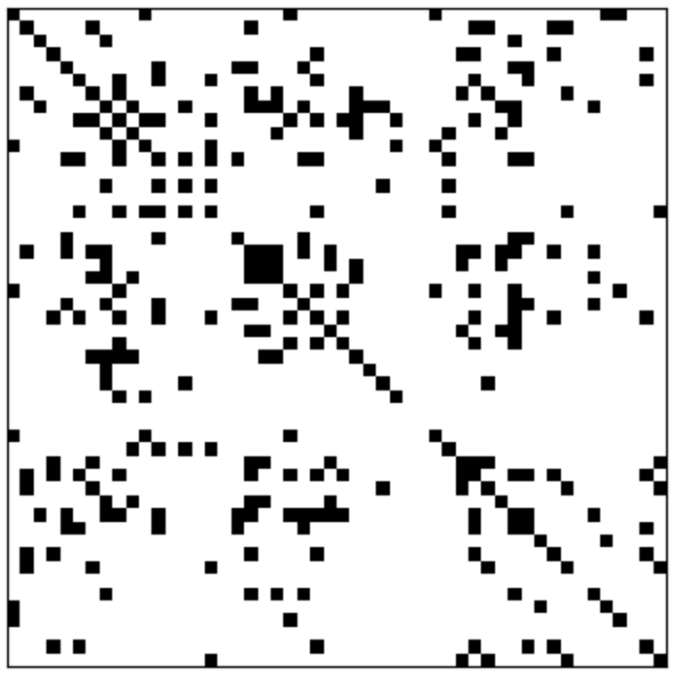
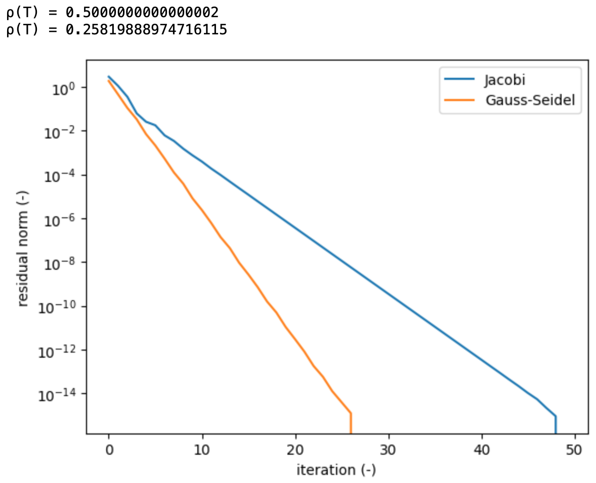
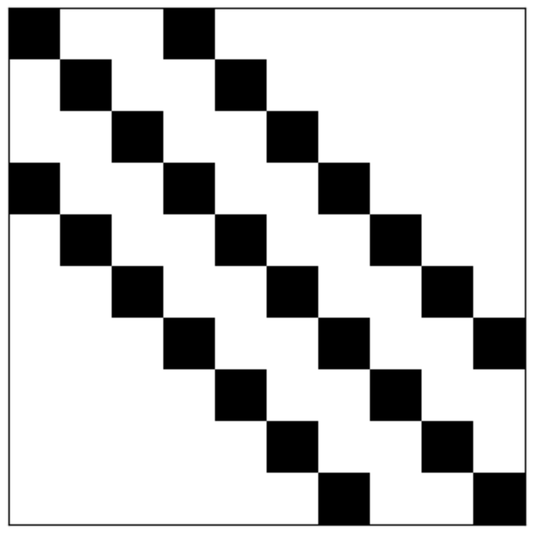
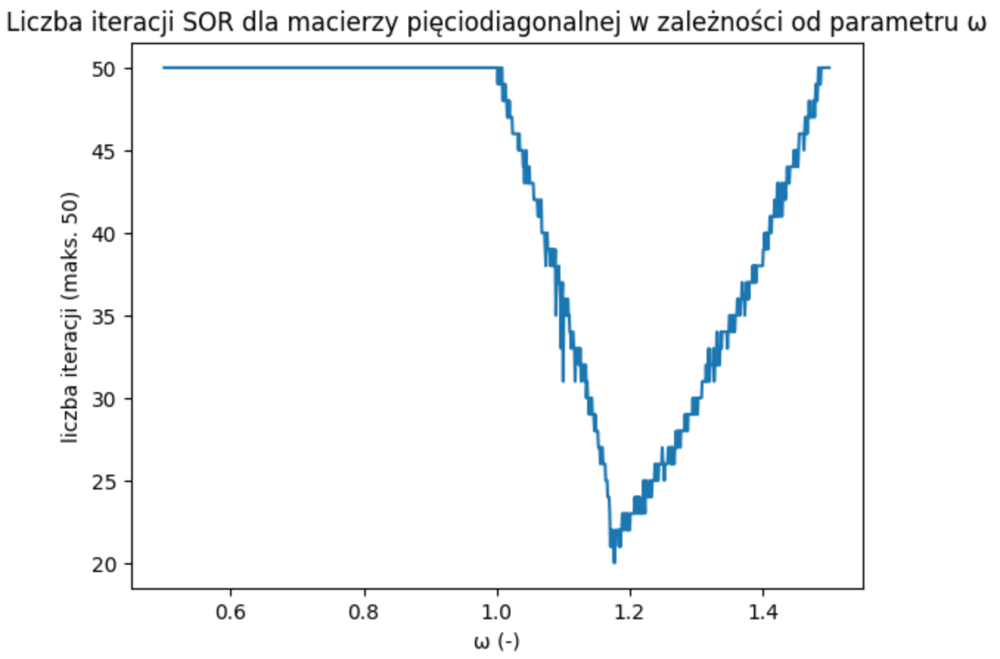

class: center, middle, inverse
<style>	.remark-slide pre { overflow: visible; } </style>
<style>	.remark-code, code { padding: 5px; font-family: monospace; font-size: 15px;} </style>
<style> .img-center img { max-height: 620px; width: auto; } </style>
<style>	.attention { color: #ffb570; } </style>
<style>	.has-jax { background: none; font-size: 13pt } </style>
<style> .-fullscreen img { width: 0; height: 0; }
.full-height img { max-width: 100%; }
.full-width img { max-height: 100%; }
.fullscreen img {
  position: absolute;
  top: 0; left: 0;
}
</style>
<style>.pull-left-30 { float: left; width: 35%; }</style>
<style>.pull-left-70 { float: left; width: 63%; }</style>
<style>.pull-right-30 { float: right; width: 35%;}</style>
<style>.pull-right-70 { float: right; width: 63%;}</style>

# Algorytmy w inżynierii danych

## Wykład 11 - Iteracyjne metody rozwiązywania dużych układów liniowych

## Bartosz Chaber

e-mail: bartosz.chaber@ee.pw.edu.pl
2023L

.img-nerw-header[]

---

## Duże, macierzowe układy równań liniowych

Wiele problemów inżynierskich można przedstawić w postaci macierzowego układu równań.

Zwykle, dokładne rozwiązanie problemu wymaga zbudowania dużego, macierzowego układu równań liniowych (rzędu `\(10^{12}\)` elementów). Większość użytecznych metod formułowania takich układów generuje rzadkie macierze.

Nietrywialnym zagadnieniem jest jednak zachowanie "rzadkości" macierzy w metodach bezpośrednich.
.pull-left-30[
.img-center-xsmall[]
]
---

## Metody iteracyjne

Interesującą klasą metod są metody iteracyjne, m.in.
- metoda Jacobiego,
- metoda Gaussa-Seidela,
- metoda sukcesywnej nadrelaksacji (ang. Successive OverRelaxation &mdash; SOR).

Na kolejnych wykładach poznamy też kolejne metody.

---

## Ogólna procedura budowy metod iteracyjnych

Załóżmy nieosobliwą macierz `\(\mathbf{A}\)` o wymiarach `\(n \times n\)` opisującą macierzowy układ równań:

$$ \mathbf{A} \cdot \mathbf{x} = \mathbf{b} $$

Poszukujemy iteracyjnego schematu wyznaczającego kolejną poprawkę rozwiązania `\(\mathbf{x}^{(k+1)}\)` na podstawie poprzedniego rozwiązania `\(\mathbf{x}^{(k)}\)` i "jakiejś" macierzy `\(\mathbf{C}\)`:

$$ \mathbf{C}\mathbf{x} + (\mathbf{A} - \mathbf{C})\mathbf{x} = \mathbf{b} $$
$$ \mathbf{C}\mathbf{x}^{(k+1)} + (\mathbf{A} - \mathbf{C})\mathbf{x}^{(k)} = \mathbf{b} $$
$$ \mathbf{x}^{(k+1)} = \mathbf{x}^{(k)} - \mathbf{C}^{-1}(\mathbf{A}\mathbf{x}^{(k)} - \mathbf{b}) $$
$$ \mathbf{x}^{(k+1)} = (\mathbf{I} - \mathbf{C}^{-1}\mathbf{A})\mathbf{x}^{(k)} + \mathbf{C}^{-1}\mathbf{b}.$$

--

Załóżmy, że `\(\mathbf{B} = \mathbf{I} - \mathbf{C}^{-1}\mathbf{A}\)` oraz `\(\mathbf{c} = \mathbf{C}^{-1}\mathbf{b}\)`. Nasz schemat iteracyjny wygląda następująco:

$$ \mathbf{x}^{(k+1)} = \mathbf{B}\mathbf{x}^{(k)} + \mathbf{c} $$

Warunkiem jego **zbieżności** jest spełnienie zależności na promień spektralny macierzy `\(\mathbf{B}\)`:

$$ \rho(\mathbf{B}) = \max(|\lambda_1|, |\lambda_2|, \ldots, |\lambda_n|) < 1 $$

Zbieżność jest tym szybsza, im promień spektralny jest mniejszy.

---

## Metoda Jacobiego

Jest to jedna z najprostszych (i nadal skutecznych) metod iteracyjnych. Zakładamy w niej,
że `\(\mathbf{C} = \mathbf{D}\)`, gdzie `\(\mathbf{D}\)` jest macierzą zawierającą jedynie główną diagonalę macierzy `\(\mathbf{A}\)`.

$$ \mathbf{x}^{(k+1)} = (\mathbf{I} - \mathbf{D}^{-1}\mathbf{A})\mathbf{x}^{(k)} + \mathbf{D}^{-1}\mathbf{b} $$

Warunkiem dostatecznym na zbieżność metody Jacobiego jest dominacja głównej diagonali, tj:
w każdym wierszu macierzy `\(\mathbf{A}\)`, suma wartości elementów poza diagonalą musi być mniejsza niż moduł elementu na diagonali.

---

## Metoda Jacobiego: implementacja

Ogólna implementacja wykorzystująca macierze:

```julia
using LinearAlgebra

function rspec(T) # spectral radius
    λ = eigvals(T)
    ρ = 0.0
    for i=1:length(λ)
        if abs(λ[i]) > ρ
            ρ = abs(λ[i])
        end
    end
    println("ρ(T) = ", ρ)
end

function jacobi!(x, A, b)
    D = diag(A)
    L = tril(A, -1)
    U = triu(A, +1)
    
    LU = L + U
    invD = diagm(1.0 ./ D);
    
    rspec(invD * LU)
    history = zeros(50)
    for k=1:50
        x .= invD * (b - LU * x)
        history[k] = norm(A * x - b)
    end
    
    return history
end
```
---

## Metoda Jacobiego: alternatywne sformułowanie
Czasami jednak, samo sformułowanie macierzy jest niepotrzebne, bo jej struktura jest przewidywalna. Wtedy możemy skorzystać z alternatywnej postaci metody Jacobiego:

`\(x_i^{(k+1)} = (b_i - \sum_{j=1}^{i-1} a_{ij}x_j^{(k)} - \sum_{j=i+1}^n a_{ij}x_j^{(k)})/a_{ii}\)`

```julia
function jacobi!(x, A, b)
    n  = length(x)
    xk = copy(x)
    xl = similar(x)

    for k=1:50
        for i=1:n
            s = 0.0
            for j=1:i-1
                s += A[i,j] * xk[j]
            end
            for j=i+1:n
                s += A[i,j] * xk[j]
            end

            xl[i] = (b[i] - s) / A[i,i]
        end

        xl, xk = xk, xl
    end
    x .= xk
    return nothing
end
```

---

## Metoda Gaussa-Seidela

Jest modyfikacją metody Jacobiego. Pozwala na zredukowanie wykorzystania pamięci (nie potrzebujemy dwóch wektorów z rozwiązaniem) oraz przyspieszyć zbieżność.

`\(x_i^{(k+1)} = (b_i - \sum_{j=1}^{i-1} a_{ij}x_j^{(k+1)} - \sum_{j=i+1}^n a_{ij}x_j^{(k)})/a_{ii}\)`

W postaci macierzowej:

$$ \mathbf{x}^{(k+1)} = -(\mathbf{L}+\mathbf{D})^{-1}\mathbf{U}\mathbf{x}^{(k)} + (\mathbf{L}+\mathbf{D})^{-1}\mathbf{b} $$

Warunek dominacji głównej diagonali jest również wystarczający do uzyskania zbieżności.

---

## Metoda Gaussa-Seidela: implementacja

.pull-left[
```julia
function gaussseidel!(x, A, b)
  L = tril(A)
  U = triu(A, +1)
  
  history = zeros(50)
  rspec(L \ U)
  for k=1:50
    x .= L \ (b - U * x)
    history[k] = norm(A * x - b)
  end
  
  return history
end
```
]

.pull-right[
```julia
function gaussseidel!(x, A, b)
  n  = length(x)
  xk = copy(x)

  for k=1:50
    for i=1:n
      s = 0.0
      for j=1:i-1
        s += A[i,j] * xk[j]
      end
      for j=i+1:n
        s += A[i,j] * xk[j]
      end

      xk[i] = (b[i] - s) / A[i,i]
    end
  end
  x .= xk
  return nothing
end
```
]

---

## Metoda sukcesywnej nadrelaksacji (SOR)

Kolejne rozszerzenie, tym razem metody Gaussa-Seidela (GS), gdzie nowa wartość przybliżenia rozwiązania jest ważoną sumą poprawki GS i aktualnego rozwiązania. Wagę stanowi wartość współczynnika `\(\omega\)`.

`\(x_i^{(k+1)} = \omega \cdot (b_i - \sum_{j=1}^{i-1} a_{ij}x_j^{(k+1)} - \sum_{j=i+1}^n a_{ij}x_j^{(k)})/a_{ii} + (\omega-1)\cdot x_i^{(k)}\)`

W postaci macierzowej:

$$ \mathbf{x}^{(k+1)} = (\omega\mathbf{L}+\mathbf{D})^{-1}(\mathbf{D}-\omega\mathbf{D}-\omega\mathbf{U})\mathbf{x}^{(k)} + \omega(\omega\mathbf{L}+\mathbf{D})^{-1}\mathbf{b} $$

--

Udowodniono, że ta metoda jest **rozbieżna** dla `\(\omega > 2\)`.
Dla `\(0 < \omega < 1\)` metodą nazywamy podrelaksacyjną.
Dla `\(1 < \omega < 2\)` metodą nazywamy nadrelaksacyjną.

Dla różnych macierzy, optymalna wartość parametru `\(\omega\)` musi być wyznaczana osobno.

---

## Zbieżność metod iteracyjnych

Wspomniane metody są zbieżne, gdy `\(\rho(\mathbf{B}) < 1\)`.
.pull-left-70[
.img-center-xsmall[]
]
---

## Twierdzenie Younga o optymalnej wartości parametru relaksacji

Niech macierz `\(\mathbf{A}\)` będzie symetryczna, **trójdiagonalna** i niech `\(\mu < 1\)` będzie równe promieniowi spektralnemu
macierzy iteracji metody Jacobiego (`\(\mathbf{I} - \mathbf{D}^{-1}\mathbf{A}\)`). Wtedy optymalna wartość parametru relaksacji `\(\omega\)`, gwarantująca najmniejszy promień spektralny iteracji SOR, jest równa:
.pull-left-30[
$$ \omega_{opt} = \frac{2}{1 + \sqrt{1 - \mu^2}} $$

.img-center-xsmall[]
]
.pull-right-70[
Promień spektralny macierzy iteracji SOR jest wtedy równy:

$$ (\omega_{opt}\cdot \mu/2)^2 $$

.img-center-xsmall[]
]
---
## Prekondycjonowanie macierzy

Prekondycjonowanie macierzy (nazywane _ściskaniem_ macierzy) polega na takiej modyfikacji oryginalnego układu równań, że
jest on prostszy do rozwiązania (metody iteracyjne są szybciej zbieżne), natomiast samo rozwiązanie jest rozwiązaniem oryginalnego układu.

--

- Technika ściskania macierzy jest kluczowa, gdy stosujemy metody iteracyjne;
- Różne typy problemów macierzowych mogą mieć bardziej lub mniej skuteczne macierze prekondycjonujące;
- Zasadniczym celem prekondycjonowania jest redukcja wartości promienia spektralnego macierzy `\(\mathbf{B}\)`;
- Macierz `\(\mathbf{M}\)` jest nazywana prekondycjonerem i pozwala na rozwiązanie zmodyfikowanego problemu:

$$ \mathbf{A} \mathbf{x} = \mathbf{b}\quad |\ \mathbf{M}^{-1} \cdot $$
$$ \mathbf{M}^{-1} \mathbf{A} \mathbf{x} = \mathbf{M}^{-1} \mathbf{b}; $$

- Aby prekondycjoner był skuteczny, musi spełniać następujące wymagania:
 - zbieżność zmodyfikowanego układu równań powinna być szybsza, niż oryginalnego;
 - odwrotność macierzy prekondycjonującej powinna być łatwa do wyznaczenia.

---

## Rodzaje prekondycjonowania

Prekondycjonowanie lewostronne (nie wymaga dodatkowego kroku do wyznaczenia **x**):

$$ \mathbf{M}^{-1} \mathbf{A} \mathbf{x} = \mathbf{M}^{-1} \mathbf{b} $$

Prekondycjonowanie centralne (zachowuje symetrię macierzy):

$$ \mathbf{M} = \mathbf{L} \mathbf{U} $$
$$ \mathbf{L}^{-1} \mathbf{A} \mathbf{U}^{-1} = \mathbf{L}^{-1} \mathbf{b} $$
$$ \mathbf{x} = \mathbf{U}^{-1} \mathbf{y} $$

Prekondycjonowanie prawostronne (nie zmienia normy residuum):

$$ \mathbf{A} \mathbf{M}^{-1} \mathbf{y} = \mathbf{b}$$
$$ \mathbf{x} = \mathbf{M}^{-1} \mathbf{y}$$

---
## Różne macierze prekondycjonujące

Do ściskania macierzy można np. wykorzystać macierz iteracji Jacobiego:
$$ \mathbf{M} = diag(\mathbf{A}) $$

Można też wykorzystać niekompletną faktoryzację LU (ang. ILU &mdash; incomplete LU):
$$ \mathbf{M} = \mathbf{L} \cdot \mathbf{U} $$

Możemy wyeleminować niezerowe elementy na dwa sposoby:
- nie naruszając wzorca rzadkości macierzy, np. pomijając elementy faktoryzacji jeżeli w oryginalnej macierzy była wartość zerowa,
- ze względu na wartość elementu macierzy, np. pomijając elementy faktoryzacji jeżeli ich wartość jest pomijalnie mała.

Ciekawą implementację ILU można znaleźć pod adresem https://github.com/haampie/IncompleteLU.jl. Może on być wykorzystywany w metodach zaimplentowanych w pakiecie [IterativeSolvers.jl](https://github.com/JuliaLinearAlgebra/IterativeSolvers.jl).

---

## Literatura
* [1] Peter J. Olver, Lecture Notes on Numerical Analysis, url: https://www-users.cse.umn.edu/~olver/num_/lni.pdf, dostęp: 12.05.2022.
* [2] Venit, Stewart, The Convergence of Jacobi and Gauss-Seidel Iteration, Mathematics Magazine, vol. 48, no. 3, 1975, pp. 163–67. JSTOR, https://doi.org/10.2307/2689699. dostęp: 15.05.2023.
* [3] Robert Szmurło, wykład pt. Numeryczna algebra liniowa &mdash; metody iteracyjne, Wydział Elektryczny, 2020
* [4] Shiming Yang and Matthias K. Gobbert, The Optimal Relaxation Parameter for the SOR Method Applied to the Poisson Equation in Any Space Dimensions, Applied Mathematics Letters, Volume 22, Issue 3, 2009, pp. 325-331, ISSN 0893-9659, https://doi.org/10.13016/M2D795F5H, dostęp: 15.05.2023.
---
class: center, middle, inverse
# Dziękuję za uwagę
