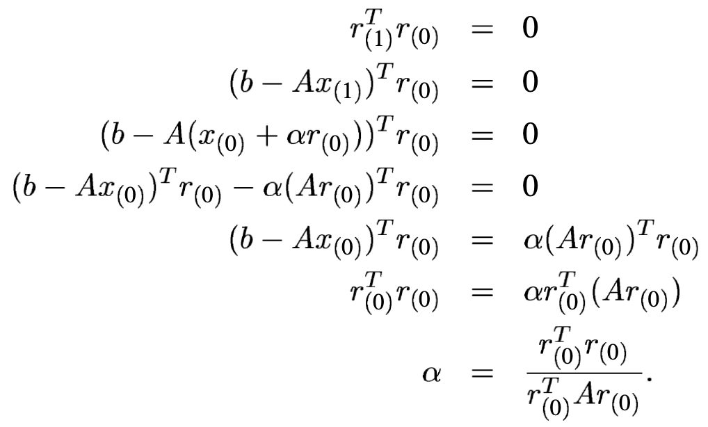
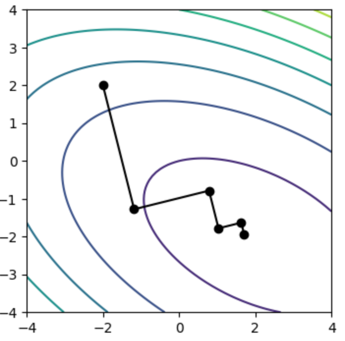
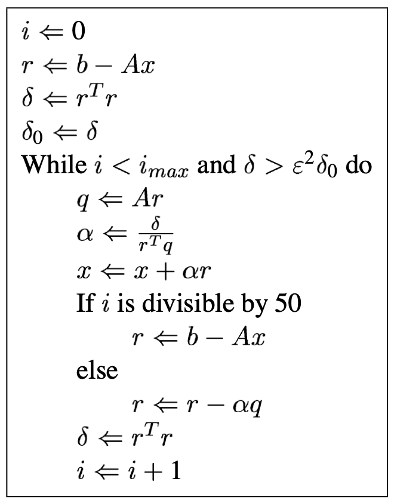
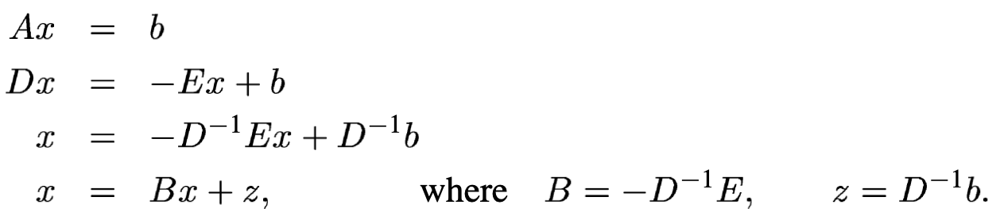
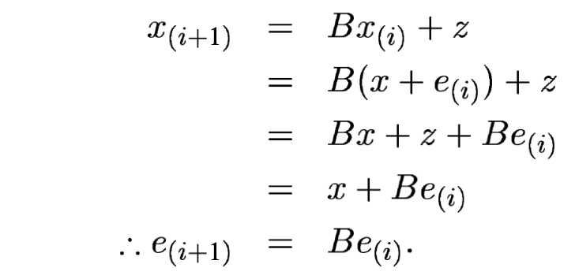
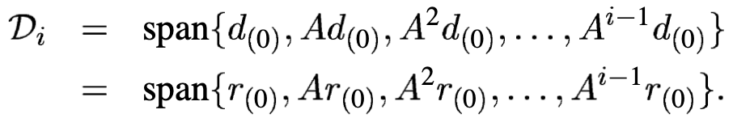
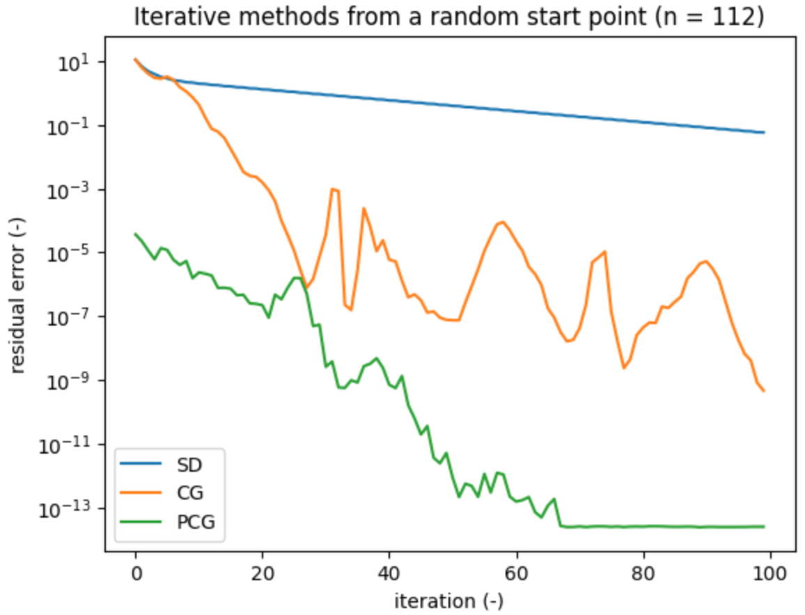

class: center, middle, inverse
<style>	.remark-slide pre { overflow: visible; } </style>
<style>	.remark-code, code { padding: 5px; font-family: monospace; font-size: 15px;} </style>
<style> .img-center img { max-height: 620px; width: auto; } </style>
<style> .img-tiny img { max-width: 80%; } </style>
<style>	.attention { color: #ffb570; } </style>
<style>	.has-jax { background: none; font-size: 13pt } </style>
<style> .-fullscreen img { width: 0; height: 0; }
.full-height img { max-width: 100%; }
.full-width img { max-height: 100%; }
.fullscreen img {
  position: absolute;
  top: 0; left: 0;
}
</style>
<style>.pull-left-30 { float: left; width: 35%; }</style>
<style>.pull-left-70 { float: left; width: 63%; }</style>
<style>.pull-right-30 { float: right; width: 35%;}</style>
<style>.pull-right-70 { float: right; width: 63%;}</style>

# Algorytmy w inżynierii danych

## Wykład 12 - Metoda gradientów sprzężonych

## Bartosz Chaber

e-mail: bartosz.chaber@ee.pw.edu.pl
2023L

.img-nerw-header[]

---

## Forma kwadratowa macierzy

Wróćmy do kilku definicji z poprzednich wykładów.

Mówimy, że _macierz jest dodatnio określona_ jeżeli dla każdego wektora _niezerowego_ `\(\mathbf{v}\)` wyrażenie `\(\mathbf{v}^T\mathbf{A}\mathbf{v} > 0\)`.

Jeżeli macierz jest dodatnio określona i symetryczna, to minimum formy kwadratowej
`\(f(\mathbf{v}) = \frac{1}{2}\mathbf{v}^T\mathbf{A}\mathbf{v} - \mathbf{v}^T\mathbf{b}\)`
jest jednocześnie rozwiązaniem układu równań `\(\mathbf{A}\mathbf{v}=\mathbf{b}\)`.

Gradient formy kwadratowej dla dany jest wzorem [1,2]:

`\(\nabla f(\mathbf{v}) = \frac{1}{2}(\mathbf{A}^T + \mathbf{A})\mathbf{v} - \mathbf{b}\)`,
czyli dla macierzy symetrycznej `\(\mathbf{A}^T=\mathbf{A}\)`:
 
`\(\nabla f(\mathbf{v}) = \mathbf{A}\mathbf{v} - \mathbf{b}\)`.

Oznacza to, że problem rozwiązywania macierzowego układu równań możemy w tym wypadku sprowadzić do problemu optymalizacyjnego.

---

## Residuum a wektor najszybszego spadku
Uporządkujemy kilka terminów:

Błąd rozwiązania (ang. _solution error_) określa jak daleko jesteśmy od dokładnego rozwiązania.
Wyliczamy go jako wektor pomiędzy naszym przybliżonym rozwiązaniem `\(\mathbf{x}_k\)`,
a rozwiązaniem dokładnym `\(\mathbf{x}\)`:

`\(\mathbf{e}_k=\mathbf{x}_k-\mathbf{x}.\)`

Residuum (ang. _residual error_) określa jak nasze przybliżone rozwiązanie spełnia macierzowy układ równań:

`\(\mathbf{r}_k=\mathbf{b}-\mathbf{A}\mathbf{x}_k.\)`

Można pokazać też, że `\(\mathbf{r}_k=-\mathbf{A}\mathbf{e}_k.\)`
Residuum jest też powiązane z gradientem formy kwadratowej: `\(\mathbf{r}_k=-\nabla f(\mathbf{x}_k).\)`

---

## Metoda najszybszego spadku

Zastosujmy ją, wybierając optymalny krok `\(\alpha\)` (bo w wybranym przez nas kierunku forma kwadratowa będzie parabolą).
Kierunkiem, w którym poszukujemy rozwiązania (a wcześniej: optymalnej wartości kroku) jest kierunek przeciwny do gradient, czyli w naszym wypadku _residuum_.

Optymalną długość kroku wyliczamy przy pomocy residuum i macierzy.

.pull-left-70[.img-center-xsmall[]]

---

Możemy przyspieszyć iterację metody najszybszego spadku poprzez wyliczenie nowego residuum jako:
`\(\mathbf{r}_{k+1} = \mathbf{r}_k - \alpha\cdot\mathbf{A}\mathbf{r}_k\)`
zamiast `\(\mathbf{r}_{k+1} = \mathbf{b} - \mathbf{A}\mathbf{x}_k\)`.
Ponieważ wynik `\(\mathbf{A}\mathbf{r}\)` pojawia się też podczas liczenia `\(\alpha\)` oszczędzamy jedno mnożenie macierzy przez wektor. Należy jednak uważać na akumulację błędów operacji zmiennoprzecinkowych!

.pull-left-70[
Gdy możemy zwizualizować "trasę" optymalizatora, to zauważymy, że zawsze kolejny kierunek ruchu jest prostopadły do poprzedniego.
.img-tiny[]
]
.pull-right-30[.img-center-xsmall[]]

---

## Hipotetyczna metoda kierunków ortogonalnych

Załóżmy, że nie chcielibyśmy powtarzać kierunków poszukiwania rozwiązania. W tym celu chcemy, aby każdy
z tych kierunków był ortogonalny do pozostałych. Oznacza to, że krok optymalizatora powinien być dobrany
tak, aby kolejny _błąd rozwiązania_ był ortogonalny do aktualnego kierunku.
Teoretycznie, taka metoda wyliczałaby w każdym kroku kolejne elementy wektora rozwiązania, więc zakończyłaby
się po `\(n\)` krokach (gdzie `\(n\)` to długość wektora prawych stron).

--

Niestety, taka metoda zakłada znajomość _błędu rozwiązania_ `\(\mathbf{e}_k\)`, co wymaga od nas znajomości
_dokładnego rozwiązania_ `\(\mathbf{x}\)`.

--

Ale, ale... co, gdyby zamiast ortogonalnych kierunków wybierać A-ortogonalne kierunku?

$$ \mathbf{d}_i^T \cdot \mathbf{d}_j \neq 0,\quad\text{ale}\quad \mathbf{d}_i^T \cdot \mathbf{A} \cdot \mathbf{d}_j = 0.$$

Takie kierunki nazywamy sprzężonymi macierzą `\(\mathbf{A}\)`.

---

## Wartości własne i promień spektralny
Pokażemy, że metoda Jacobiego jest _wygładzaczem_.
Metodę można zapisać w postaci macierzowej:
.img-center-xsmall[]

.pull-left-70[.img-center-xsmall[]]
.pull-right-30[Jak widać po lewej stronie, w kolejnych krokach błąd jest zmniejszany
(o ile promień spektralny macierzy `\(\mathbf{B}\)` jest mniejszy niż 1]

---

## Wstęp do ortogonalizacji Grama-Schmidta

Jak wybierać kierunki sprzężone? Wykorzystując ortogonalizację Grama-Schmidta.
Jest to metoda, pozwalająca przekształcić zbiór `\(n\)` liniowo niezależnych wektorów
`\(\mathbf{u}_0, \mathbf{u}_1, \ldots, \mathbf{u}_{n-1}\)`
w bazę złożoną z `\(n\)` ortogonalnych wektorów:
`\(\mathbf{d}_0, \mathbf{d}_1, \ldots, \mathbf{d}_{n-1}.\)`

--

Zakładając, że `\(\mathbf{d}_0 = \mathbf{u}_{0}\)`, resztę wektorów budujemy poprzez odejmowanie
od nich zrzutowanych, wszystkich wektorów z bazy.

`\(\mathbf{d}_i = \mathbf{u}_i + \sum_{k=0}^{i-1} \beta_{ik}\mathbf{d}_k\)`
.img-center-xsmall[]

---

## Metoda gradientów sprzężonych

No dobrze, ale potrzebujemy kierunków `\(\mathbf{u}_i\)`...

--

wybierzemy je na podstawie residuum: `\(\mathbf{r}_0, \mathbf{r}_1, \ldots, \)`
Przy każdym kroku algorytmu rozszerzamy naszą bazę o nowy wektor `\(\mathbf{A}\mathbf{d}_{i-1}\)`.

Rozwiniemy to: `\(\mathbf{A}\mathbf{d}_{i} = \mathbf{A}^{i}\mathbf{d}_0 = \mathbf{A}^{i}\mathbf{r}_0\)`.
Przestrzeń postaci:
.img-center-xsmall[]
nazywać będziemy podprzestrzenią Kryłowa.

---

## Prekondycjonowana metoda gradientów sprzężonych

Tak jak omawiane wcześniej metody iteracyjne, metoda gradientów sprzężonych też korzysta z
prekondycjonowania.

Warto zwrócić uwagę, że często nasza macierz prekondycjonująca nie musi być _materializowana_. Wystarczy,
aby udało się policzyć efekt `\(\mathbf{M}^{-1}\mathbf{v}\)`.

.pull-left[Przykładowo:
```julia
> using LinearAlgebra
> A = [3.0 2.0
       2.0 6.0];
> M = Diagonal(A)
2×2 Diagonal{Float64,Vector{Float64}}:
 3.0   ⋅ 
  ⋅   6.0
> M \ [3., 12] # M^(-1) ⋅ v
2-element Vector{Float64}:
 1.0
 2.0
```]

--

.pull-right[.img-center-xsmall[]]

---

## Literatura
* [1] Mark Schmidt, Deriving the Gradient of Linear and Quadratic Functions in Matrix Notation, 2016, url: https://www.cs.ubc.ca/~schmidtm/Courses/340-F16/linearQuadraticGradients.pdf, dostęp: 21.05.2023
* [2] Jonathan Richard Shewchuk, An Introduction to the Conjugate Gradient Method Without the Agonizing Pain, 1994,
url: https://www.cs.cmu.edu/~quake-papers/painless-conjugate-gradient.pdf, dostęp: 21.05.2023
---
class: center, middle, inverse
# Dziękuję za uwagę
