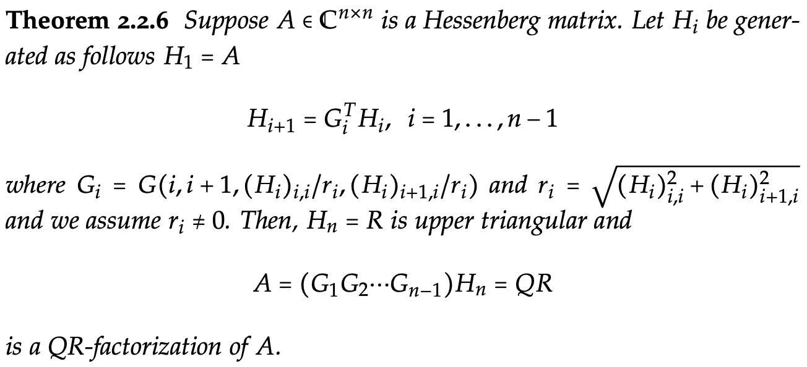

class: center, middle, inverse
<style>	.remark-slide pre { overflow: visible; } </style>
<style>	.remark-code, code { padding: 5px; font-family: monospace; font-size: 15px;} </style>
<style> .img-center img { max-height: 620px; width: auto; } </style>
<style> .img-tiny img { max-width: 80%; } </style>
<style>	.attention { color: #ffb570; } </style>
<style>	.has-jax { background: none; font-size: 13pt } </style>
<style> .-fullscreen img { width: 0; height: 0; }
.full-height img { max-width: 100%; }
.full-width img { max-height: 100%; }
.fullscreen img {
  position: absolute;
  top: 0; left: 0;
}
</style>
<style>.pull-left-30 { float: left; width: 35%; }</style>
<style>.pull-left-70 { float: left; width: 63%; }</style>
<style>.pull-right-30 { float: right; width: 35%;}</style>
<style>.pull-right-70 { float: right; width: 63%;}</style>

# Algorytmy w inżynierii danych

## Wykład 13 - Rozkład QR

## Bartosz Chaber

e-mail: bartosz.chaber@ee.pw.edu.pl
2023L

.img-nerw-header[]

---

### Macierz ortogonalna
Wróćmy do definicji z poprzednich wykładów.

Macierz ortogonalna to macierz _unitarna_ o wartościach rzeczywistych. Iloczyn
macierzy ortogonalnej i jej _sprzężenia hermitowskiego_ (w naszym przypadku _transpozycji_)
jest macierzą _jednostkową_.

Przykładem macierzy ortogonalnej jest np. macierz obrotu:
```julia
> Q = [cos(π/4) -sin(π/4); sin(π/4) cos(π/4)] # π/4 to 45 stopni
2×2 Matrix{Float64}:
 0.707107  -0.707107
 0.707107   0.707107

> Q * Q'
2×2 Matrix{Float64}:
 1.0  0.0
 0.0  1.0
```

Na macierz ortogonalną możemy patrzeć jak na zbiór _ortogonalnych_ wektorów kolumnowych.

---

### Macierz podobna

W metodach opisanych poniżej wykorzystana będzie własność macierzy podobnych, czyli takich, że
widmo macierzy `\(\mathbf{A}\)` jest takie samo jak macierzy `\(\mathbf{B}^{-1} \cdot \mathbf{A} \cdot \mathbf{B}\)`, gdy `\(\mathbf{B}\)` jest **odwracalną** macierzą.

Pewną trudnością może być wyznaczenie macierzy odwrotnej do `\(\mathbf{B}\)`. Jednak warto pamiętać o macierzach ortogonalnych, dla których prawdziwa jest zależność: `\(\mathbf{Q}^{-1} = \mathbf{Q}^T\)`.

---

### Macierz Hessenberga
Macierz, _prawie_ górnotrójkątna. Posiada niezerowe elementy
również _pod_ główną przekątną.

```julia
> using LinearAlgebra
> hessenberg(rand(6,6)).H
6×6 UpperHessenberg{Float64, Matrix{Float64}}:
  0.319084  -1.08695    0.806435   0.162724  -0.143383    0.0952936
 -1.01479    1.26041   -1.18598    0.224861   0.313971    0.472413
   ⋅        -0.940752   0.824951  -0.341308  -0.632469   -0.181593
   ⋅          ⋅        -0.689652   0.403017   0.395576    0.398501
   ⋅          ⋅          ⋅         0.24755    0.0145165   0.0577847
   ⋅          ⋅          ⋅          ⋅         0.0482109  -0.189054
```
---

### Transformacja Householdera

Jedną z metod pozwalających znaleźć postać Hessenberga pełnej macierzy `\(\mathbf{A}\)` o wymiarach `\(N \times N\)` jest metoda odbić Householdera.
Aby zrozumieć tę metodę warto patrzeć na macierz jako na przestrzeń _N_-wymiarowych wektorów. Wyzerowanie niektórych składowych tych wektorów można dokonać poprzez odbicie w _N_-wymiarowej przestrzeni.

```julia
function householder_hessenberg(A :: Matrix{Float64})
  H = copy(A)
  N = size(A, 1)

  for i=1:N-2
    α = H[i+1:N, i] # FIXME
    σ = norm(α)
    β = 1.0  / (σ * (σ + abs(α[1])))
    expjϕ = α[1] < 0.0 ? -1.0 : 1.0 
    u = copy(α)
    u[1] = expjϕ * (σ + abs(α[1]))
    T = diagm(ones(N))
    T[i+1:N, i+1:N] .= diagm(ones(length(α))) - β * u * u'
    H .= T * H * T
  end

  return H
end
```

--

W powyższym algorytmie warto zwrócić uwagę na wykorzystanie macierzy odbicia `\(\mathbf{T}\)`. Ponieważ odbicie względem wybranej hiperpłaszczyzny jest symetryczne, wygląda na to, że `\(\mathbf{T}^{-1} = \mathbf{T}\)`. Co za tym idzie, macierz `\(\mathbf{T} \cdot \mathbf{A} \cdot \mathbf{T}\)` będzie miała takie samo widmo jak macierz `\(\mathbf{A}\)`. Docelowo, po pewnej liczbie odbić otrzymamy macierz równoważną macierzy `\(\mathbf{A}\)`, ale w postaci Hessenberga.

---

### Rozkład QR macierzy

Poprzez delikatną modyfikację kodu możliwe jest też dokonanie tzw. dekompozycji QR "rozbijającej" macierz `\(\mathbf{A}\)` na iloczyn macierzy `\(\mathbf{Q} \cdot \mathbf{R}\)`. Macierz `\(\mathbf{Q}\)` jest macierzą ortogonalną, natomiast macierz `\(\mathbf{R}\)` jest macierzą górnotrójkątną.

```julia
function householder_qr(A :: Matrix{Float64})
  R = copy(A)
  N = size(A, 1)
  Q = diagm(ones(N))
  for i=1:N-1
    α = R[i:N, i]
    σ = norm(α)
    β = 1.0  / (σ * (σ + abs(α[1])))
    expjϕ = α[1] < 0.0 ? -1.0 : 1.0 
    u = copy(α)
    u[1] = expjϕ * (σ + abs(α[1]))
    T = diagm(ones(N))
    T[i:N, i:N] .= diagm(ones(length(α))) - β * u * u'
    R = T * R # te linie zostały zmienione
    Q = Q * T # względem metody Householdera zdefiniowanej wcześniej
  end

  return Q, R
end
```

---

```julia
> using SparseArrays
> dropalmostzeros(A, ϵ) = sparse([abs(aij) > ϵ ? aij : 0.0 for aij in A])
> A = rand(5, 5);
> Q, R = householder_qr(A);

> dropalmostzeros(Q' * Q, 1e-15)
5×5 SparseMatrixCSC{Float64, Int64} with 5 stored entries:
 1.0   ⋅    ⋅    ⋅    ⋅ 
  ⋅   1.0   ⋅    ⋅    ⋅ 
  ⋅    ⋅   1.0   ⋅    ⋅ 
  ⋅    ⋅    ⋅   1.0   ⋅ 
  ⋅    ⋅    ⋅    ⋅   1.0

> dropalmostzeros(R, 1e-15)
5×5 SparseMatrixCSC{Float64, Int64} with 15 stored entries:
 -1.24317  -0.881957  -1.16746   -0.739276    -1.40247
   ⋅       -1.12885   -0.146022  -0.00999683  -0.812501
   ⋅         ⋅        -0.45926    0.177693    -0.418866
   ⋅         ⋅          ⋅        -0.676806    -0.222057
   ⋅         ⋅          ⋅          ⋅           0.22363
```

---

### Metoda Grama-Schmidta
Alternatywną metodą do wyznaczenia rozkładu QR wybranej macierzy jest `\(\mathbf{A}\)` jest metoda Grama-Schmidta. Wykorzystuje ona tę samą interpretację macierzy, co metoda odbić Householdera, ale zamiast odbić rzutuje ona kolejne kierunki w celu uformowania ortogonalnej bazy `\(\mathbf{Q}\)`. Macierz `\(\mathbf{R}\)` otrzymuje się potem poprzez rzutowanie macierzy `\(\mathbf{A}\)` na kierunki `\(\mathbf{Q}\)`.

$$\mathbf{Q} \cdot \mathbf{R} = \mathbf{A} \quad | \cdot \mathbf{Q}^{-1}$$
$$\mathbf{Q}^{-1} \cdot \mathbf{Q} \cdot \mathbf{R} = \mathbf{Q}^{T} \cdot \mathbf{A}$$
$$\mathbf{R} = \mathbf{Q}^{T} \cdot \mathbf{A}$$

.pull-right[]

Podstawową operacją w metodzie Grama-Schmidta jest rzutowanie wektora `\(\mathbf{v}\)` na<br/>
wektor `\(\mathbf{u}\)`.

$$\text{proj}_u v = \frac{\mathbf{u} \cdot \mathbf{v}}{\mathbf{u} \cdot \mathbf{u}} \mathbf{u}$$

Jeżeli zarówno `\(\mathbf{u}\)` jak i `\(\mathbf{v}\)` są wersorami, tj. mają długość równą _1_ to wzór uprości się do

$$\text{proj}_u v = (\mathbf{u} \cdot \mathbf{v}) \mathbf{u}$$


---

Klasyczna wersja algorytmu:
```julia
function cgs(A :: Matrix{Float64})
  n, _ = size(A)
  v = A[:,1]
  Q = zeros(n, n)

  for j = 1:n
    v = A[:,j]
    
    for k = 1:j-1
      v .-= (Q[:,k] ⋅ A[:,j]) * Q[:,k]
    end

    Q[:,j] .= v ./ norm(v)
  end
  R = Q' * A
  return Q, R
end
```

---

### Zmodyfikowana metoda Grama-Schmidta

W klasycznej wersji, wektor `\(\mathbf{u}\)` powstaje poprzez odejmowanie rzutów `\(\mathbf{v}\)` na poprzednie kierunki:

$$\mathbf{u}\_i = \mathbf{v} - \text{proj}\_{\mathbf{u}\_1} \mathbf{v} - \text{proj}\_{\mathbf{u}_2} \mathbf{v} - \ldots$$

Takie sformułowanie w arytmetyce zmiennoprzecinkowej powoduje dość szybką utratę ortogonalności między kolejnymi kierunkami.

Równoważne, ale bardziej stabilne numeryczne sformułowanie można zapisać następująco:

$$\mathbf{u}^{(1)}\_i = \mathbf{v}      - \text{proj}\_{\mathbf{u}\_1} \mathbf{v}$$
$$\mathbf{u}^{(2)}\_i = \mathbf{u}^{(1)}\_i - \text{proj}\_{\mathbf{u}\_2} \mathbf{u}^{(1)}\_i$$
$$\mathbf{u}^{(3)}\_i = \mathbf{u}^{(2)}\_i - \text{proj}\_{\mathbf{u}\_3} \mathbf{u}^{(2)}\_i$$
$$\ldots$$
$$\mathbf{u}^{(i-1)}\_i = \mathbf{u}^{(i-2)}\_i - \text{proj}\_{\mathbf{u}\_{i-1}} \mathbf{u}^{(i-2)}\_i$$

---

Zmodyfikowana wersja algorytmu:
```julia
function mgs(A :: Matrix{Float64})
  n, _ = size(A)
  v = A[:,1]
  Q = zeros(n, n)

  for j = 1:n
    v = A[:,j]
    
    for k = 1:j-1
      v .-= (Q[:,k] ⋅ v) * Q[:,k]
    end

    Q[:,j] .= v ./ norm(v)
  end
  R = Q' * A
  return Q, R
end
```

--

```julia
> A = rand(200, 200)
> Q, _ = cgs(A); @show norm(I - Q' * Q);
norm(I - Q' * Q) = 1.2391108200049796e-11
> Q, _ = mgs(A); @show norm(I - Q' * Q);
norm(I - Q' * Q) = 1.8589603619760764e-13
```

--

```julia
> A = [(i == j ? 1.0001 : 1)/(i+j-1) for i=1:200, j=1:200];
> Q, _ = cgs(A); @show norm(I - Q' * Q);
norm(I - Q' * Q) = 179.8030660935869
> Q, _ = mgs(A); @show norm(I - Q' * Q);
norm(I - Q' * Q) = 4.662298863101829e-10
```

---
### Algorytm Francisa

Jednym z najważniejszych algorytmów ostatnich lat jest **algorytm** QR, który pozwala na szybkie wyznaczenie wartości własnych macierzy. Aby nie mylić go z _dekompozycją_ QR nazwiemy go od nazwiska oryginalnego autora: Johna Francisa (równolegle i niezależnie opracowała go też Vera N. Kublanovskaya).

Najprostsza implementacja wykorzystuje rozkład QR macierzy, a następnie wymnożenie składników "na odwrót".
Można pokazać, że wynik takiego mnożenia ma to samo widmo, co macierz podlegająca rozkładowi, ponieważ:

$$ \mathbf{Q} \cdot \mathbf{R} = \mathbf{A} \quad | \cdot \mathbf{Q} \text{ (prawostronnie)} $$
$$ \mathbf{Q} \cdot \mathbf{R} \cdot \mathbf{Q} = \mathbf{A} \cdot \mathbf{Q} \quad | \cdot \mathbf{Q}^{-1} \text{ (lewostronnie)} $$
$$ \mathbf{Q}^{-1} \cdot \mathbf{Q} \cdot \mathbf{R} \cdot \mathbf{Q} = \mathbf{Q}^{-1} \cdot \mathbf{A} \cdot \mathbf{Q}$$

Ostatecznie sprowadzając nas do:
$$ \mathbf{R} \cdot \mathbf{Q} = \mathbf{Q}^{-1} \cdot \mathbf{A} \cdot \mathbf{Q}$$

Co zgodnie z własnością macierzy podobnych pozwala nam stwierdzić, że widma `\(\mathbf{R} \cdot \mathbf{Q}\)` jest takie samo jak macierzy `\(\mathbf{A}\)`. Jednak zaletą takiej transformacji jest to, że po pewnej liczbie iteracji  wynikowa macierz staje się macierzą górnotrójkątną, której wartości własne znajdują się na głównej diagonali.

---

```julia
function explicitfrancis(A :: Matrix{Float64}, maxiter)
  M = copy(A)
  N = size(A, 1)
  λs = zeros(N)
  for k = 1:maxiter
    Q, R = grammschmidt(M)
    mul!(M, R, Q)
    λs .= diag(M)
  end
  
  return λs
end
```
--
```julia
> A = randn(5,5)
> A *= A' # niech A będzie symetryczna
> λ = explicitfrancis(A, 100)
[21.87917065432922,
 14.060237996936197,
  2.3115851771234817,
  0.6475979594944075,
  0.06021804947597513]

> λ = reverse(eigvals(A))
[21.879170654329148,
 14.060237996936166,
  2.311585177123479,
  0.6475979594944056,
  0.06021804947597582]
```
---

### Ulepszony algorytm Francisa

Ciekawą wersją algorytmu Francisa jest wykorzystanie własności postaci Hessenberga. Otóż postać Hessenberga o wymiarach `\(n \times n\)` wymaga _n-1_ operacji do przekształcenia tej macierzy do postaci górnotrójkątnej.

Eliminacji niechcianych elementów można dokonać poprzez wykorzystanie _obrotów Givensa_, pozwalających na wyzerowanie dowolnego elementu macierzy.

--

### Obroty Givensa

Macierz `\(\mathbf{G}\)` pozwala na "obrócenie" wektorów w kolumach `\(\mathbf{A}\)` tak, aby wybrany element macierzy `\(\mathbf{A}_{i,j}\)` był równy zeru:

.pull-left[```julia
using LinearAlgebra
function givensrot(A, i, j)
  q = sqrt(A[j,j]^2 + A[i,j]^2);
  c = A[j,j] / q;
  s = A[i,j] / q;
    
  N = size(A, 1);
  G = diagm(ones(N));
  G[i,i] = c; G[j,j] = c;
  G[j,i] = s; G[i,j] =-s;

  return G
end
```]

.pull-right[```julia
> A = rand(3,3)
> G = givensrot(A, 2, 1)
3×3 Matrix{Float64}:
  0.348304  0.937382  0.0
 -0.937382  0.348304  0.0
  0.0       0.0       1.0
> G * A
3×3 Matrix{Float64}:
 0.997136     1.00958   0.328816
(5.551e-17)   0.13537  -0.787595
 0.422237     0.23822   0.083311
```]

---

Zgodnie z twierdzeniem w [5] złożenie _n-1_ macierzy Givensa pozwalających na wyeliminowanie pod-diagonali
jest **równoważne** z przeprowadzeniem rozkładu QR tej macierzy. Następnie, można dokończyć przekształcenie
przez podobieństwo, aplikując sekwencję macierzy Givensa z prawej strony.

.pull-left[.img-center-xsmall[]]
.pull-right[.img-center-xsmall[]]

---

```julia
> A1 = A = rand(3,3)
> G1 = givensrot(A1, 2, 1); A2 = G1 * A1
> G2 = givensrot(A2, 3, 1); A3 = G2 * A2
> G3 = givensrot(A3, 3, 2); A4 = G3 * A3
> dropalmostzeros(A4, 1e-15)
 0.934422  0.936767   0.377592
  ⋅        0.583307   0.853773
  ⋅         ⋅        -0.190757
```

--

.pull-left[
```julia
> Q = (G1' * G2' * G3')
> dropalmostzeros(Q' * Q, 1e-15)
 1.0   ⋅    ⋅ 
  ⋅   1.0   ⋅ 
  ⋅    ⋅   1.0
```
]

.pull-right[
```julia
> R = (G3 * (G2 * (G1 * A)))
> dropalmostzeros(R, 1e-15)
 0.934422  0.936767   0.377592
  ⋅        0.583307   0.853773
  ⋅         ⋅        -0.190757
```
]

Algorytm rozkładu QR:
```julia
function givens_qr(A)
    N = size(A, 1)
    Q = diagm(ones(N))
    R = copy(A)
    for i=1:N-1
        for j=i+1:N
            G = givensrot(R, j, i)
            Q = Q * G'
            R = G * R
        end
    end
    return Q, R
end
```
---

```julia
function francis(A :: Matrix{Float64}, maxiter)
  H = householder_hessenberg(A)
  N = size(H, 1)
  G = [[0. 0.; 0. 0.] for j=1:N-1]
  λs = zeros(N)
  for k = 1:maxiter
    for j = 1:N-1
      q = sqrt(H[j,j]^2 + H[j+1,j]^2);
      c = H[j,  j] / q;
      s = H[j+1,j] / q;
      G[j] = [c -s; +s c]
      H[j:j+1, j:N] = G[j]' * H[j:j+1, j:N] # => 2 x (N-j)
    end
    for j = 1:N-1
      H[1:j+1, j:j+1] = H[1:j+1, j:j+1] * G[j] # (j) x 2
    end
    λs .= diag(H)
  end
  return λs
end
```

--

```julia
> using BenchmarkTools
> @btime francis(rand(5,5), 100);
298.781 μs (4139 allocations: 283.61 KiB)
```

Teraz przyspieszymy ten algorytm wykorzystując statyczne macierze...

```julia
> using StaticArrays
```

---

```julia
function francis(A :: Matrix{Float64}, maxiter)
  H = householder_hessenberg(A)
  N = size(H, 1)
  G = [@SMatrix [0. 0.; 0. 0.] for j=1:N-1]
  λs = zeros(N)
  for k = 1:maxiter
    for j = 1:N-1
      q = sqrt(H[j,j]^2 + H[j+1,j]^2);
      c = H[j,  j] / q;
      s = H[j+1,j] / q;
      Gj = G[j] = @SMatrix [c -s; +s c]
      for k=j:N
        H[j,  k] = Gj[1,1] * H[j, k] + Gj[2,1] * H[j+1, k]
        H[j+1,k] = Gj[1,2] * H[j, k] + Gj[2,2] * H[j+1, k]
      end
    end
    for j = 1:N-1
      Gj = G[j]
      for k=1:j+1
        H[k,j]   = H[k,j] * Gj[1,1] + H[k,j+1] * Gj[2,1]
        H[k,j+1] = H[k,j] * Gj[1,2] + H[k,j+1] * Gj[2,2]
      end
    end
    λs .= diag(H)
  end
  return λs
end
```

--

```julia
> using BenchmarkTools
> @btime francis(rand(5,5), 100);
19.182 μs (131 allocations: 14.41 KiB)
```

---

## Literatura
* [1] Tony Driscoll, Krylov Subspaces MATH 426 / CISC 410, 2012, url: https://www.youtube.com/watch?v=ji__O4deIZo, dostęp: 29.05.2023
* [2] Nathan Kutz, Applied Linear Algebra GMRES, 2020, url: https://www.youtube.com/watch?v=pPoLsRkBha4, dostęp: 29.05.2023
* [3] Greg Fasshauer, Chapter 14 - Arnoldi Iteration and GMRES, url: http://www.math.iit.edu/~fass/477577_Chapter_14.pdf, dostęp: 29.05.2023
* [4] Tom Trogdon, Fall 2016: UCI MATH 105A: Numerical Analysis, url: https://www.math.uci.edu/~ttrogdon/105A/html/Lecture23.html, dostęp: 30.05.2023
* [5] Elias Jarlebring, Lecture Notes in Numerical Linear Algebra, Chapter 2: QR algorithm, page 9, url: https://people.kth.se/~eliasj/qrmethod.pdf
---
class: center, middle, inverse
# Dziękuję za uwagę
