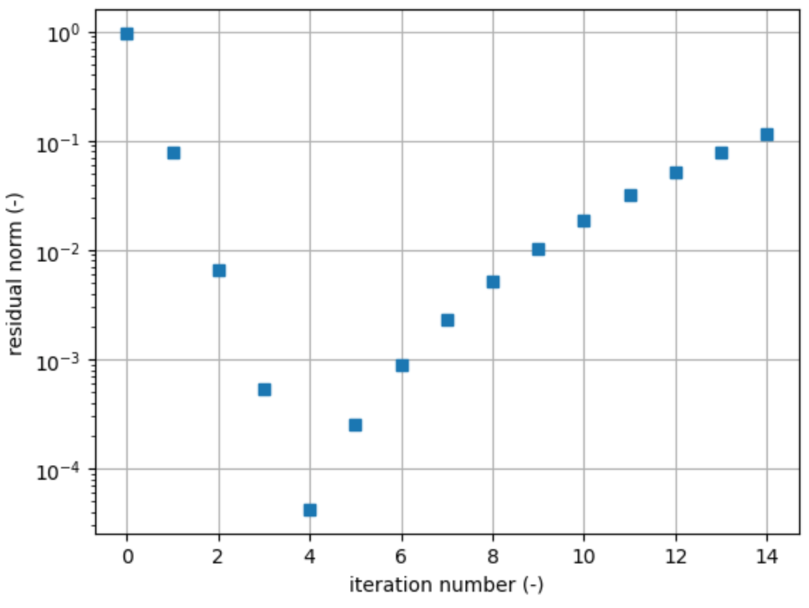
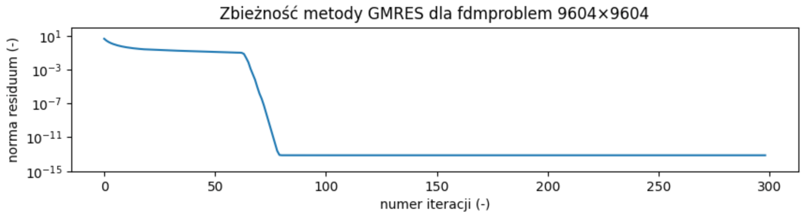
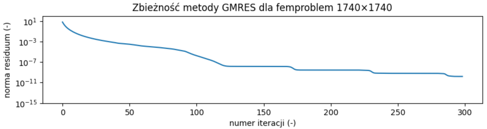

class: center, middle, inverse
<style>	.remark-slide pre { overflow: visible; } </style>
<style>	.remark-code, code { padding: 5px; font-family: monospace; font-size: 15px;} </style>
<style> .img-center img { max-height: 620px; width: auto; } </style>
<style> .img-tiny img { max-width: 80%; } </style>
<style>	.attention { color: #ffb570; } </style>
<style>	.has-jax { background: none; font-size: 13pt } </style>
<style> .-fullscreen img { width: 0; height: 0; }
.full-height img { max-width: 100%; }
.full-width img { max-height: 100%; }
.fullscreen img {
  position: absolute;
  top: 0; left: 0;
}
</style>
<style>.pull-left-30 { float: left; width: 35%; }</style>
<style>.pull-left-70 { float: left; width: 63%; }</style>
<style>.pull-right-30 { float: right; width: 35%;}</style>
<style>.pull-right-70 { float: right; width: 63%;}</style>

# Algorytmy w inżynierii danych

## Wykład 14 - Algorytmy wykorzystujące podprzestrzenie Kryłowa

## Bartosz Chaber

e-mail: bartosz.chaber@ee.pw.edu.pl
2023L

.img-nerw-header[]

---

### Metody rozkładu QR

Algorytmy pozwalające na rozkład macierzy `\(\mathbf{A}\)` na iloczyn ortogonalnej macierzy `\(\mathbf{Q}\)` i górnotrójkątnej macierzy `\(\mathbf{R}\)` wykorzystywane są zarówno do poszukiwania pełnego widma macierzy (algorytm Francisa) jak i do ortogonalizacji (m.in. algorytm Grama-Schmidta).

--

Do tej pory, przyglądaliśmy się głównie macierzom kwadratowym. Rozkład QR pozwala nam jednak rozwiązywać też _nadokreślone_ układy równań (gdzie _n_ > _m_).

`\(\mathbf{A}_{n \times m}  = \mathbf{Q}_{n\times n} \cdot \mathbf{R}_{n \times m}\)`

`\(\mathbf{A}\cdot \mathbf{x}  = \mathbf{b}\)`

`\(\mathbf{Q} \cdot \mathbf{R} \cdot \mathbf{x}  = \mathbf{b}\)`

`\(\mathbf{Q}^T \cdot \mathbf{Q} \cdot \mathbf{R} \cdot \mathbf{x}  = \mathbf{Q}^T \cdot \mathbf{b}\)`

Ponieważ `\(\mathbf{Q}^T \cdot \mathbf{Q} = \mathbf{I}\)`, to:

`\(\mathbf{R} \cdot \mathbf{x} = \mathbf{Q}^T \cdot \mathbf{b}\)`

---

### Wykorzystanie rozkładu QR do rozwiązania nadokreślonego układu równań

Przyglądając się dekompozycji QR wykonanej metodą transformacji Householdera widać, że macierz `\(\mathbf{R}\)` składa się z górnotrójkątnej macierzy `\(\mathbf{R_1}_{m \times m}\)`, oraz ostatnie (_n - m_) wierszy jest zerami.
Niech `\(\mathbf{Q_1}_{n \times m}\)` będzie macierzą złożoną z _m_ pierwszych kolumn macierzy `\(\mathbf{Q}\)`.

`\(\mathbf{R_1}_{m \times m} \cdot \mathbf{x}_{m \times 1} = \mathbf{Q_1}^T_{m \times n} \cdot \mathbf{b}_{n \times 1}\)`

Znalezione rozwiązanie _kwadratowego_ układu równań jest też _przybliżonym_ rozwiązaniem oryginalnego, _nadokreślonego_ układu równań.

--

Trzeba też zwrócić uwagę, że górnotrójkątna postać macierzy `\(\mathbf{R_1}\)` pozwala na wykorzystanie np. metody wstecznego podstawienia.

---

```julia
> A = rand(10, 5)
> x = rand(5)
> b = A * x
> Q, R = householder_qr(A)
> dropalmostzeros(R, 1e-15)
 -1.31661  -0.936979  -1.92423   -1.26407   -2.04406
   ⋅       -1.44231   -0.903101  -0.643508  -0.292849
   ⋅         ⋅        -0.906743   0.117817  -0.483823
   ⋅         ⋅          ⋅        -0.666688  -0.266078
   ⋅         ⋅          ⋅          ⋅        -0.910211
   ⋅         ⋅          ⋅          ⋅          ⋅ 
   ⋅         ⋅          ⋅          ⋅          ⋅ 
   ⋅         ⋅          ⋅          ⋅          ⋅ 
   ⋅         ⋅          ⋅          ⋅          ⋅ 
   ⋅         ⋅          ⋅          ⋅          ⋅
```

--

```julia
> R1 = R[1:5, :]
> Q1 = Q[:, 1:5]
> R1 \ (Q1' * b)
5-element Vector{Float64}:
 0.3639204345878613
 0.5829862691465332
 0.8974911501949492
 0.7674252582835013
 0.032862745769500094
> x
5-element Vector{Float64}:
 0.3639204345878615
 0.5829862691465323
 0.8974911501949493
 0.767425258283502
 0.03286274576949999
```

---

### Naiwna metoda Kryłowa

Wyobraźmy sobie algorytm, który w każdej iteracji poszukuje rozwiązania w coraz to większej przestrzeni (1-wymiarowej, 2-wymiarowej, ...) utworzonej przez kolejne wektory rozpinające podprzestrzeń `\(\mathbf{K}_m\)`, gdzie _m_ jest liczbą wymiarów i jest **mniejsza** niż _n_ oznaczające liczbę wierszy w `\(\mathbf{A}\)`.

Naiwna implementacja wykorzystująca podprzestrzenie Kryłowa polega na zbudowaniu bazy z kolejnych wyników iteracji metodą potęgową (omawiane na wykładzie dot. wyznaczania dominującej wartości własnej macierzy `\(\mathbf{A}\)`): `\(\mathbf{u}, \mathbf{A}\mathbf{u}, \mathbf{A}^2\mathbf{u}, ..., \mathbf{A}^{m-1}\mathbf{u}\)`.

Kroki algorytmu:

1. niech podprzestrzeń `\(K\)` składa się tylko z wektora prawej strony `\(\mathbf{b}\)`,
2. znajdź takie `\(\mathbf{y}\)`, które minimalizuje normę `\(\mathbf{A}\cdot\mathbf{K}\cdot\mathbf{y} - \mathbf{b}\)`,
3. znajdź rzut rozwiązania: `\(\mathbf{x} = \mathbf{K}\cdot\mathbf{y}\)`,
4. rozszerz podprzestrzeń o kolejny wektor bazowy,
5. powtarzaj od 2. najwyżej _n_ razy.

---

```julia
# Naïve Krylov solver (uses {b, Ab, A^2b, A^3b, ...})
function naïvekrylov(A, b, maxiter, epsilon)
    K = b;
    x = similar(b)
    history = Float64[]
    for k = 1:maxiter
        # solve least squares problem
        # minimize norm( (A*K) y - b)
        AK = A*K
        println(k, ") A*K = ", size(AK))
        
        y = AK \ b;
        # find the minimal residual
        # note that: x =  K * y
        x .= K * y;
        
        push!(history, norm(b - AK * y));
        if history[k] < epsilon
            break
        end
        # extend our Krylov subspace
        K = hcat(K, AK[:, k]);
    end
    println("Maximum number of iterations reached")
    return x, history
end
```

```julia
A = randn(150, 150) + 150.0diagm(ones(150));
b = ones(150);

x, res = naïvekrylov(A, b, 15, 1e-7); # naive Krylov method
norm(A * x - b)
```

---

Problem z poprzednią metodą polega na tym, że operujemy na liczbach zmiennoprzecinkowych.
Potrzebujemy _lepszej_ bazy.
.img-center-xsmall[]

---

### Iteracja Arnoldiego
Wykorzystuje zmodyfikowaną metodę Grama-Schmidta,
aby wyznaczyć _kolejny_ wektor ortogonalny rozpinający
podprzestrzeń Kryłowa.

```julia
# Iteracja Arnoldiego pozwala na wyznaczenie wektora
# ortogonalnego do wektorów z bazy Q
# wykorzystując proces podobny do metody Gramma-Schmidta
# źródło: [3]
function arnoldi_iteration(A, Q, k)
    q = A * Q[:,k]; # next power iteration
    h = zeros(k+1);
    for j=1:k
        h[j] = dot(Q[:, j], q);
        q = q - h[j] * Q[:, j]; # Gram-Schmidt
    end
    h[k+1] = norm(q);
    q = q / h[k+1]; # normalize
    
    return q, h
end
```
---

### Metoda GMRES

GMRES &mdash; _ang._ Generalized Minimal RESidual.

```julia
# GMRES
function gmres(A, b, maxiter, epsilon)
    N  = size(A, 1);
    x0 = zeros(N, 1);
    r0 = b - A * x0;
    
    β  = norm(r0);
    e1 = [1.0; zeros(maxiter, 1)]; # MAXITER × 1
    
    H = zeros(maxiter, maxiter);    # MAXITER × MAXITER
    Q = zeros(N, maxiter);               #  N × MAXITER
    
    Q[:, 1] .= r0 / β;
    
    G = diagm(ones(maxiter)); # MAXITER × MAXITER
    history = Float64[]
    
    y = zeros(0)
    ...
```

---

```julia
    for k=1:maxiter-1
        # find next orthogonal vector
        qkp, hkp = arnoldi_iteration(A, Q, k);
        Q[:, k+1] .= qkp
        H[1:k+1,k].= hkp 
        # update Given's rotation matrix
        Gi = givensrot(G * H, k+1, k);
        G  = Gi * G;
        # solve least squares problem:
        # minimize norm([U; 0] y - [F; e])
        U = G[1:k, 1:k+1] * H[1:k+1, 1:k];
        F = G[1:k, 1:k+1] * β * e1[1:k+1];
        e = G[k+1, 1:k+1]'* β * e1[1:k+1];
        y = U \ F;
        
        Kn = H[1:k+1,1:k] # Krylov subspace
        Un = U[1:k,  1:k]
        push!(history, abs(e))
        if abs(e) < epsilon
            break
        end
    end
...
```
```julia
    k = length(y)
    x = x0 + Q[:, 1:k] * y;
    
    return x, history
end
```
---

.img-center-full[]

--

.img-center-full[]

---

## Literatura
* [1] Tony Driscoll, Krylov Subspaces MATH 426 / CISC 410, 2012, url: https://www.youtube.com/watch?v=ji__O4deIZo, dostęp: 29.05.2023
* [2] Nathan Kutz, Applied Linear Algebra GMRES, 2020, url: https://www.youtube.com/watch?v=pPoLsRkBha4, dostęp: 29.05.2023
* [3] Greg Fasshauer, Chapter 14 - Arnoldi Iteration and GMRES, url: http://www.math.iit.edu/~fass/477577_Chapter_14.pdf, dostęp: 29.05.2023
* [4] Tom Trogdon, Fall 2016: UCI MATH 105A: Numerical Analysis, url: https://www.math.uci.edu/~ttrogdon/105A/html/Lecture23.html, dostęp: 30.05.2023
---
class: center, middle, inverse
# Dziękuję za uwagę
